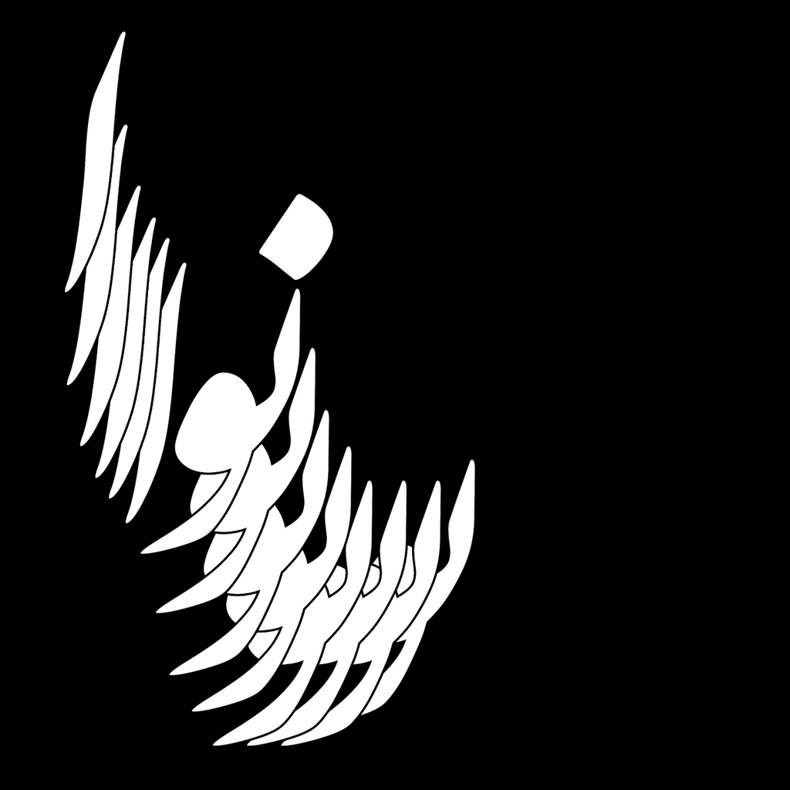
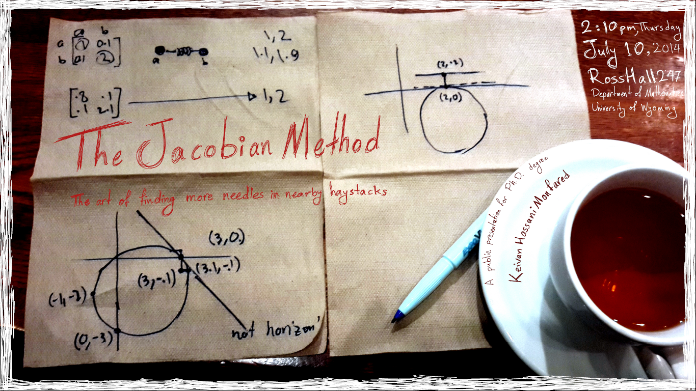
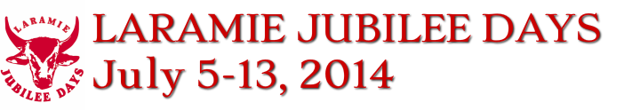
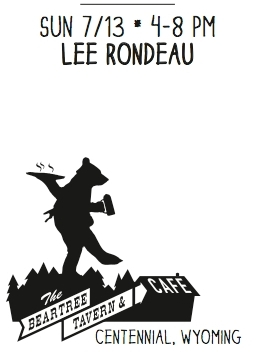

# Some events

So, the last days of living in Laramie and here are a few things happening:

	- Our Persian traditional music band, Nava, is performing on Wednesday night (July 9th), 8:30pm at the Art Museum's Star Party.

	- I'm defending my PhD dissertation on Thursday (July 10th), 2:00pm, Ross Hall 247
	- The Laramie Jubilee days of Friday and Saturday (including BrewFest!)

	- World Cup final match on Sunday, then live music, dance and more in Centennial, WY.
Cheers, to new starts.
