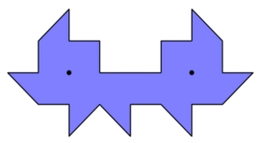
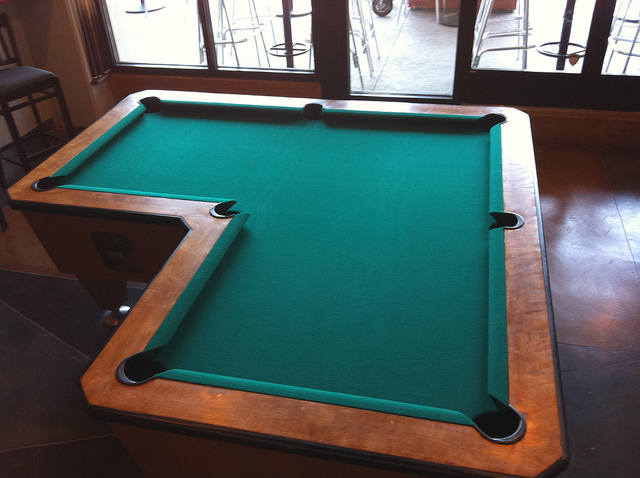
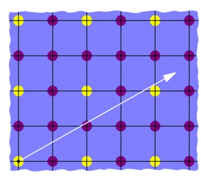

# Unilluminated pool tables

Yesterday I gave a colloquium talk at WIU and as a tradition the department head gave me a book. The book is called [The Ph$\gamma$sics Book: From the Big Bang to Quantum Resurrection, 250 Milestones in the History of Physics](https://www.google.com/shopping/product/9646007351510608831?q=250+physics&client=firefox-a&hs=QSe&rls=org.mozilla:en-US:official&channel=sb&biw=1138&bih=579&psj=1&bav=on.2,or.r_cp.r_qf.&bvm=bv.78677474,d.aWw&tch=1&ech=1&psi=3-NTVJzWN8iPyASg6IG4Cw.1414783968544.5&prds=paur:ClkAsKraXx1rLUYXLFzbMffVY7UhSUSNK5LYkS41qPQBmfVrSfl3_gA46lmnAxSaqQ4Tfhlt_wMlh80rT9dNORVhQbJn197O2XD8OxpZJNL0i2RPMjFRqYSvhRIZAFPVH70ajymhoDPb2C8W6xTbqjBofRLutw&ei=5-NTVML3IYv9yQT9wYLoCQ&ved=0CGoQpiswAA). One of the topics is about unilluminated rooms or the [illumination problem](https://en.wikipedia.org/wiki/Illumination_problem), which asks what shapes of rooms cannot be illuminated with one light, if all the walls are covered with mirrors.

 The smallest polygonal shape known has 24 sides.

That reminded me of an [L-shaped pool table ](https://i.imgur.com/OX9pYF1.jpg)that I had seen in Wynkoop Brewing Company at Denver, CO. I was thinking that playing on that table is not fair (to whom? I dunno!). But now it all makes more sense.

The lattice point interpretation is also interesting (See [this](http://blog.zacharyabel.com/tag/unilluminable-rooms/)).

 We need to find a straight trajectory from the initial yellow point to some other yellow point that does not hit any purple points.
