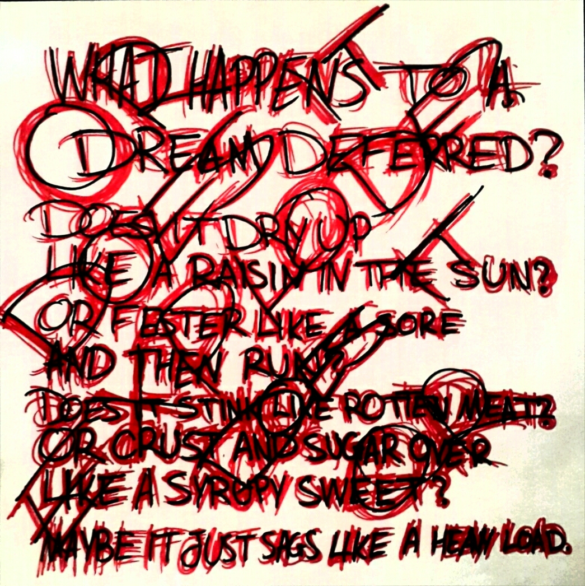

# Harlem

> What happens to a dream deferred?
> 
> Does it dry up
> like a raisin in the sun?
> Or fester like a sore—
> And then run?
> Does it stink like rotten meat?
> Or crust and sugar over—
> like a syrupy sweet?
> Maybe it just sags
> like a heavy load.
> 
> *            Or does it explode?
> *
<address>Langston Hughes, “Harlem” from *Collected Poems.*</address>
