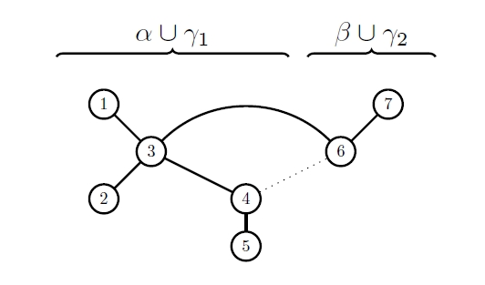

# lambda-tau paper got accepted

Our paper (joint with Bryan Shader) on the $\lambda$-$\tau$ structured inverse eigenvalue problem just got accepted in Linear Algebra and its Applications. The referee wants it to become two papers though.
