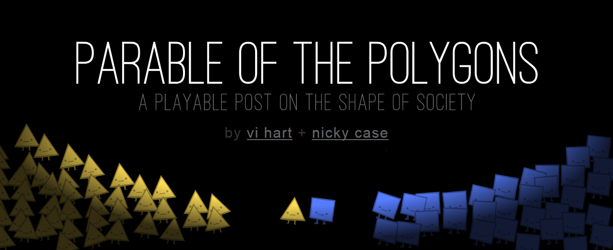

# Shapism in Polygons

Visit http://ncase.me/polygons for an incredible presentation of mathematical sociology using simple fun games.

They show how small innocent bias in each person leads to large scale segregation in the society.
