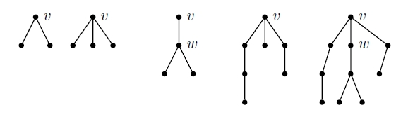

# Spectral characterization of matchings in graphs

 Examples of trees which are not NEB.

We (Sudipta Mallik and I) just submitted our paper on the "Spectral characterization of matchings in graphs". It is based on our previous work on "Construction of real skew-symmetric matrices from interlaced spectral data and graph" which is available on [arXiv:1412.6085](http://arxiv.org/abs/1412.6085). We show that a graph has a maximum matching of size $k$ if and only if it can realize certain spectra as a real skew-symmetric matrix.
