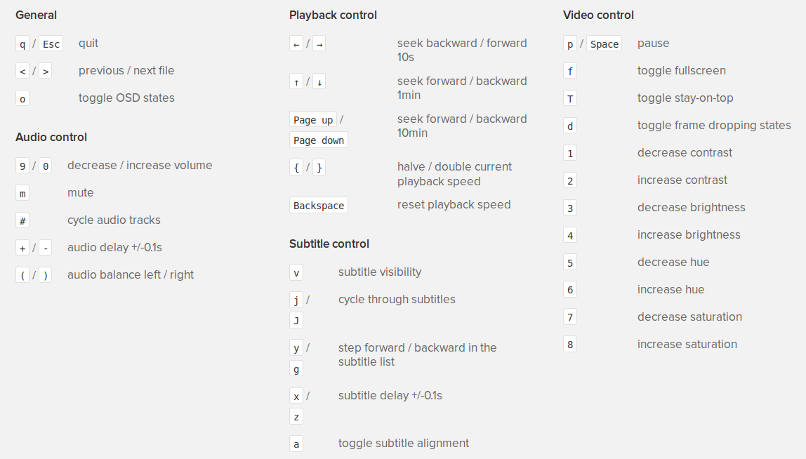

# Search and play things from terminal

There are times that I feel lazy to open a new tab in my firefox to search for something or a youtube video, even though I have tags for every important thing that I use commonly. For example if my firefox is open, all I need to do is to press `ctrl+t` to open a new tab, then `ctrl+k` to go to search bar, and then type in my search query and press enter to search my term in `DuckDuckGo`. Though that `ctrl+k` is not really needed! Or when I have a new tab, all I need to do is to type `yt` my search query to search it in `youtube`. Firefox has this great shortcuts for this searches. But still sometimes I feel lazy. So, I open a terminal (`F12` opens up my `Guake terminal`) and then type `ytp my search query` and it does the same youtube search for me, or other things (see below). The whole idea is very simple. Here is what I do. I have some bash scripts in a folder at `~/opt`. I've added the address of this folder to my `~/.bashrc` file with: `PATH=$PATH:"~/opt"`

And in my opt file, I put my bash scripts. So to do a search you actually first need to read the search query from terminal. In all this scripts I use the following to read:
```
if [[ $(echo $*) ]]; then
    searchterm="$*"
else
    read -p "Enter your search term: " searchterm
fi

searchterm=$(echo $searchterm | sed -e 's/\ /+/g')

```
So, really what it does is if I run my command like `ytp my search query` it puts the three terms my and search and query together in `$searchterm`. But if I just run `ytp` without anything, it asks me to enter the search terms in the next line. If I just press `enter` one more time, then it passes an empty string, which is sometimes good to open an empty google page :D I also do this with my contacts in google!

Then the rest of the scripts are just simple commands to do something with that search term. Here are a few examples:

**Google things:** (I save this in a file called google)
```
#!/bin/bash

if [[ $(echo $*) ]]; then
    searchterm="$*"
else
    read -p "Enter your search term: " searchterm
fi

searchterm=$(echo $searchterm | sed -e 's/\ /+/g')

firefox http://www.google.com/search?q=$searchterm

```
But you better be searching with DuckDuckGo instead of Google!
**Search using DuckDuckGo:** (I save this in a file called ddg)
```
#!/bin/bash

if [[ $(echo $*) ]]; then
    searchterm="$*"
else
    read -p "Enter your search term: " searchterm
fi

searchterm=$(echo $searchterm | sed -e 's/\ /+/g')

firefox https://duckduckgo.com/?q=$searchterm

```
**Search Youtube** (I save this in a file called yts)
```
#!/bin/bash

if [[ $(echo $*) ]]; then
    searchterm="$*"
else
    read -p "Enter your search term: " searchterm
fi

searchterm=$(echo $searchterm | sed -e 's/\ /+/g')

firefox https://www.youtube.com/results?search_query=$searchterm

```
**Search Google Contacts** (I save this in a file called contacts. Don't use `gc` since it's reserved for some other commands! See for yourself by typing `whatis gc` in terminal :p )
```
#!/bin/bash

if [[ $(echo $*) ]]; then
    searchterm="$*"
else
    read -p "Enter your search term: " searchterm
fi

searchterm=$(echo $searchterm | sed -e 's/\ /+/g')

firefox https://contacts.google.com/u/0/preview/search/$searchterm

```
But here is the most important thing. If you want to play youtube videos from terminal using `player` use the following script. But you need to get the video ID from its url first. For example if this is the video you're watching: `https://www.youtube.com/watch?v=daQhI1JFXn4` Then the video ID is the part after `v=` which is `daQhI1JFXn4` and feed this to your shell script when calling it in terminal. I need to figure out how to join this with my youtube search. I mean, I want to search for a term and then ask youtube to play the *first* result in the terminal using mplayer. It shouldn't be too hard, but I don't know how to do it yet.

There could be several reasons you might want to play some youtube video in the terminal. Here is the code:

**Play youtube in terminal:** (I save this in a file called ytp)
```
#!/bin/bash

if [[ $(echo $*) ]]; then
    searchterm="$*"
else
    read -p "Enter the video ID: " searchterm
fi

searchterm=$(echo $searchterm | sed -e 's/\ /+/g')

mplayer $(youtube-dl -g https://youtube.com/v/$searchterm)

```
You need `youtube-dl` and `mplayer` to be installed, of course. And in case you don't remember all the handy keys to control mplayer, here is list of some of them:[](files/20151005/selection_007.png)If you're watching an online course from youtube, I think `{` and `}` will come handy for the speed. Now, if you want to do play something on an infinite loop, do this:

**Play youtube in terminal on an infinite loop: **(I save this in a file called ytx)
```
#!/bin/bash

if [[ $(echo $*) ]]; then
    searchterm="$*"
else
    read -p "Enter the video ID: " searchterm
fi

searchterm=$(echo $searchterm | sed -e 's/\ /+/g')

video=$(youtube-dl -g https://youtube.com/v/$searchterm)

[[ -f ~/Videos/$searchterm.mp4 ]] || wget -O - $video | tee ~/Videos/$searchterm.mp4 2>&1 > /dev/null

while true; 
do 
    sleep 2;
    mplayer ~/Videos/$searchterm.mp4
done
```
When you're tired of playing that video you need to press `ctrl+c` twice, to first exit the mplayer, then exit the script. Or, you could get a number and make a for loop and play the file that many times! What is slightly different in this is I first download the file and put it in a loop to play for ever. This saves some bandwidth! (I got the solution here: [http://unix.stackexchange.com/questions/233928/downloading-a-file-once-and-playing-it-multiple-times](http://unix.stackexchange.com/questions/233928/downloading-a-file-once-and-playing-it-multiple-times)) I'm actually saving the files with their ID, and I could play them later.

The line before the while loop, actually searches if that video ID is already downloaded, and it won't download it again, if it exists. || means exclusive OR. I don't wanna use this for the previous version, because it downloads the whole video fist and then plays it, and the file remains there. It would be good if I'm playing something, I'll check to see if it's downloaded, and if not to do download it though, but it seems the code will get a little complicated. I'll look into it later.

What I would like to do for now is to see if I can tag my videos or add titles from the youtube title so that they're also human readable. Because why not?
