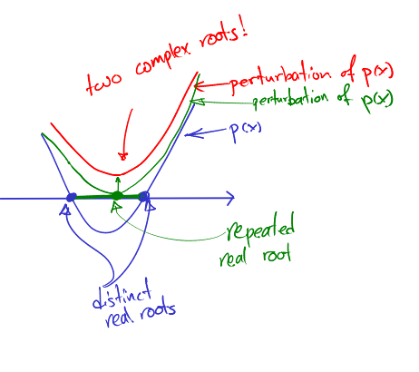

# Roots of a polynomial

Today I read a lot of random mathematics and many of them led to places outside math, and among them is this one: [Parkinson's Law](https://en.wikipedia.org/wiki/Parkinson's_law). One of them that at this last hour of work day is still related to math is a paper by Morris Marden which is from a [talk on his work on zeros of polynomials](http://www.jstor.org.ezproxy.lib.ucalgary.ca/stable/pdf/2318685.pdf), which he cheerfully names "MUCH ADO ABOUT NOTHING".

The reason I found this paper is because I want a theorem that tells me something like this:
> **Desired Theorem: **If a real polynomial with distinct real roots is perturbed small enough, the real roots remain real and the nonreal roots remain nonreal.
Looking at the the "desired theorem", I am convinced that it holds for two main reasons:

	- Continuity of roots of a polynomial with respect to its coefficients, and
	- Two real roots should match up in order two convert to a pair of non-real roots.

 2. Two distinct real roots should match up to get a par of nonreal roots.

And I have written down my proof. But to prove it rigorously there are a lot of little things that need to be taken care of. Still I love to see some other approaches, which are more intuitive and/or more rigorous.

---

**Update:**

Paul Horn provided a rigorous proof, and Sajjad Lakzian mentioned that
> The zero set of a [single variable] polynomial in $\mathbb{C}$ is a [nonsingular] variety [and a manifold, since nonsingular algebraic varieties over the real or complex numbers are manifolds]. real roots are the intersection with the x-axis [another manifold]. having distinct real roots means that the real line is transversal to this variety at all intersection points. meaning the derivative of the polynomial is not zero! (even if you have more than one variables, this can be rigorously written using the partial derivatives). Now the theorem is a standard direct consequence of the inverse function theorem (or implicit function theorem to be more precise) [that small perturbations of two manifolds that intersect transversally at a point, still intersect transversally at a nearby point].
I've also found this paper by Alen Alexanderian called [On continuous dependence of roots of polynomials on coefficients](http://users.ices.utexas.edu/~alen/articles/polyroots.pdf) which first uses Rouche's theorem to show the famous result that roots of a polynomial are continuous functions of its coefficients, then Theorem 3.5 states exactly what I needed. The continuity part is also proven in this short note using topological tools: [PDF](http://www.ams.org/journals/proc/1987-100-02/S0002-9939-1987-0884486-8/S0002-9939-1987-0884486-8.pdf).

---

## Old Comments

> **Loosing the symmetry | k1monfared** — April 8, 2016
> 
> […] should hold by looking at a graph of a polynomial, but writing it formally was ugly. So I posted it here and soon I got a few answers, among them one by Paul Horn which had a rigorous analytic proof, and […]
