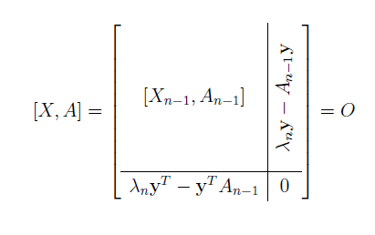

# Infinite inverse spectrum problems

Ehssan Khanmohammadi and I just submitted a paper on inverse eigenvalue problems for infinite graphs. Essentially we proved that for a given bounded set $\Lambda$ and an infinite graph $G$ on countably many vertices, there is an infinite matrix $A$ whose graph is $A$ and its spectrum is closure of $\Lambda$.

 Matrices $X$ and $A$ commute.

We used the Jacobian method to prove the finite case, but this time with an induction. The induction helped to control the norm of the solutions. To complete the induction we introduced a property that we called the Weak Spectral Property (WSP), akin to Strong Arnold Property. WSP grasps a notion of genericity in the Jacobian method when using the Jacobian method. Then we took a limit of the solutions for finite matrices when the size of the matrix approaches infinity.

You can read the paper here: [arXiv](http://arxiv.org/abs/1512.05834)
