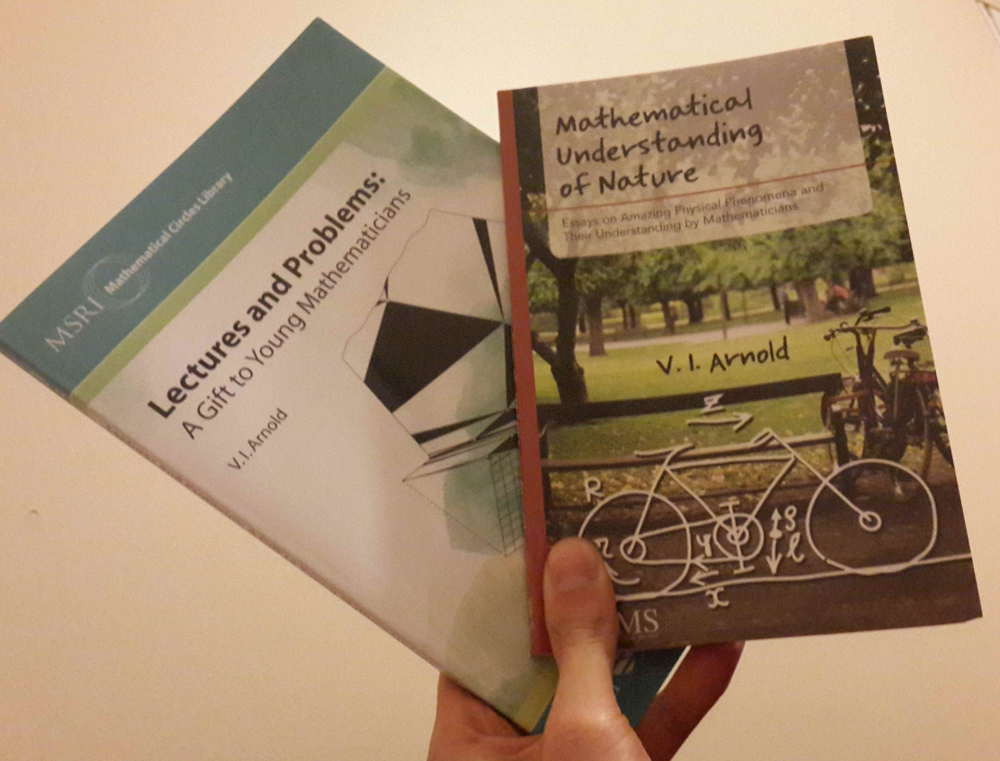

# Celebrating the joy of mathing with Arnold

I don't think anyone who's learned anything can deny the fact that they have learned from their errors. Well, they might not know this quite clearly but they would eventually agree that it is the case. Mathematics is even more so that during learning a proof of a theorem for example, it's not the logical reasoning that pushes you forward, but it's checking that nothing can go wrong is the moving force; that you check that: OK, this thing could go wrong, but ahha, this little argument is telling me that it won't. And then this other big thing could end in a shithole, but oh there're these 5 pages that are paving the way around that so we won't fall into it... etc.

Vladimir Arnold puts away formality and proofs, he just picks some objects and starts playing with them, something that is righteously called experimental mathematics (also the name of one of his books). And that's what I like about him. I've learned to be a little like this from my PhD advisor Bryan Shader. If I had a big question, he would say: OK, let's look at a 2x2 example... If i had some classic question he would say: Oh let's see if it's true... And we would start experimenting. It's a lot of fun, it's how math is done. It's where the ideas come from. Writing the proofs and being neat is not usually that much of fun.

I ordered a couple of Arnold's books at JMM and I received them yesterday. I'll be reading them in the next few days. Some of his books and books about him can be found on AMS's bookstore: [link](http://bookstore.ams.org/#search?arnold?page=0).
