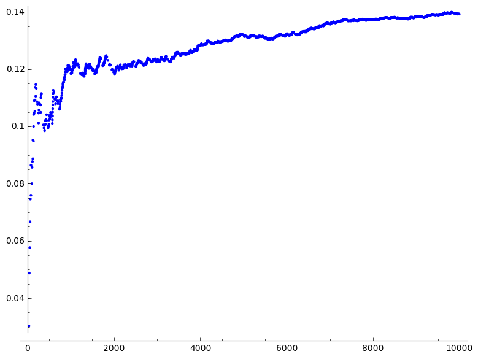

# On the last digits of conscutive prime numbers

If you have a prime number $p$ (other than two and five) then the last digit of $p$ is 1, 3, 7, or 9. If for some reason we believe that prime numbers are randomly distributed (after all, the last digits 1,3,7, and 9 appear equally likely among primes), then we expect if a prime numbers ends in 1, then the next prime number also ends in 1 with probability of 1/4. A [recent study](http://arxiv.org/abs/1603.03720) has shown otherwise, statistically, and has proved it mathematically, assuming the [Hardy–Littlewood *k*-tuple conjecture](https://en.wikipedia.org/wiki/Twin_prime#First_Hardy.E2.80.93Littlewood_conjecture) is true. In fact the statistical data shows the probability is less than 1/4. [Here](http://www.nature.com/news/peculiar-pattern-found-in-random-prime-numbers-1.19550) is an article explaining the main content of this study.

And if you want to check it for yourself, [here](http://sagecell.sagemath.org/?z=eJxNkM0KgzAQhO-BvMNCKWSxP6beCn0He5YgUrTk4Bqjvn-zMZLOaZnMN5uE4AW6ZEkhRe3t2C_BcnFoB-uXtSVFyKdzzPL0PnKNkWKYPDiwBDv9lAKCUqQIGQdnmA1zn2mjlTEogTHLmO_o26sZIXX9mXTVmPq6gO2djTW7ZQd2s11ok8KsuKvpDF9BZ_sUnkarqo-qS51pzDEp1LKNKpbgPXwA3khVD_wBZYRQnw==&lang=sage) is a little code that finds the empirical probability of two consecutive prime numbers ending in the same last digit:
```
n = 100000
Primes = primes_first_n(n)
q = 10
Qrimes = []
for p in Primes:
    Qrimes += [p % q]
count = [ 0 for i in range(q) ]
for i in range(n-1):
    a = Qrimes[i]
    if a == Qrimes[i+1]:
        count[a] += 1
        #print(Primes[i],Primes[i+1])
(sum(count)/(n)).n(32)
```

0.153300000</pre>

And [here](http://sagecell.sagemath.org/?z=eJxNkMEKwyAQRO-C_7CXgpKWxmuh_5CeRUJakrKHrIkm_19XDemedHgzOyzBE0ybRwopuoDzGJO25Ec_YYhbT4q0FGtGmXodlHVSTD7AAkhQvA8pIE1FmsQscIHVlXT_PmxSfPxOG_-gBQ5BDgkDfUe1aqjJfyLdjK7pQ7KVDRZdkXBi9ZQb4yrMk3fZwXEhc8qlEJe0eFVxn1UG9V2h1s6dYOrOR_FIm8qmdI_uBypEUuc=&lang=sage) is a modification that shows how the probability changes as $n$ grows:

```
n = 1000000

Primes = primes_first_n(n)
q = 10

Qrimes = []
for p in Primes:
    Qrimes += [p % q]

Probs = []

count = [ 0 for i in range(q) ]
for i in range(n-1):
    a = Qrimes[i]
    if a == Qrimes[i+1]:
        count[a] += 1
        Probs += [[i,(sum(count)/(i))]]
        
P = point(Probs)
P

```
 As $n$ grows (horizontal axis) the empirical probability of having two consecutive prime numbers with the same last digit (vertical axis) changes but remains well below 1/4.

The fun part is by noting the last digit of a number is just the remainder mod 10, then you can ask about what happens to the remainders mod some other number $q$. In the paper they show the probability is still less than what one would expect  mod any number $q$, which sounds paradoxical.
