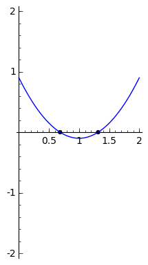
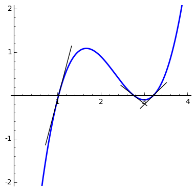

# Losing the symmetry

If you know about my work, you know that for the past several years I've been working on a special type of problems called structured inverse eigenvalue problems (or SIEP's for short). Well, I mainly focused on SIEP's for Graphs (or IEPG's for short). The question is that you give me a (multi-)set of $n$ numbers $\Lambda$ and a graph $G$ and ask me if there is a matrix whose graph is $G$ and its spectrum (the set of eigenvalues) is $\Lambda$. [Previously](http://www.sciencedirect.com/science/article/pii/S0024379513001006), Bryan Shader and I proved a few theorems and in particular we showed that whenever you choose those $n$ numbers to be distinct real numbers, then there is a real symmetric matrix with the given graph and spectrum. A little [after that](http://www.sciencedirect.com/science/article/pii/S0024379516000951), Sudipta Mallik and I had more fun with this problem and in particular showed that if you choose those numbers to be $2k$ distinct purely imaginary numbers in complex conjugate pairs and $l$ zeros, and if you choose a graph on $2k+l$ vertices which has a matching of the size $k$, then there is a real [skew-symmetric](https://en.wikipedia.org/wiki/Skew-symmetric_matrix) matrix with the given graph whose eigenvalues are the given numbers.

For the longest time I was afraid to touch the general problem of what happens in the non-symmetric case? That is, if you give me a bunch of complex conjugate pairs and a bunch of real numbers, can I answer the question that if there exist a matrix with a given graph which has those eigenvalues or not. Until this past winter that I saw a question on [Research Gate](https://www.researchgate.net/post/Is_any_arrowhead_matrix_similar_to_a_tridiagonal_matrix?_tpcectx=qa_overview_following&_trid=d0jhIMucOOm13dWkFPVSZ614_) asking if any [arrowhead matrix](https://en.wikipedia.org/wiki/Arrowhead_matrix) (a matrix whose graph is subgraph of a [star](https://en.wikipedia.org/wiki/Star_%28graph_theory%29)) is similar to a [tridiagonal matrix](https://en.wikipedia.org/wiki/Tridiagonal_matrix) (a matrix whose graph is subgraph of a [path](https://en.wikipedia.org/wiki/Path_graph)). Having done all the work I responded to the question, assuming eigenvalues are distinct and real, and the matrix is real and symmetric. The OP responded that they actually work with not-necessarily-symmetric matrices; exactly what I was afraid of. To make it worse, the OP mentioned that they actually need an algorithm to find the similar tridiagonal matrix without computing its eigenvalues, because [computing eigenvalues for matrices of order larger than 4 is not exact](https://en.wikipedia.org/wiki/Quintic_function). The problem is hard, and I can't still suggest a nice way to do it, but there might be ways to solve the problem for arrowhead matrices and tridiagonal matrices, since they are very special. But I decided to approach the problem as an IEPG.

Considering that I have recently been reading Vladimir Arnold's works (mostly the not serious works) and that I was a student of Bryan Shader, I started some experiments. $2 \times 2$ matrices seem easy enough to play with. So I started there and the problem was easily solved. It even gave me so much wiggle room in the solution that I hoped for more (In the Jacobian method we usually look for a solution that is robust, i.e. with a lot of wiggle room, and then use the Implicit Function Theorem to do the rest of the work. In [this paper](http://arxiv.org/abs/1511.06705) it is put together as a black-box tool that solves many problems. All you need to do is to find a "generic" matrix to begin with). In fact

$A = \begin{bmatrix}  a+d & x \\ y & a-d\end{bmatrix}$

has eigenvalues $a \pm b \rm{i}$, where $d^2 = -xy -b^2$ for any choice of $x$ and $y$ such that $xy \leq -b^2$. Then there was time to go to $3 \times 3$ case which I suddenly realized I can just look at direct sums of $2 \times 2$ and $1 \times 1$ blocks, to construct a matrix (ignoring the graph) with the given spectrum.

$A = \left( \bigoplus_{j=1}^{k} \left[ \begin{array}{cc}
\lambda_j & \mu_j\\
-\mu_j & \lambda_j
\end{array} \right] \right)
\oplus
\left( \bigoplus_{j=1}^{l}
\left[ \begin{array}{c}
\gamma_j
\end{array} \right] \right)$

Easy enough. Then, the problem was to show that the matrix is generic (in the sense of the Jacobian method).

First, I needed to show that if I have a real polynomial with a simple root $a$, then small (real) perturbations of it also have a simple root close to $a$. It was clear that this should hold by looking at a graph of a polynomial, but writing it formally was ugly. So I posted it [here](https://k1monfared.wordpress.com/2016/01/28/roots_of_a_polynomial/) and soon I got a few answers, among them one by Paul Horn which had a rigorous analytic proof, and one by Sajjad Lakzian who suggested the geometric approach of transversality.

The analytic idea is that if you have a simple root and if you are going to lose it as a result of perturbation (i.e. for it to become a nonreal root),  two real roots should come together on the real axis to join and then separate into a complex conjugate pair, so for a simple root, if you keep your perturbations small, such thing won't happen.

The geometric idea is that, the graph of the polynomial and the $x$-axis intersect transversally at a simple root (i.e. generically, i.e. non-horizontal tangents), so as an implication of the Implicit Function Theorem a perturbation of them also intersects transversally in a nearby point.

The rest of it was really using the same ideas as in my works with Bryan and Sudipta and doing new computations and book-keepings to prove this:

**Theorem. **For a given set $\Lambda$ consisting of $k$ distinct complex conjugate pairs and $l$ distinct real numbers, and a given graph $G$ on $2k+l$ vertices with a matching of size $k$, there is a real matrix with graph $G$ whose spectrum is $\Lambda$.

And a cute corollary of this theorem is the following:

**Corollary.** A real matrix has distinct eigenvalues if and only if it is similar to a real irreducible tridiagonal matrix.

The paper is submitted and the preprint ~~will be~~ is available through [arXiv](http://arxiv.org/pdf/1604.02195v1.pdf) ~~on Monday~~.

~~
~~

**UPDATE: **The paper is published now and it is available [here](https://www.sciencedirect.com/science/article/pii/S002437951730229X?np=y&npKey=0c18348cdb17bfb3776074a5b70ba5b3592604688ecd35f7b90a500af00642ee).

---

## Old Comments

> **“Existence of a Not Necessarily Symmetric Matrix with Given Distinct Eigenvalues and Graph” is published in LAA | k1monfared** — April 5, 2017
> 
> […] and its Applications, yesterday. It took it exactly one year! I’ve written about it here: Losing the Symmetry. And you can find the published version […]
