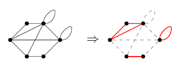
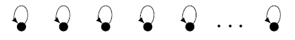
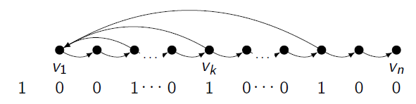
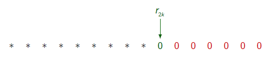
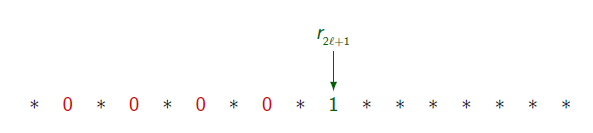
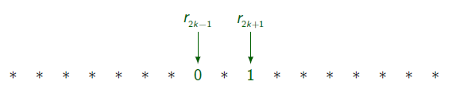
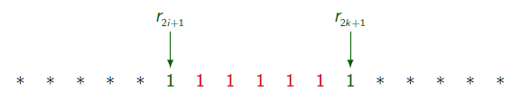
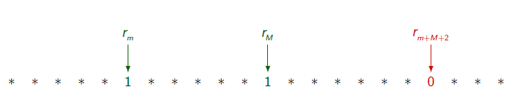
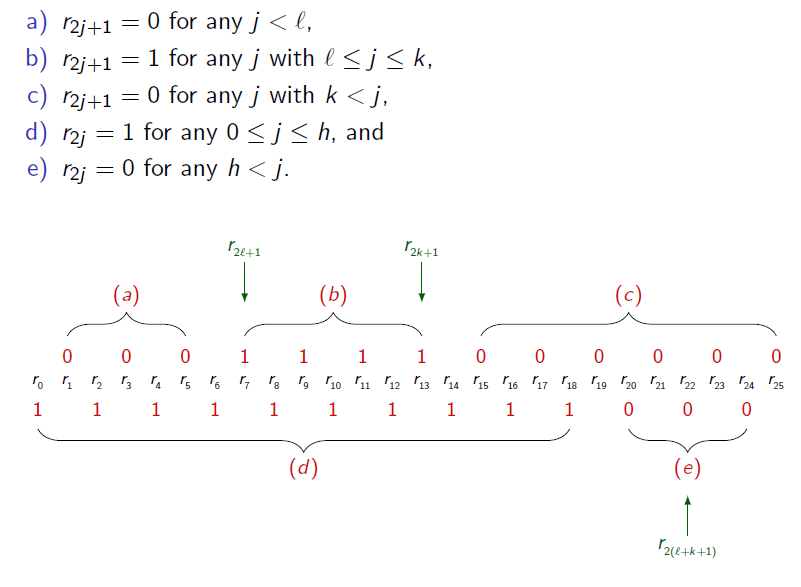
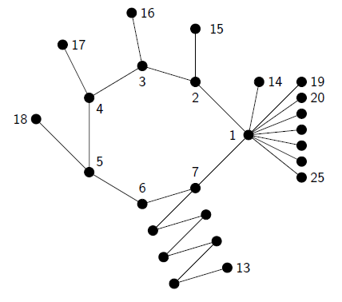

# Permanent rank paper is published by ELA

We started the project in [Graduate Research Workshop in Combinatorics](https://sites.google.com/site/rmgpgrwc/home) (Rocky Mountain Great Plains GRWC) in summer 2014, hosted by University of Denver and University of Colorado Denver. Two weeks of work with an amazing group of people in a great research environment, and we eventually submitted the final paper a few months ago, and it is now published by Electronic journal on Linear Algebra (ELA), a publication of International Linear Algebra Society (ILAS) which is an open access journal. The article is available here: [http://repository.uwyo.edu/ela/vol31/iss1/16](http://repository.uwyo.edu/ela/vol31/iss1/16)
## Some definitions
[Permanent](https://en.wikipedia.org/wiki/Permanent) of a matrix is like the determinant of it, instead half of the terms don't have the -1 coefficient in their expansion. That is, for an $n\times n$ matrix its permanent is

$\rm{per}(A) = \displaystyle\sum_{i=1}^n \prod_{\sigma \in S_n} A_{i \sigma(i)},$

where $S_n$ is the set of all permutations of $n$ objects. The permanent rank of a matrix then can be defined similar to the rank of it, as the order of the largest square submatrix of $A$ with a nonzero permanent. There are several open problems concerning permanents and in particular about their computatoin, since it turns out that even while the definition "looks" simpler than that of determinant, but the computation of it is actually harder. In fact Valiant in his 1979 paper showed that the complexity of [computing the permanent of a (0,1)-matrix is #P-complete](https://en.wikipedia.org/wiki/Sharp-P-completeness_of_01-permanent). It can be shown that any permanent problems can be reduced to a (0,1) permanent problem, hence computing the permanent in general is #P-hard.

On the other hand, there is a matrix associated with an entry-wise non-negative matrix $A_{n\times n}$. That is, a graph on $n$ vertices where two distinct vertices $i$ and $j$ are adjacent if $A_{ij}$ is nonzero. For a graph we define a generalized cycle of it to be the vertex-disjoint union of its $k$-cycles, for $k = 1,2,\ldots, n$, where a 1-cycle is a loop, and a 2-cycle is an undirected or a bidirected edge. if it includes all the vertices, then we call it a spanning generalized cycle.

 An spanning generalized cycle of the graph on the left, shown in red colour in the right.

Now there is an obvious relation between the spanning generalized cycles of the graph of a matrix and each term $\prod_{\sigma \in S_n} A_{i \sigma(i)}$, for a given permutation $\sigma$, and if the matrix is non-negative, each such term is non-negative, and the relation extends to permanent rank of the matrix.
## Motivation and the question
A few years ago I was reading a paper by my academic grandfather and his collegues (A. Brualdi, L. Deaett, D.D. Olesky, and P. van den Driessche. The principal rank characteristic sequence of a real symmetric matrix. Linear Algebra and its Applications , 436:2137–2155, 2012) and I was thinking about a similar problem using permanent rank instead of rank, until I heard about GRWC. I knew this is the place that people will be interested in such problems, and sure enough they did. Sinan Aksoi, Zhanar Berikkyzy, Hayoung Choi, and Devon Sigler were also among the people who also started on this (am I missing anyone?).

The big question with the regular rank asks to characterize all binary sequences $r_0 r_1 r_2 \ldots r_n$ that $r_k$ is one if and only if there is a $k\times k$ principal submatrix with nonzero determinant (with an exception about $r_0$). The big question in the permanent rank case replaces the determinant with permanent.
## Results
At the end we characterized all sequences for **entry-wise non-negative matrices**. In particular we showed

	- if $r_0$ is zero then everything else in the sequence should be one, and the sequence is obtainable by the identity matrix.
	- if $r_0$ is one then everything is allowed for the rest of the sequence and it is obtainable by the adjacency matrix of the following graph.

And if we restrict ourselves to symmetric matrices:

	- If an even position is zero, then everything in the sequence after it is zero:
	- Any odd position in the sequence before the shortest odd cycle is zero:
	- The smallest odd position which is one is from a chordless odd cycle:
	- Anything between two odd positions with ones is one:
	- And the hardest of all, if $m$ and $M$ are respectively the smallest and largest
odd integers so that $r_m = r_M = 1$, then $r_{m+M+2} = 0$.
	- Finally, any sequence that is validated by above 5 cases is obtainable by the adjacency matrix of a graph (in most cases we kept the graph connected). In particular, in a genereic case that the sequence satisfies the adjacency matrix of the the following graph has the given sequence:

## Future research
We have some results also in the skew-symmetric case, but in general it is not yet solved. Also, the general case when the entries are not restricted to be non-negative is also wide open. One of the directions that I'm interested in pursing is to enhance the sequence to counting the number of generalized cycles of each size, rather than just noting the existence of them with a 1.

Thanks to NSF for their grant to support GRWC, Sinan, Zhanar, Hayoung, Paul, Franklin,  Katy, Devon, John, and Josh for the amazing time we had together solving this problem, and all the lovely GRWC participants and organizers.
