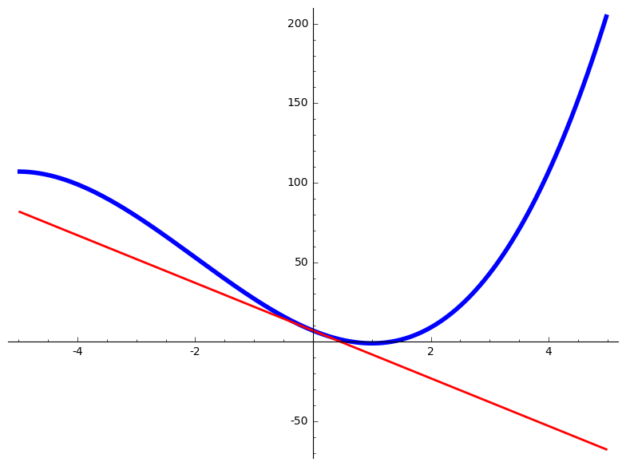
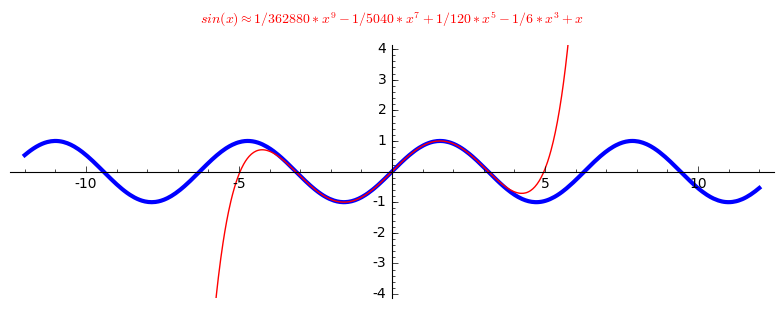

# Linear approximation and Taylor polynomials

For a given function $f(x)$ around a point $a$, if you zoom in close enough on the graph of the function, you can't tell the difference between the curve and the tangent line to the graph of the function at point $a$. This is the basic idea for linear approximations. To explore that statement here I wrote a little sage interactive code that will let you play around with it:
```
@interact
def _(
    f = ('$f(x)=$', input_box(x^3 + 6*x^2 - 15*x + 7,width=20)),
    a = ('around the point $x = a$', input_box(0,width=10)),
    zoom = ('zoom', slider(.1,12,default=1))):
    
    g(x) = f(a) + diff(f,x)(a)*(x-a)
    P = plot(f,(x,a-10*2^(-zoom), a+10*2^(-zoom)),  color="blue", axes=True, thickness=4) # for horizontal tangent lines add 'aspect_ratio=1' to see something meaningful, otherwise sage will just change the ration so that the graph is not just a horizontal line.
    Q = plot(g,(x,a-10*2^(-zoom), a+10*2^(-zoom)),  color="red", axes=True, thickness=2)
    show(P + Q)

```
Click [here](http://sagecell.sagemath.org/?z=eJyVUU1PwzAMvSPxH6wxacnI0Fq-JKRK_ASQOG_y2qQNZHGVpFrEr8drhxgHDuSQxPbz88vLs_VJB6zT5UWjDWzF5QXwMlCBWMyNyLKaLxRY3w9pu6Ms8uYWruFhmTclrKC4X2YOH9XBNqmryrWUamLAkQEDDb6B1GnoiUfBPHMef1OuT93FT_cn0X4kOF4YHJ1tdBA3hSpKxUJxcKkqpJRPE37aW5bLXUagZFGNNUYYlSWHS5FXKCfUC0N6R4lrIitcFetluRGr4ySpAK_PY05ATY5CNdu5Qc-4nnWs3sKgFb_K1h9ex1jdSbgCQwE6CvaTfEIHCX2r-cXOMgSwaWCBsdd12gZMlqpiAYkgag2R9pq5fAt7jZ5PMzgFxKaFg41cx1bDwToH70NMUHdH5tHTkckzAUeYxlQbsO_ARvCUJjyeqzqquZl8eP32of2XD0E3f9lQnhyOHR3EC3_Bq_wCORS04A==&lang=sage) to play with it in the sage cell server. Here is an output:



The linear approximations have errors though. One way to get better approximations is by taking into account the higher order derivatives of the function at the given point. The following code will calculate and draw the n-th degree Taylor polynomial of the function so that you can compare them:
```
@interact
def _(
    f = ('$f(x)=$', input_box(sin(x),width=20)),
    n = ('Degree of the Taylor polynomial, $n=$', slider([0..9],default=3)),
    a = ('around the point $x = a$', input_box(0,width=10)),
    xzoom = ('range of $x$', range_slider(-12,12,default=(-12,12))),
    yzoom = ('range of $y$', range_slider(-20,20,default=(-4,4)))):
    
    g = f.taylor(x, a, n)
    P = plot(f,(x,xzoom[0], xzoom[1]), ymin = yzoom[0], ymax = yzoom[1], color="blue", axes=True, aspect_ratio=1, thickness=3)
    Q = plot(g,(x,xzoom[0], xzoom[1]), ymin = yzoom[0], ymax = yzoom[1], color="red", axes=True, aspect_ratio=1)
    R = text(r"$%s \approx %s$" %(f,g),(0,yzoom[1]+1),rgbcolor=(1,0,0))
    show(P + Q + R)

```
Click [here](http://sagecell.sagemath.org/?z=eJylkd9KwzAUxu-FvcNhdCxhx9HO3SgUvPABdOxujpG1aRfskpKkmPr0HtP9QRRvLKEk53B-35cvj0p7aUXhRzelrGDHRjdAXwU5sGlSscDzZIqgdNv53d4E5pSmIr6r0h_yRco5DhM6TjzJ2koJpgJ_kLAWfWMstKbptTkq0SAkOvJco0pp2Sadz--3SMqia3x-d6GJSBPWdLqMqNaQUUgC1cV3Q-nJS3b1Ej6MOUaCFbqOdpLwNRWPu5P4bbZAWmfx05lfKP0vlP4nZZEirStliUti8IcBMvxrwlRzH-NgAUEgaD60nqnVNsazCqkTnW_SLQ532GRbjtAf1Ve6_aXXH0W4FDIqFIbA-XjfdHJM9CBdvradpK1rZeF3Vnhl8gwpSlW8aekcZT3ov5z16__rW1n-JX9SXNGol8EzO04mDl5F21oTYOKSMUwohpojPeoZPss42no_KLAMU6R3HkDuYN7ZM8zoDjNY8U87LNCV&lang=sage) to see it in the sage cell server. Here is an output:



The only problem with that code is that it doesn't render the latex formula correctly. That is, the two digit exponents are shown wrong. So, for now I've limited $n$ to 9. If you have any suggestions on how to fix it please see the discussion [here](http://ask.sagemath.org/question/33805/latex-in-plots/).
