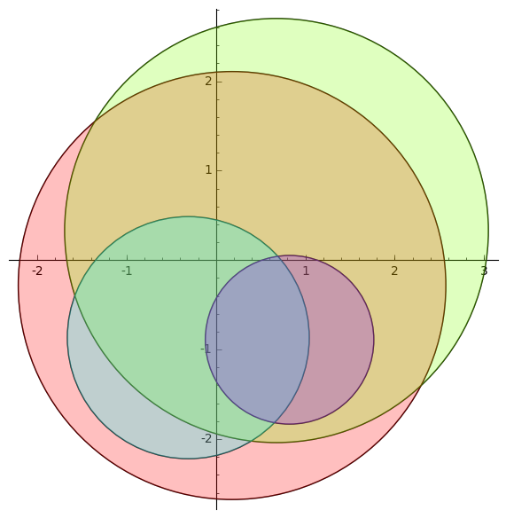

# Gershgorin Disks

Gershgorin circle theorem roughly states that the eigenvalues of an $n \times n$ matrix lie inside $n$ circles where $i$-th circle is centred at $A_{i,i}$ and its radius is the sum of the absolute values of the off-diagonal entries of the $i$-th row of $A$. Applying this to $A^{\top}$ implies that the radius of this circles shall be the smaller of the sums for rows and columns. The following Sage code draws the circles for a given matrix.
```
def Gershgorin(A,evals=False):
    # A is a square matrix
    # Output is the Gershgorin disks of A
    
    from sage.plot.circle import Circle
    from sage.plot.colors import rainbow
    
    n = A.ncols()
    Colors = rainbow(n, 'rgbtuple')
    E = point([])
    
    B = A.transpose()
    R = [(A[i-1,i-1], min(sum( [abs(a) for a in (A[i-1:i]).list()] )-abs(A[i-1,i-1]),sum( [abs(a) for a in (B[i-1:i]).list()] )-abs(B[i-1,i-1]))) for i in range(1,n+1)]
    C = [ circle((real(R[i][0]),imaginary(R[i][0])), R[i][1], color="black") for i in range(n)]
    if evals == True:
        E = point(A.eigenvalues(), color="black", size=30)
    CF = [ circle((real(R[i][0]),imaginary(R[i][0])), R[i][1], rgbcolor=Colors[i], fill=True, alpha=1/n) for i in range(n)] 
    
    (sum(C)+sum(CF)+E).show()

```
And here is a sample output:
```
A =  random_matrix(CDF,4)
Gershgorin(A)
```
 Gershgorin disks for a randomly generated $4\times 4$ complex matrix

If you want to see the actual eigenvalues, call the function as below:
```

Gershgorin(A,evals=True)

```
