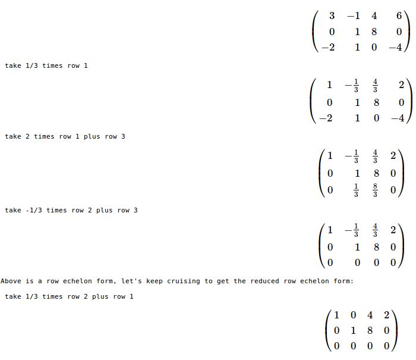
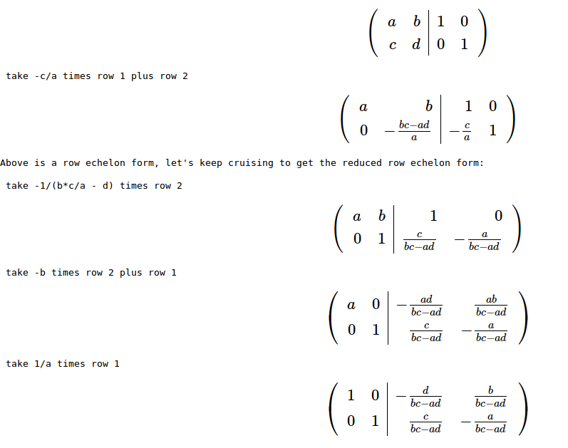
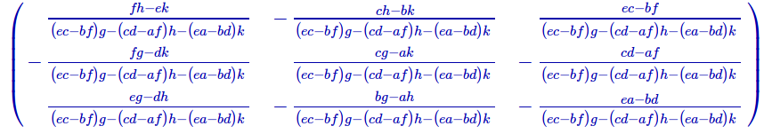
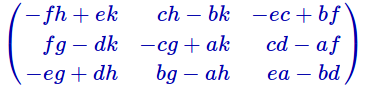

# Step-by-step reduction

One of the things that I always tell my students is to check their solutions when they are done solving a problem. That by itself can mean several things, depending on what the problems is. Of course after solving a system of linear equations, one would plug in the solutions into the original system of equations to see if they are satisfied. The harder part is to come up with a way to check if you've done the row-reduction correctly or not. One can easily use Sage to see if the reduced row echelon form is computed correctly. If `A` is your matrix, just input `A.rref()` to find the reduced row echelon form of it.

But still sometimes in the case that the answer is wrong, one might get frustrated by not trying to figure out in which step they've made an error, or sometimes they might just get stuck. Considering that row-reduction is a time consuming process, it is plausible to assume that some one can easily give up after a few tries. I have found this nice code in Sage that shows step-by-step Gauss-Jordan elimination process, and actually tells you what to do in each step, from [here](https://ask.sagemath.org/question/8840/how-to-show-the-steps-of-gauss-method/). Then I did a little bit of customization on it. Here is the final version:
```
# Naive Gaussian reduction
def gauss_method(MATRIX,rescale_leading_entry='Last'):
    """Describe the reduction to echelon form of the given matrix of rationals.

    MATRIX  matrix of rationals   e.g., M = matrix(QQ, [[..], [..], ..])
    rescale_leading_entry='First' make the leading entries to 1's while doing Gaussisan ellimination
    rescale_leading_entry='Last' (Default) make the leading entries to 1's while reducing

    Returns: reduced form.  Side effect: prints steps of reduction.

    """
    M = copy(MATRIX)
    num_rows=M.nrows()
    num_cols=M.ncols()
    show(M.apply_map(lambda t:t.full_simplify()))

    col = 0   # all cols before this are already done
    for row in range(0,num_rows): 
        # ?Need to swap in a nonzero entry from below
        while (col < num_cols
               and M[row][col] == 0): 
            for i in M.nonzero_positions_in_column(col):
                if i > row:
                    print " swap row",row+1,"with row",i+1
                    M.swap_rows(row,i)
                    show(M.apply_map(lambda t:t.full_simplify()))
                    break     
            else:
                col += 1

        if col >= num_cols:
            break

        # Now guaranteed M[row][col] != 0
        if (rescale_leading_entry == 'First'
           and M[row][col] != 1):
            print " take",1/M[row][col],"times row",row+1
            M.rescale_row(row,1/M[row][col])
            show(M.apply_map(lambda t:t.full_simplify()))
            
        for changed_row in range(row+1,num_rows):
            if M[changed_row][col] != 0:
                factor = -1*M[changed_row][col]/M[row][col]
                print " take",factor,"times row",row+1,"plus row",changed_row+1 
                M.add_multiple_of_row(changed_row,row,factor)
                show(M.apply_map(lambda t:t.full_simplify()))
        col +=1

    print "Above is a row echelon form, let's keep cruising to get the reduced row echelon form:\n"
    
    for i in range(num_rows):
        row = num_rows-i-1
        if M[row] != 0:
            for col in range(num_cols):
                if M[row,col] != 0:
                    if M[row,col] != 1:
                        print " take",1/M[row][col],"times row",row+1
                        M.rescale_row(row,1/M[row][col])
                        show(M.apply_map(lambda t:t.full_simplify()))
                    break

            for changed_row in range(row):
                factor = -1 * M[row-1-changed_row,col]
                if factor != 0:
                    print " take", factor,"times row", row+1, "plus row", row-1-changed_row+1
                    M.add_multiple_of_row(row-1-changed_row,row,factor)
                    show(M.apply_map(lambda t:t.full_simplify()))
    return(M.apply_map(lambda t:t.full_simplify()))

```
And here is a sample run:
```
M = matrix(SR,[[3,-1,4,6],[0,1,8,0],[-2,1,0,-4]])
gauss_method(M,rescale_leading_entry='First')

```
And the output looks like this: 

Click [here](http://sagecell.sagemath.org/?z=eJytVt9v2zYQfg-Q_-GmPERqaM3aimEw5g4Fig0F5qBN9jDAMwRaomwiFCWIVF3vr--RlGzKloOlLR8kiveL9313pG7gnvJPDP6krVKcSmhY3maaV_L6KmcFbMx6WjK9rfJw8fbvh_f_kIapjAqWCkZzLjcpk7rZz2__okrfRrPrK8ARBME7VGv4moHesqNb0BWwbMsETouqKaEqrMIGdyGhpLrhn81aQ402FSq-vnIuXXQY00EpizcxgQXMO3n48SOB5TKOV_iyT3xEztOFBP7gDWaA9k9uz50YjJgzZXae3CrYbblgkFdG5GBTiBsTgpdcUgfdM1EsTBC-YwVthY7-ZziLH0p7MB6YbhupZk7AcotlDPDIcwasKFimZ_Ch4VIrUJrVyuLVk3DAFGnqwEXgsqredxx3QMm2TJtqp-aLWJp36K1nlbDr5t2vq221CxcxrWuxT0tah4KW65yCnum4aIVIFS9rwYt9GEVRvwd0gMGnOLsBKoT5VrBmmJDBhSugOKGiQXj2CLtkzgzlgHsCjjVL5YaFU9JvN5qB0wHr9Pd7hgAhnGpHa6NPQVbyP9ZUFus9FE1VYkRR7Y5mDvbQbO63Q75HcTeozGGxxJirJcpXMMdEBtH7nXITF9FycdO6UtwQoVIujee2lCZU3z3-4AUavzGpjgjNqA3LELjsUC0g-LhLSLDjeusW-F0ybruIjZUFLcQH4dG43guJHXOxRgKf7GwoZ0KxkcwM8HdzSPoq6aAwy2_mB0JODG0M3-IG7rFENi3FEtGmCnyyfkCyBs7D0ZY1pHZnwyDaKffoLjklsOdGY5MHJPnR0yeB5iW2-ZGxoeki7neDQkvOwPwE5W8g6PhlCjXbmmbK00FruYI6ttfQASK3WHp2HrwjxBY00xhnDpPk1YiZn-O58RBP5-ocSBLUou0WvAB3CZx7RMzyPC3xKOY1Yl0VFm7PyrjsIo1U9lfi7qr7UNxdWm_XFV7F5sSzJ5t_TRK8HjTeBk-M1ZA1LVfmqsAzbcP08YLFAj81nP0ruyP-eGzyI7NjnBoX88PZP-GTZNAljqAxem39YGYD76ZNL5xr1hN5rlhGFZMLiucF8qKGG1bFS5rPH9_rpPRPsQO2F3pzDF6vzeCVA3CSTPy6Hu8wRLszfYaSIcow0ofgGhG8ToSzLVy-lcZ68jyDZzvzK8lo7I_Vi35ibvyBn_BIUQFbspWzM-n1lfeP-vhAlsufySQhr8kvK7KckoT8SqY4m_yE0ymZvF6ZYhv-hV_6AXd3VPQFXbJSmA==&lang=sage) to run it in the sage cell server. Note that the code is implemented to work over rational field since it is being used for pedagogical reasons.

In the comments Jason Grout has [added](http://aleph.sagemath.org/?q=a2b497f8-fd66-4d7e-a693-62159e85a70b&lang=sage%3C/p%3E) an interactive implementation of the first part of the code:
```
# Naive Gaussian reduction
@interact
def gauss_method(M=random_matrix(QQ,4,algorithm='echelonizable',rank=3),rescale_leading_entry=False):
    """Describe the reduction to echelon form of the given matrix of rationals.

    M  matrix of rationals   e.g., M = matrix(QQ, [[..], [..], ..])
    rescale_leading_entry=False  boolean  make the leading entries to 1's

    Returns: None.  Side effect: M is reduced.  Note: this is echelon form, 
    not reduced echelon form; this routine does not end the same way as does 
    M.echelon_form().

    """
    num_rows=M.nrows()
    num_cols=M.ncols()
    print M    

    col = 0   # all cols before this are already done
    for row in range(0,num_rows): 
        # ?Need to swap in a nonzero entry from below
        while (col < num_cols                and M[row][col] == 0):              for i in M.nonzero_positions_in_column(col):                 if i > row:
                    print " swap row",row+1,"with row",i+1
                    M.swap_rows(row,i)
                    print M
                    break     
            else:
                col += 1

        if col >= num_cols:
            break

        # Now guaranteed M[row][col] != 0
        if (rescale_leading_entry
           and M[row][col] != 1):
            print " take",1/M[row][col],"times row",row+1
            M.rescale_row(row,1/M[row][col])
            print M
        change_flag=False
        for changed_row in range(row+1,num_rows):
            if M[changed_row][col] != 0:
                change_flag=True
                factor=-1*M[changed_row][col]/M[row][col]
                print " take",factor,"times row",row+1,"plus row",changed_row+1 
                M.add_multiple_of_row(changed_row,row,factor)
        if change_flag:
            print M
        col +=1

```
One of the uses of this can be to find the inverse of a matrix step by step. For example:
```
var('a b c d')
A = matrix([[a,b],[c,d]])
R = gauss_method(A.augment(identity_matrix(A.ncols()),subdivide=True))
```
will give you: Or you can run it for a generic matrix of size 3 (for some reason it didn't factor i, so I used letter k instead:)
```
var('a b c d e f g h i j k l m n o p q r s t u v w x y z')
A = matrix([[a,b,c],[d,e,f],[g,h,k]])
R = gauss_method(A.augment(identity_matrix(A.ncols()),subdivide=True))
```
The steps are too long, so I'm not going to include a snapshot, if you are interested look at the steps [here](http://sagecell.sagemath.org/?z=eJytVkuP2zYQvi-w_2HiPayUpdXoasQpDAQtCtSLZpNDAdcQaImyWVOUSlLrOL8-Q1KyJFtedNPyoAfnxfm-GZJ38Ej5M4Nfaa01pxIUy-rU8FLe3mQsh62dTwpmdmUWLBdfnn77kyimUypYIhjNuNwmTBp1nN__TrW5D2e3N4BjMpl8RDXFNwzMjnVuwZTA0h0T-JmXqoAydwpbXIWEghrFv9o5Ra02FTq6vfEufXQY00Epi7YRgSXMG3nw6ROB1SqK1vhyT3yE3tOVBH7hCjNA-71fcyMGK-ZM25XH9xoOOy4YZKUVedg04saE4AWX1EP3QhQHEwQfWU5rYcJ_Gc7hh9IWjCdmaiX1zAtY5rCMAD7zjAHLc5aaGfyhuDQatGGVdni1JJwwRZoacBG4tKyODccNULIuElUe9HwZSfsOevNpKdy8fbfzelcegmVEq0ock4JWgaDFJqNgZibKayESzYtK8PwYhGHYrgEdYPB3-HUHVAj7r2HDMCGLC9dA8YMKhfAcEXbJvBnKAdcEHGuWyi0L3pF2ueEMvA44pz8_MgQI4dQHWll9CrKU35gqHdZHyFVZYERRHjozD3tgF_f-lG8nbgaVGSxXGHO9Qvka5pjIIHq7Um7jIlo-blKVmlsidMKl9VwX0oZqu6c_eI7GH2yqI0I7KssyTHx2qDYh-HiIyeTAzc5P8Id43HYZWSsHWoAPwsNxvVcSO-ZigwTu3ddQzoRmI5lZ4B_mELdV0kBhpz_MT4ScGboYfYs7eMQS2dYUS8TYKuiT9QbJGjgPRlvWktrsDYNo59yju_icwJYbg00-IfFPPX0yMbzANu8YG5ouo3Y1KHTkDMzPUP4PBHV_tlDTnW2mLBm0li-orr2GDhC55apn14N3hNicpgbjzGEavx0x6-d4aTzE07u6BJJMKlE3E70ADzFcekTMsiwpcCvmFWJd5g7unpV12UQaqewfxN1X96m4m7QWmxKPYrvjuZ2tf0wSPB4MngZ7xipIVc21PSpwT9sy0x2wWODnhrO_ZLPFd9sm75gd49S6mJ_2_imfxoMu8QSN0evqBzMbeLdtemVfc57IS8UyqhhfUbwskFc13LAqXtN8_fF_7ZT9XeyE7ZXeHIO312bw1gM4jaf9uh7vMES7MX2BkiHKMNKH4BsRep0IF0u4fiqN9eRlBi925g-SodzF6lWXmLv-wF_4TFEBW7KWswvp7c0zVcE9hQ2kkAEDvGPDDlvyb9iDgAIklFDBP6AAr4BQwzMc4Csc4ds9Blt099vVipINSddklRFGcnxvyY7s17Y4n1BtcHNfRLTeFnicBXg_lIYbm5lzs2hvcCHR9Sbjz6gw_6JqFobfAf5eakY=&lang=sage). But you can check out only the final result by
```
view(R.subdivision(0,1))
```
which will give you And to check if the denominators and the determinant of the matrix have any relations with each other you can multiply by the determinant and simplify:
```
view((det(A)*R.subdivision(0,1)).apply_map(lambda t:t.full_simplify()))
```
to get



Do you think this can help students?
