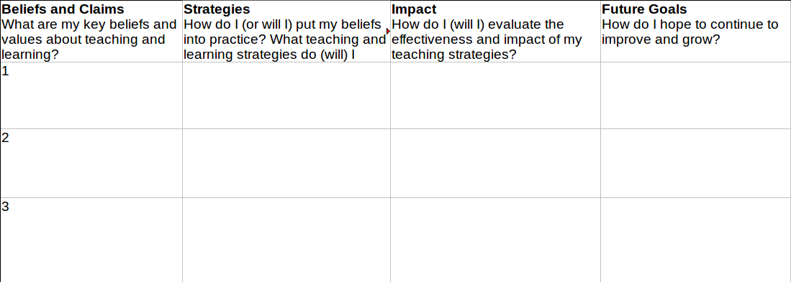

# Teaching philosophies

One of the recent workshops I've attended here at the Taylor Institute was about developing a teaching philosophy offered by Carol Berenson.The goals of the workshop were

	- to reflect on and articulate our beliefs about teaching and learning and where they come from,
	- to make connections between our beliefs and specific teaching and learning strategies, and
	- prepare a draft of a teaching philosophy.

In short, a learner-centred teaching style has the following key elements in it [1-4](#footnote):

	- Actively Engage Learners:

	<li>Material are stimulating, relevant, and interesting
	- Explain material Clearly
	- Use a variety of methods that encourages active learning
	- Adapt to evolving classroom context

</li>
	- Demonstrate Passion, Empathy, and respect:

	<li>Show interest in students' opinions and concerns
	- Understand their diverse talents, needs, prior knowledge, and approach to learning
	- Encourage interaction between students and instructor
	- Share your love of the discipline

</li>
	- Communicate Clear Expectations:

	<li>Make clear the intended learning outcomes and standards for performance
	- Provide organization, structure, and direction for where the course is going

</li>
	- Encourage Student Independence:

	<li>Provide opportunities to develop and draw upon personal interests
	- Offer choice in learning processes and modes of assessment
	- Provide timely and developmental feedback on learning
	- Encourage metacognition to promote self-assessment

</li>
	- Create a Teaching and Learning Community:

	<li>Encourage mutual learning
	- Encourage thoughtful, respectful, and collaborative engagement and dialogue between all members of the classroom community

</li>
	- Use Appropriate Assessment methods:

	<li>Clearly align assessment methods with intended course outcomes
	- Provide clear criteria for evaluation
	- Emphasize deep learning
	- Scaffold assessments to ensure progressive learnin

</li>
	- Commit to Continuous Improvement:

	<li>Gather formative and summative feedback on your teaching
	- Practice critical self-reflection
	- Consult scholarly literature on teaching and learning
	- Identify clear goals for strengthening your teaching

</li>

One of the things that comes to mind that needs to be added to that list is to evaluate the **Impact**, we've had on students. That is, how do we know our students have "learned".

In order to reflect on above mentioned aspects of a teaching philosophy in ours, we were asked to complete the following questionnaire. I'd be happy to see your responses if you care to share.

A teaching philosophy is a statement that clearly and logically communicates

	- **What** your fundamental values and beliefs are about teaching and learning
	- **Why** you hold these values and beliefs (literature and personal experience)

	<li>It is becoming more common to cite one or two literature in teaching philosophies
	- In mine, I usually refer to a few people that have great impact on my philosophy including

	<li>Joseph Stepans on values of different teaching methodologies and importance of misconceptions
	- Gilbert Strang on his approach to teaching linear algebra and what matters most is what students remember eventually

</li>

</li>
	- **How** you translate these values and beliefs into your teaching and learning practice within the context of your discipline (contains also reflections on how your evaluate and plan to continue grow your practice)

Teaching philosophies are supposed to be [5-7](#footnote):

	- 1-2 pages long, single spaced
	- First person, narrative, reflective, authentic voice
	- Grounded in discipline, and avoiding jargon
	- might use a metaphor or critical incident as a way in
	- Can link to scholarly literature (speaks to the why)
	- Demonstrates humility and commitment to on-going growth (one can share their challenges)
	- Paints "your" picture
	- and they are an ever evolving work in progress

A typical flow of a teaching philosophy is that it starts with beliefs (what do you think) and moves into the strategies (what do you do), and mentions the impact (what is the effect of these strategies on learners, self, colleagues), and usually ends with the future goals (how will you improve). The impact can be discussed more in the dossier, which could include comments from students, yourself, and colleagues. In order to collect comments from students one can refer to the evaluation forms that are done at the end of each semester. On top of that I usually ask for one or two feedbacks from students during each semester, which is more tailored to what I have in mind and also can help me modify my strategies during a semester. Here is an example of a mid-semester teaching feedback that I ask students to fill out (please do not fill out this one, but if you have suggestions on how to improve the form itself, the last page of the form is for that purpose and I would appreciate any comments):

In order to organize your thoughts to write a teaching philosophy, you can start by filling out a form like this: 

Here is a PDF file for easier printing: [PDF](https://dl.dropboxusercontent.com/u/3292780/Teaching/Organize.pdf). Maybe fill a few of them and then choose between the best 3. As you are filling them out you might notice that a lot of strategies or impacts bleed into each other. In order to eventually formalize them in terms of a statement there are a few things you can do. One is instead of going by rows, go by columns! Another one is to pick the most important strategy for each key belief and do not repeat it for the other ones. One other issue might be that you have beliefs that you haven't or can't implement them in your classes. You can refer to these key believes as future goals.

Taylor institute has several great resources on this topic that can be found [here](http://www.ucalgary.ca/taylorinstitute/resources/teaching-philosophies-and-dossiers). Most of the information that I've written here are in that webpage as well as several great teaching philosophy (real) samples.
#### Footnotes

	- Arthur Chickering and Zelda F. Gamson (1987) **Seven principles for good practice in undergraduate education**. *AAHE Bulletin*, 39(7) 3-7.
	- P. Ramsden (2003) **Learning to teach in higher education: Thirteen principles for effective university teaching**. *New York: Routledge*.
	- Maryellen Weimer (2013) **Learner-centred teaching: Five key changes to practice**. *John Wiley & Sons*.
	- Lizzio, Alf, Wilson, Keithia, Simons (2002) **University students' perceptions of the learning environment and academic outcomes: Implications for theory and practice**. (Conceptual model for an effective academic environment). *Studies in higher education*, 27(1) 27-52.
	- Schonwetter (2002)
	- Seldin and Seldin (2010)
	- Kearns and Sullivan (2011)
