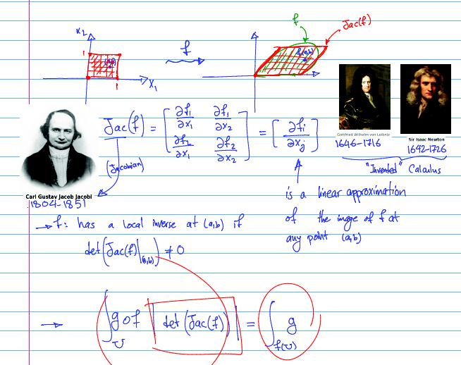
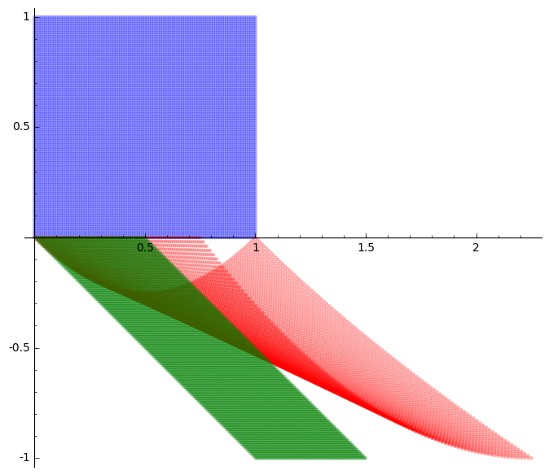

# Determinant and Jacobian

Today I started my linear algebra class by motivating the determinant using a little bit of history and applications. In particular I talked about determinant appearing in the change of variables in integration of multivariate functions in calculus:Then after the class I noticed that my picture of what happens when we linearize the image wasn't very clear as I had drawn it. So I decided to take a look at an actual example. The following code takes a function $f$ that maps $\mathbb{R}^2$ to $\mathbb{R}^2$ and draws three regions:

	- the unit cube in blue,
	- the image of the unit cube under $f$ in red, and
	- the linearization of the image by Jacobian of $f$ at the origin

```
def show_linearization(f,n=100):
    # f is a function that maps R^2 to R^2 for example
    # f(x,y) = ((x^2+2*(x+2)*(y+1))/4-1,y^2-(x+1)*y)
    # The output is three areas:
        # the unit cube
        # the image of unit cube under f
        # the linearization of the image using the Jacobian of f at (0,0)
    
    var('x y')
    A = jacobian(f,(x,y))(0,0)
    p = f(0,0)
    domxy = []
    imgxy = []
    jacxy = []
    for i in range(n+1):
        for j in range(n+1):
            domxy.append((i/n,j/n))
            imgxy.append(f(i/n,j/n))
            jacxy.append(p+A*vector([i/n,j/n]))
            
    P = points(domxy,color="blue",aspect_ratio=1, alpha = .3)
    Q = points(imgxy,color="red",aspect_ratio=1, alpha = .3)
    R = points(jacxy,color="green",aspect_ratio=1, alpha = .3)
    
    (P+Q+R).show()
```
Here is a sample run:
```
f(x,y) = ((x^2+2*(x+2)*(y+1))/4-1,y^2-(x+1)*y)
show_linearization(f)
```
and the output is:



I chose the function in a way that $f(0,0)=(0,0)$ for simplicity. Here it is on sage cell server for you to play around with it: [link](http://sagecell.sagemath.org/?z=eJyVk01vpDAMhu-V-h-s7qHJQGcGtqdKc-h1T-1ob1Wn8kACGUEShdCF_fVrAnQ-1EpdDgHb7-PYJsmFhKY0f94qpQU69Re9MprJWG-S9Zo_XF8BPT9AgmoAQbY6GwTgS_RQo21gu0vBm_CSxoHosLaV-OBYF_ccNsBYt0ujdMG6KOUL1kcJ56v7uyTud-kdORO-6PlM_S4FmNbb1g_b-tIJAegENlM9o8qTqtXKQ9buxWVA1VhQEnlU0FcuHMhL5VnnA3HE20bpIti_MDN7hSEugXpn63g91Tuu7-jYbQf97eR9pKYPE0XzDHPgJ5SluDyxc1N3PfleXkdb1cWZTbnO7GHYCpQGh7oQTNMET6YzRA9fRj_2W6K1QueMqZWODyvN-bkoFDGL5FeqUNqsstHj4l1k3jj2MulfL4HReqJurFHaNywUE2emMm5zs69acRNjYynLmxt-yyaJAStbIhHLn1Oy5yMeypxxJ_Jv0NsjHcqf6YLOmv4GP67sKXqOtnw5XCFGkeur_z3wn10-_g8cgPqS&lang=sage).

What do you think? Any suggestions or comments?
