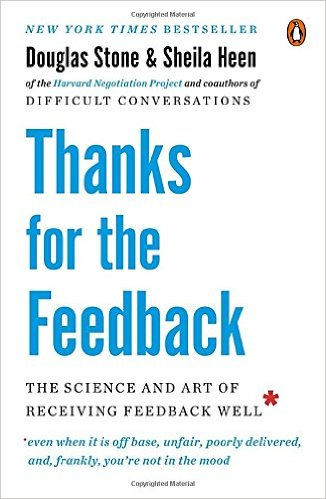

# Feedback - part I

Without much ado here is a book that is changing my life:

And why is it changing my life? Well, the book was introduced to me in a workshop about how to make sense of student comments in regular end-of-semester evaluation forms. So, I started reading the book. The premise of the book is that there are various reasons to get triggered when one receives comments and there are different types of feedback and expecting one type and receiving another type causes some troubles. Then it goes into several examples, and many many details of it and ways to prevent some of them, solve some of them, and avoid some others. I particularly like the book because of its scientific approach to writing, but at the same time being very conversational, and my most favourite part is their examples. They provide tons of examples, many case studies, and several extreme examples.

BUT...

It is changing my life because as I keep reading it, I realize that most of communications and relations in one's life fall into the same categories that the book describes, and one can follow the same strategies to make the whole experience of communicating with others (at any level and of any sort) much much better. To give you an idea of the big picture of the book, let me mention some of the main things:

One of the things that the book mentions is that when you receive a feedback three things can be triggered:

    - Truth:

    <li>It is when you feel like the feedback is not representing the truth. For example, "I couldn't be rude at that party, because I wasn't at that party. And my name is not Mike!" This is of course one of their extreme examples that makes the whole thing make a lot of sense and I love it. In a more realistic way, I could get a comment from a student that I don't have a sense of time! While I go to class 5 minutes early and prepare my slides and the notes, and start right at 10 O'clock to lecture. What the student is saying is not the truth. Well, at least not according to my definition. They go and discuss it in much detail that what happens when we feel the comment about us is not the truth and how we can resolve this. Some of the later chapters of the book are on the different aspects of this trigger.

</li>
    - Relationship:

    <li>It happens when you expect some other type of point of view. For example, a student can tell that "he wasn't organized." and you feel like "after all that work that I put into preparing this class and the schedule that I followed to the minute, and extra problems with solutions that I posted online, you tell me this?". Or in a different way, you might get a comment that "He knows math but he doesn't know how to teach it!" And you'll be like "Who the hell are you to judge my teaching?!" There are a lot to be learnt from the feedback when this gets triggered and the book spends a good amount on this topic.

</li>
    - Identity:

    <li>It is when you feel like you don't know who you are, e.g. "Maybe I am a bad teacher after all", or "What am I doing with my life teaching these courses?" And there are many other things that can be done in this case too.

</li>

The book goes on to identify three types of feedback:

    - Praise:

    <li>"Good job", "Awesome teacher", "Worst instructor ever" etc are examples of praise. It doesn't have much information in it. It simply says the feedback giver is happy or not with the performance. We all need that at times and some times we receive that feedback.

</li>
    - Coaching:

    <li>"Give us more time during the class to work on problems", "provide more examples", "he talks too fast (i.e. don't talk too fast)" etc are examples of coaching. They have lots of information in them and usually these what make you grow.

    <li>If I'm looking for praise and receive coaching instead, I'll be maaaaaaaaaaaaad! "I'm spending lots of time preparing for this course, don't tell me I need to use a larger size font on the worksheets!".
    - If I'm looking for coaching and receive praise instead, I'll be alright but frustrated as I don't know where to go next. "OK, the exam I designed was a good exam and covered all the material, but how can I make it more related to practice problems students are doing? how do I make sure that it's not too much for 2 hours? How would I ask a reasonable question about that topic that I didn't ask about it?".

</li>

</li>
    - Evaluation:

    <li>Your salary gets raised, a student sings up for your next class after they had a course with you before, you get fired, your spouse wants a divorce, you get accepted to graduate school. These are examples of evaluation.

    <li>If I'm looking for praise and I receive evaluation instead, I'll feel a little lost. "OK, my contract got extended, but am I doing well enough? Are you happy with me?".
    - If I'm looking for evaluation and I get praised instead, I'll feel they're hiding something. "Yeah, I know I'm doing a good job, will you sign my contract for next year or not, though?".
    - If I'm looking for coaching and receive evaluation instead, it's just unsettling. "My application for this job got rejected, but you haven't told me what are the strong and weak points on my portfolio, how do I improve it so that I get the job next year, what are the things that you were looking for ans was lacking in my application?".
    - If I'm looking for evaluation and I get coaching instead, I won't care! "Are you gonna hire me or not? I don't care that I should have gone to that conference!"

</li>

</li>

Then the book goes into every detail of every aspect of these topics and provides many many beautiful examples, and comes up with strategies to figure out what situation we are in and how to respond to each situation when facing them. I don't necessarily agree with all of their strategies, and I think on several cases I can do the exact opposite of what they suggest and have a better outcome, but the book is extremely helpful in identifying these situations and classifying them.

If you gave it a try, let me know what you think about it, the whole book, or any of the single details. I'd love to discuss the topics to learn more.
