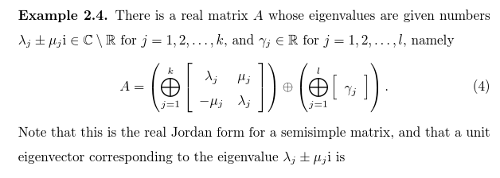
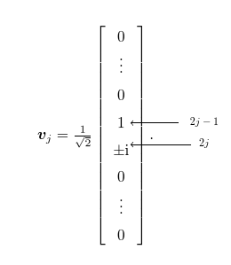

# Nonsymmetric SIEP paper is published in LAA

My first solo paper "Existence of a Not Necessarily Symmetric Matrix with Given Distinct Eigenvalues and Graph" got published in Journal of Linear Algebra and its Applications, yesterday. It took it exactly one year! I've written about it here: [Losing the Symmetry](https://k1monfared.wordpress.com/2016/04/08/losing-the-symmetry/).

The main idea is to use the implicit function theorem to perturb the following matrix in a way that entries corresponding to the edges become nonzero, and by adjusting the rest of the entries to get back to the original spectrum.

You can find the published version [here](https://www.sciencedirect.com/science/article/pii/S002437951730229X?np=y&npKey=0c18348cdb17bfb3776074a5b70ba5b3592604688ecd35f7b90a500af00642ee) (download for the first 50 days is free).
