# Miroslav and the separating wand

In a huge graph, it is hard to determine a bottleneck by just looking at it, or doing any type of search. And by a bottleneck, I mean part of graph that is not very much connected to the other part. In different setting this could mean different things, for example, if your graph is a communication network, then a bottleneck mean the information doesn't get to all of the nodes very easily, there will be traffic around the bottleneck.

One of the celebrated results in algebraic graph theory is by [Miroslav Fiedler](https://en.wikipedia.org/wiki/Miroslav_Fiedler), a Czech mathematician [1, 2], about the algebraic connectivity of a graph. It simply says the second smallest eigenvalue of the Laplacian matrix of a graph determines how connected the graph is. In particular, if it is 0, the graph is disconnected. Furthermore, it shows the eigenvector corresponding to this eigenvalue distinguishes the vertices in the two connected components. In the case that the graph is connected, this eigenvector will find bottlenecks of the graph. Below I first generate a random graph that has a visible bottleneck, then I'll use Fiedler's result to find it computationally.

First, let's generate a random graph with a bottleneck. In order to do so, I'll generate two random graphs, then I look at their disjoint union and put few random edges between them.

```
def random_bottleneck_graph(n1,n2,p1,p2,p):
    #n1 = number of vertices of first part
    #n2 = number of vertices of second part
    #p1 = probability of edges of first part
    #p2 = probability of edges of second part
    #p  = probability of edges between two parts
    
    import random
    
    #generate two parts randomly and put them together
    H1 = graphs.RandomGNP(n1,p1) #generate a random GNP graph for first part
    H2 = graphs.RandomGNP(n2,p2) #generate a random GNP graph for second part
    G = H1.disjoint_union(H2) #form the disjoint union of the two parts
    
    #add edges between two parts
    for i in range(n1): #pick each vertex in H1
        for j in range(n2): #pick each vertex in H2
            a = random.random() #generate a random number between 0 and 1
            if a > 1-p: #with probability p add an edge between the two vertices of H1 and H2
                G.add_edge([(0,i),(1,j)])
    return(G)

```

And here is a sample run:

```
#initialization
n1 = 40 #number of vertices of first part
n2 = 60 #number of vertices of second part
p1 = .7 #probability of edges of first part
p2 = .6 #probability of edges of second part
p = .01 #probability of edges between two parts

#run
G = random_bottleneck_graph(n1,n2,p1,p2,p)

```

Of course when I look at the graph, sage who has generated it knows that the graph has two main parts, and even the vertices are numbered in a way that anyone can recognize it. The left picture is generated by the above 'show' command, and the right picture is using the following code.

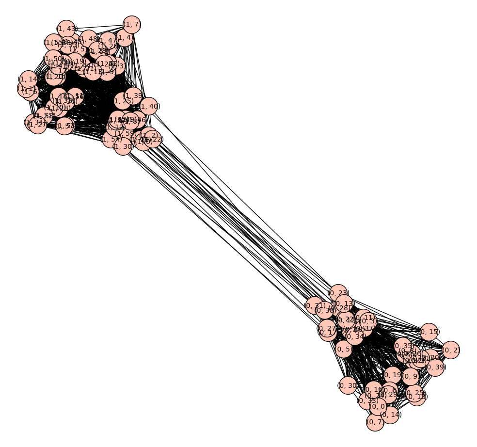

```
def show_random_bottleneck_graph(G,layout=None):
    EdgeColors={'red':[], 'blue':[], 'black':[]}

    for e in G.edges():
        if not e[0][0] == e[1][0]:
            EdgeColors['black'].append(e)
        elif e[0][0] == 0:
            EdgeColors['red'].append(e)
        else:
            EdgeColors['blue'].append(e)
            
    G.show(vertex_labels=False,figsize=[10,10],layout=layout,edge_colors=EdgeColors)

```

So, in order to really get a random graph with a bottleneck, I take the above graph and try to loose the information that I had from it.

```
def relable_graph(G,part=None):
    # input: a graph G
    # output: if part is not given, it gives a random labeling of nodes of graph with integers
    #         if part is given, then it partitions the vertices of G labeling each vertex with pairs (i,j) where i in the number of partition the vertex is in part, and j is an integer.
    
    V = G.vertices()
    E = G.edges()
    
    H = Graph({})
    
    map = {}
    if part == None:
        new_part = None
        import random
        random.shuffle(V)
        
        for i in range(len(V)):
            map[V[i]] = i
    else:
        new_part = [ [] for p in part]
        count = 0
        for i in range(len(part)):
            for w in part[i]:
                map[w] = (i,w)
                new_part[i].append((i,w))
                count += 1
    
    for v,w,l in E:
        H.add_edge([map[v],map[w],l])

    return(H,new_part)

###############################
#run
H = relable_graph(G)[0]
H.show(layout='circular',vertex_labels=False, figsize=[10,10])
```

Now if I look at the graph I won't be able to recognize the bottleneck:

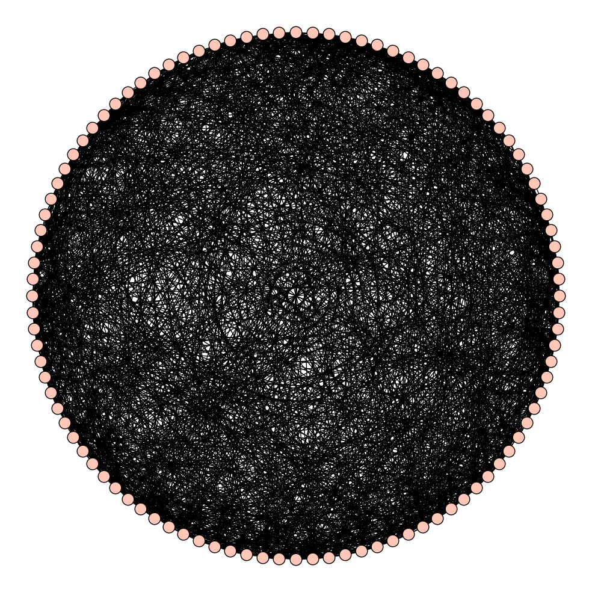

Now that I truly have random graph, which I know has a visible bottleneck, let's see if we can find it. Below I use 'networkx' to compute the Fiedler vector, an eigenvector corresponding to the second smallest eigenvalue of the Laplacian matrix. Then I'll partition the vertices according to the sign of the corresponding entry on this vector:

```
def partition_with_fiedler(G):
    # input: a graph G
    # algorithm: using networkx finds the fiedler vector of G
    # a partitioning of vertices into two pieces according to positive and negative entries of the Fiedler vector
    
    import networkx
    H = G.networkx_graph()
    f = networkx.fiedler_vector(H, method='lanczos')
    
    V = H.nodes()
    P = [[],[]]
    for i in range(len(V)):
        if f[i] >= 0:        
            P[0].append(V[i])
        else:
            P[1].append(V[i])
    
    return(P)

```

Let's see how it is partitioned:

```
P = partition_with_fiedler(H)
H.show(partition=P, layout='circular', vertex_labels=True, figsize=[10,10])
```

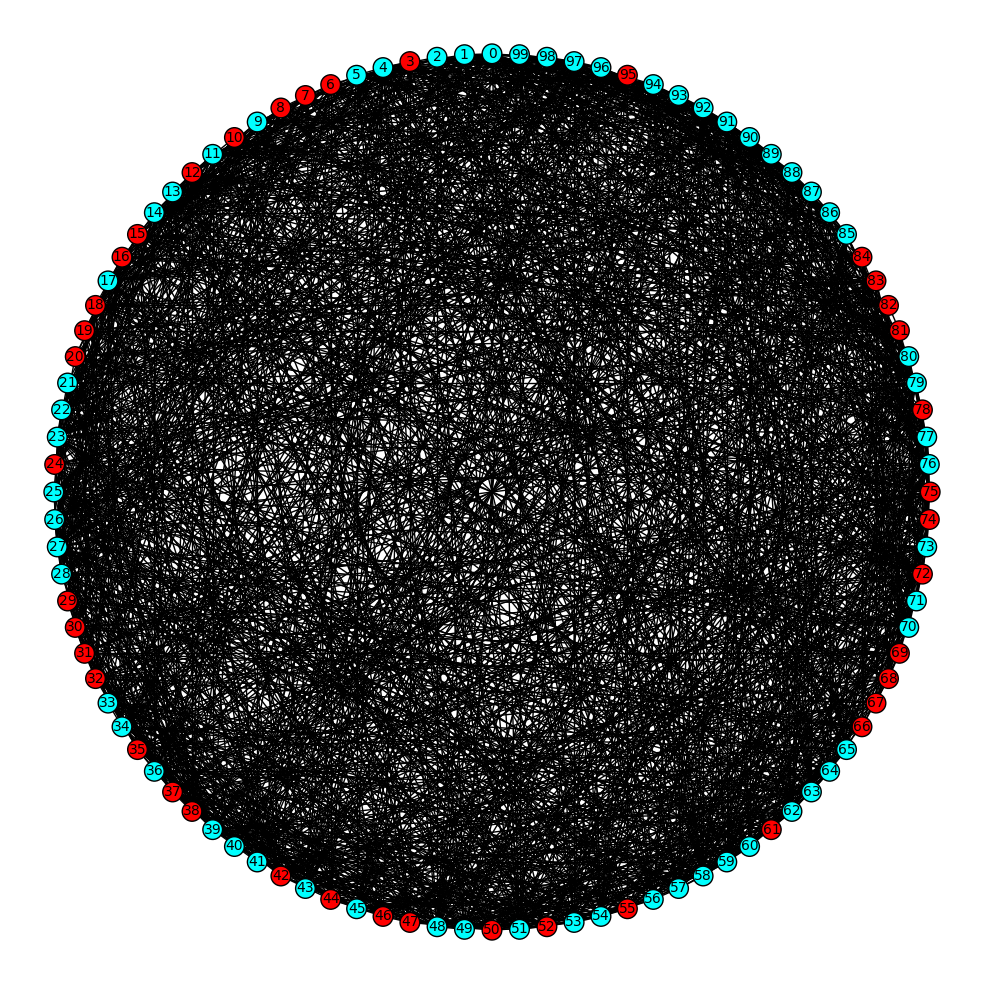

Well, not much can be seen yet. Now let me put the red vertices in one side and the blue vertices in the other side:

```
def position_bottleneck(G):
    P = partition_with_fiedler(G)
    
    V = G.vertices()
    new_pos = {}
    
    for v in V:
        if v in P[0]:
            new_pos[v] = [6*(1+random.random()),6*(2*random.random()-1)]
        else:
            new_pos[v] = [-6*(1+random.random()),6*(2*random.random()-1)]

    return(new_pos)
pos = position_bottleneck(H)
H.show(partition=P, pos=pos, vertex_labels=True, figsize=[10,10])
```

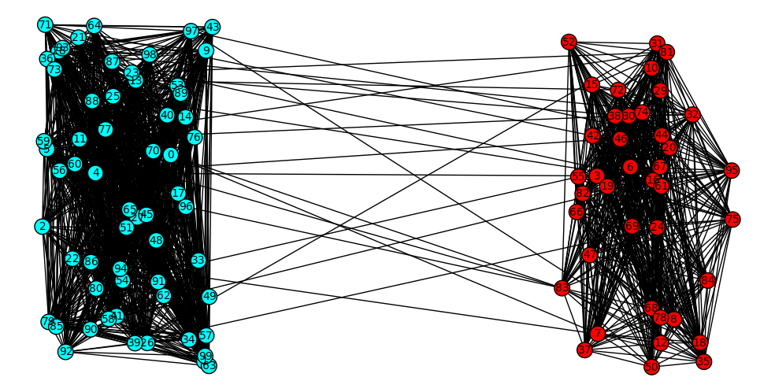

Now it's easy to see the bottleneck of the graph! We can even recover the original picture as follows:

```
(K,newP) = relable_graph(H,part=P)
K.show(partition=newP, layout='circular', vertex_labels=False, figsize=[10,10])
```

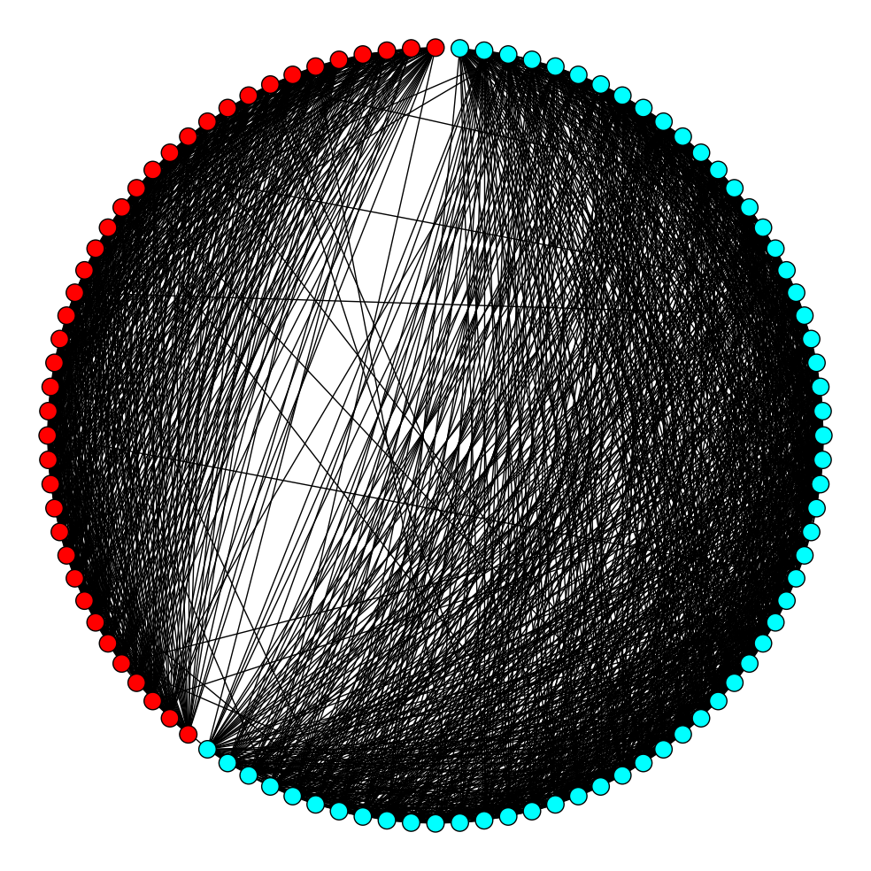

And here is the representation of it using the colored edges:

```
show_random_bottleneck_graph(K,layout='circular') #suggested layouts are "circular" and "spring"
```

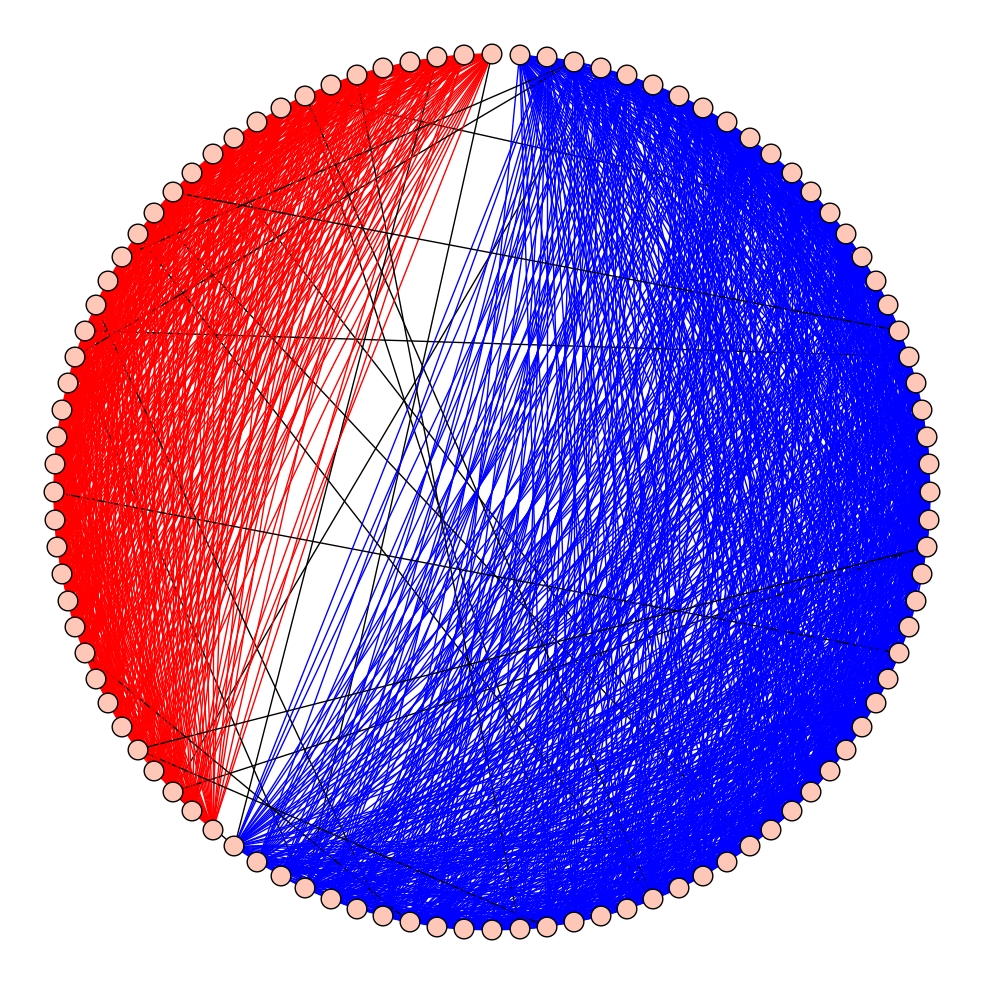

---

**UPDATE: **

Since I posted this, I've been thinking about multiway Fiedler clustering. Here is what I got so far. First I define a list N of number of vertices in each part, and a matrix A which is basically a probability matrix where entry (i,j) is the probability of an edge between part i and part j, hence it is symmetric. If you choose diagonal entries close to 1 and off-diagonal entries close to zero, then you'll get a graph with multiple communities. I'll shuffle the vertices around after creating the multi-community graph.

```
def multi_bottleneck_graph(N,A):
    #N = list of size n of number of vertices in each part
    #A = an nxn matrix where entry (i,j) shows the probability of edges between part i and part j of vertices, and n is the number of parts.
    
    import random
    
    n = len(N)
    G = Graph({})
    
    
    #add vertices for each part
    for i in range(n):
        for j in range(N[i]):
            G.add_vertex((i,j))
    
    V = G.vertices()
    
    #add edges
    for v in V:
        for w in V:
            if not v == w:
                a = random.random() #generate a random number between 0 and 1
                p = A[v[0],w[0]]
                if a > 1-p: #with probability p add an edge between the two vertices of H1 and H2
                    G.add_edge([v,w])
            
    return(G)

def relable_graph(G,part=None):
    # input: a graph G
    # output: if part is not given, it gives a random labeling of nodes of graph with integers
    #         if part is given, then it partitions the vertices of G labeling each vertex with pairs (i,j) where i in the number of partition the vertex is in part, and j is an integer.
    
    V = G.vertices()
    E = G.edges()
    
    H = Graph({})
    
    map = {}
    if part == None:
        new_part = None
        import random
        random.shuffle(V)
        
        for i in range(len(V)):
            map[V[i]] = i
    else:
        new_part = [ [] for p in part]
        count = 0
        for i in range(len(part)):
            for w in part[i]:
                map[w] = (i,w)
                new_part[i].append((i,w))
                count += 1
    
    for v,w,l in E:
        H.add_edge([map[v],map[w],l])

    return(H,new_part)

def shuffled_multi_bottleneck_graph(N,A):
    G = multi_bottleneck_graph(N,A)
    H = relable_graph(G)[0]
    return(H)

# run
N = [10,15,20]
A = matrix([[.9,.01,.01],[.01,.9,.01],[.01,.01,.9]])
G = shuffled_multi_bottleneck_graph(N,A)
G.show(layout='circular',vertex_labels=False, vertex_size=30, figsize=[10,10])

```

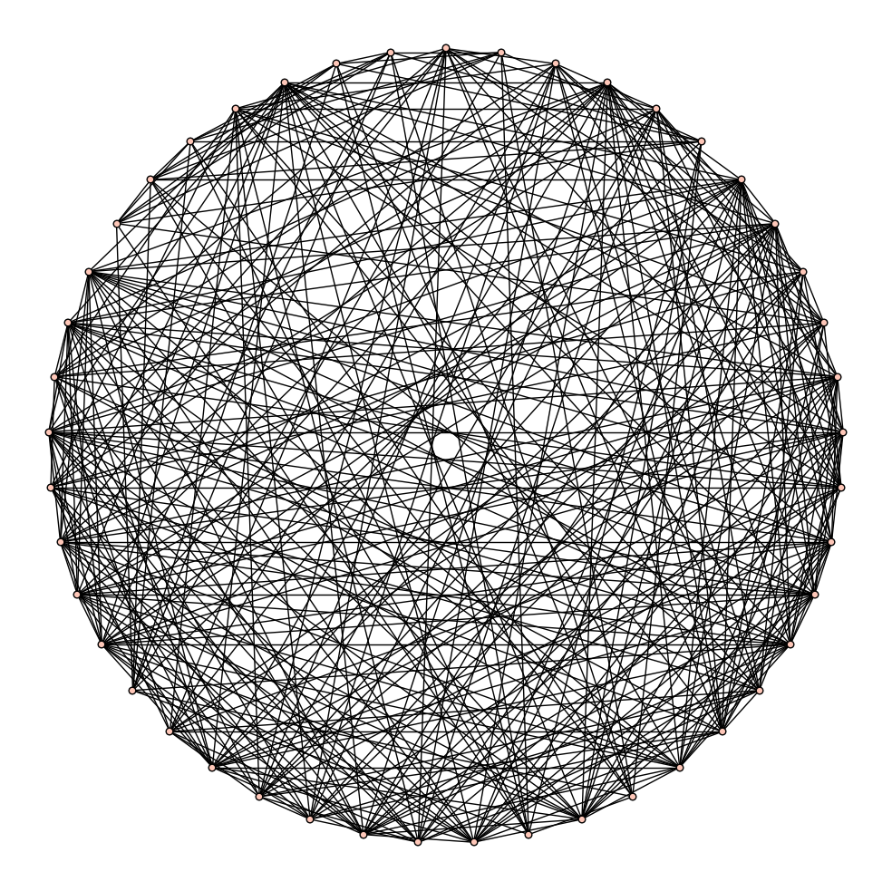

Then I break the graph into two pieces using Fiedler vector, compare the two pieces according their algebraic connectivities (second smallest eigenvalue of the Laplacian) and break the smaller one into two pieces and repeat this process, until I get n communities.

```
def partition_with_fiedler(G):
    # input: a graph G
    # algorithm: using networkx finds the fiedler vector of G
    # a partitioning of vertices into two pieces according to positive and negative entries of the Fiedler vector
    
    import networkx
    H = G.networkx_graph()
    f = networkx.fiedler_vector(H, method='lanczos')
    
    V = H.nodes()
    P = [[],[]]
    for i in range(len(V)):
        if f[i] >= 0:        
            P[0].append(V[i])
        else:
            P[1].append(V[i])
    
    return(P)
    

def multi_fiedler(G,n=2):
    if n == 2:
        P = partition_with_fiedler(G)
        return(P)
    
    else:
        import networkx

        P = partition_with_fiedler(G)
        H = [ G.subgraph(vertices=P[i]) for i in range(2) ]
        C = [ (networkx.algebraic_connectivity(H[i].networkx_graph(), method='lanczos')/H[i].order(),i) for i in range(2) ]
        l = min(C)[1]
        
        while n > 2:
            n = n-1
            
            temP = partition_with_fiedler(H[l])
            nul = P.pop(l)
            P.append(temP[0])
            P.append(temP[1])

            
            temH = [ G.subgraph(vertices=temP[i]) for i in range(2) ]
            nul = H.pop(l)
            H.append(temH[0])
            H.append(temH[1])
        
             
            temC = [ (networkx.algebraic_connectivity(temH[i].networkx_graph(), method='lanczos')/temH[i].order(),i) for i in range(2) ]
            nul = C.pop(l)
            C.append(temC[0])
            C.append(temC[1])
            l = min(C)[1]
            
        return(P)
# run
G.show(partition=K, layout='circular', figsize=[10,10])

```

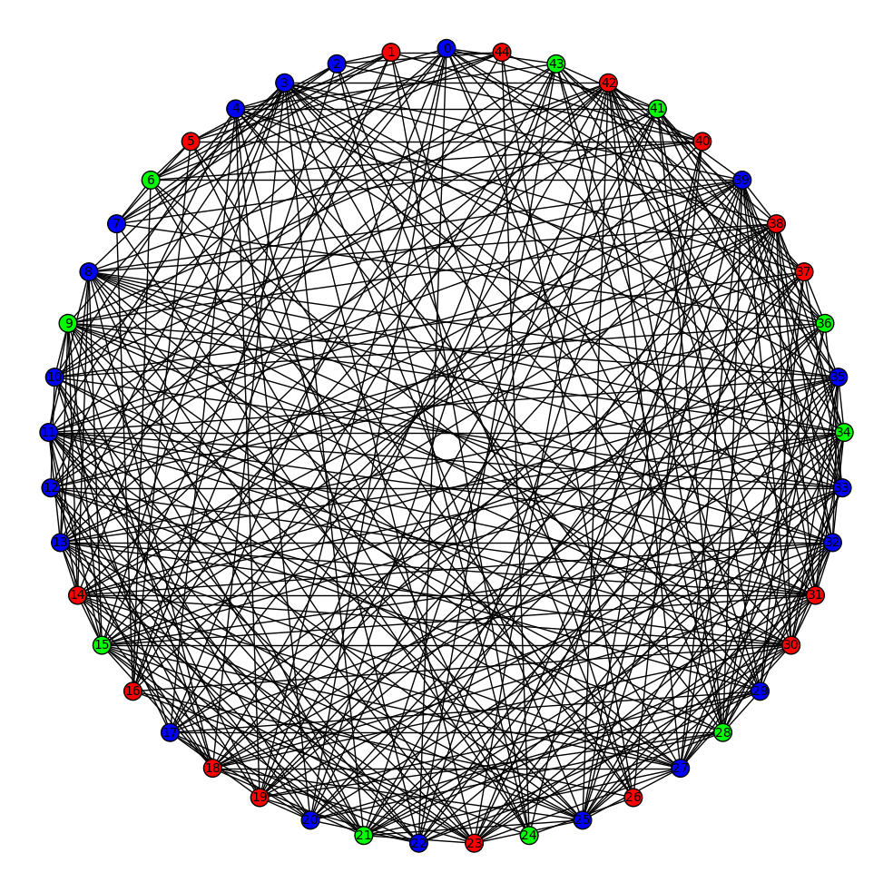

Now I can separate same colour vertices to see the communities in the graph:

```
def show_communities(G,n):
    #G: a graph
    #n: number of communities > 1
    if n == 1:
        P = [G.vertices()]
    elif n > 1:
        P = multi_fiedler(G,n)
    else:
        raise ValueError('n > 0 is the number of communities.')
    L,newP = relable_graph(G,part=P)
    L.show(partition=newP, layout='circular', vertex_labels=False, figsize=[10,10])

# run
show_communities(G,3)

```

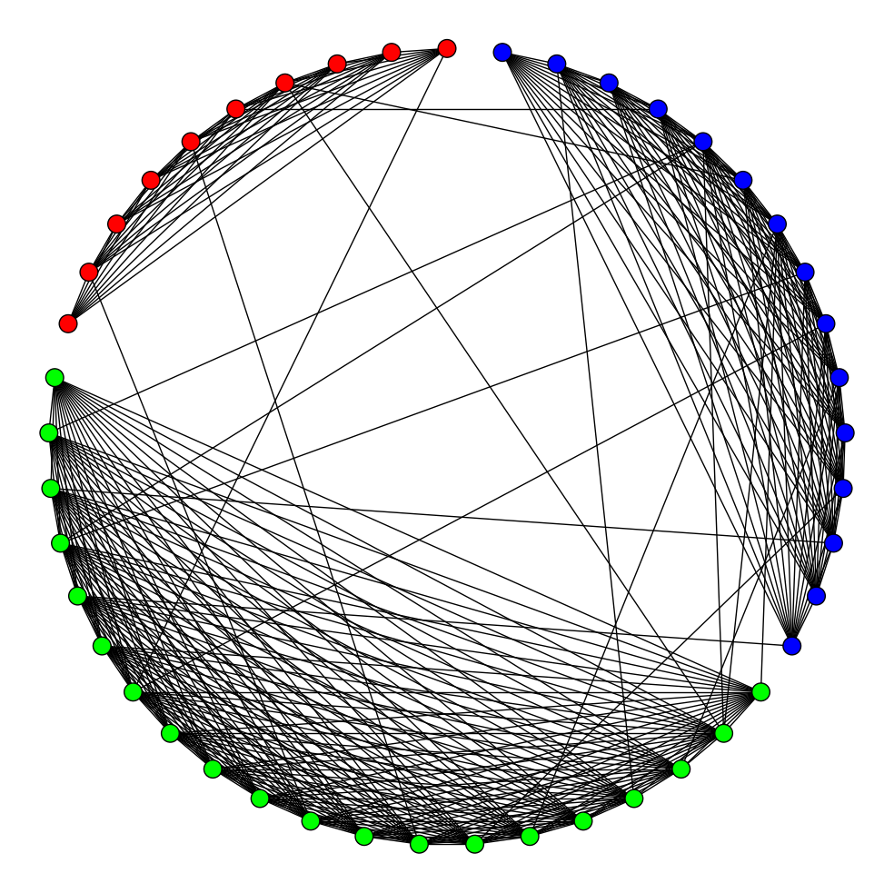

There is only one important thing in using networkx. It seems like the default method (tracemin) for algebraic_connectivity and for fiedler_vector has a bug. So, I used the method='lanczos' option there.

You might be interested to see what happens if you ask for more or less than 3 communities. Here are a couple of them:

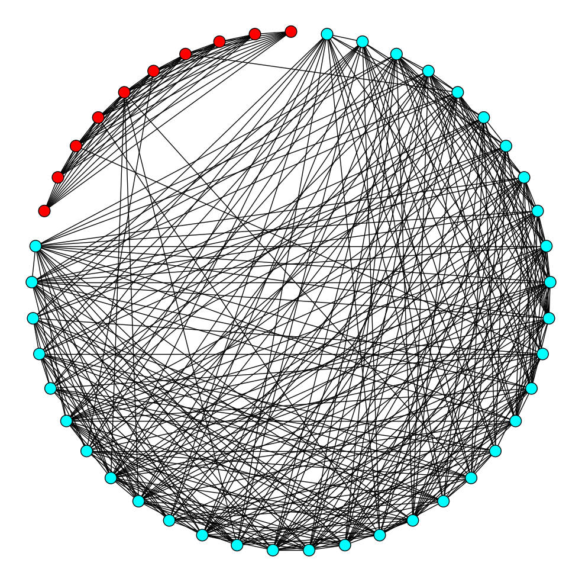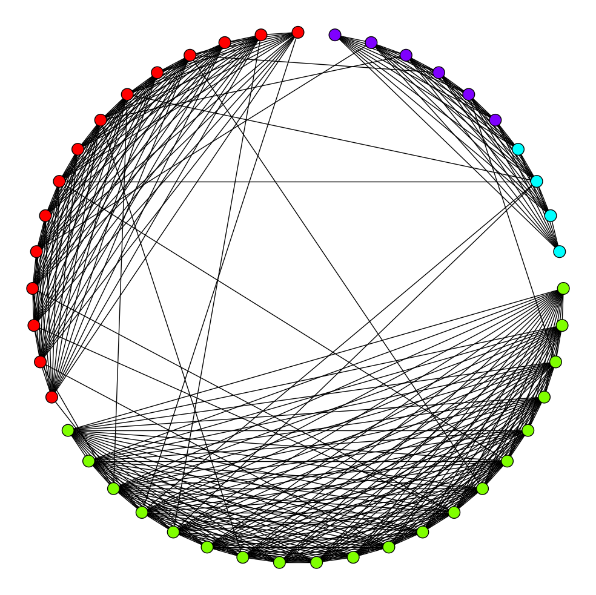

The next question is how to decide about number of communities.

---

    - M. Fiedler, Algebraic connectivity of graphs. *Czechoslovak Math. J.* **23**(98):298--305 (1973).
    - M. Fiedler, A property of eigenvectors of nonnegative symmetric matrices and its application to graph theory, Czech. Math. J. **25**:619--637, (1975).
