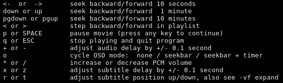

# Listen to your pc music through your phone

So I have this bunch of music on my external hard drive that is connected to my PC at home and I need to get over there to play it while I'm at home, but that's usually a hassle, well, to some extent. So, here is a partial solution to it. I ssh into my PC from my phone and play the music, and listen to it from my bluetooth loud speakers or headphone, while doing my other things at home (specially in the morning having breakfast).

#### 

#### Starting an ssh server on linux:

```
service sshd start
```

This should open the port 22. Check it by:

```
netstat -ant | grep 22
tcp     0     0     192.168.122.1:53     0.0.0.0:*           LISTEN 
**tcp     0     0     0.0.0.0:22           0.0.0.0:*           LISTEN** 
tcp     0     0     192.168.0.15:44664   192.0.78.22:443     ESTABLISHED
tcp     0   468     192.168.0.15:22      192.168.0.11:33814  ESTABLISHED
tcp     0     0     192.168.0.15:44648   192.0.78.22:443     ESTABLISHED
**tcp6    0     0     :::22                :::*                LISTEN**
```

If I want the server to start on boot I can do this:

```
chkconfig sshd on
```

Then I need to figure out what is my PC's local IP address so that I can ssh into it. A quick way to do it is by looking at the output at ifconfig and going through to find the corresponding IP. Right now mine looks like this:

```
enp0s25: flags=4099<UP,BROADCAST,MULTICAST>  mtu 1500
        ether **:85:**:0b:**:6c  txqueuelen 1000  (Ethernet)
        RX packets 0  bytes 0 (0.0 B)
        RX errors 0  dropped 0  overruns 0  frame 0
        TX packets 0  bytes 0 (0.0 B)
        TX errors 0  dropped 0 overruns 0  carrier 0  collisions 0
        device interrupt 19  memory 0xf0500000-f0520000  

lo: flags=73<UP,LOOPBACK,RUNNING>  mtu 65536
        inet 127.0.0.1  netmask 255.0.0.0
        inet6 ::1  prefixlen 128  scopeid 0x10
        loop  txqueuelen 1  (Local Loopback)
        RX packets 468  bytes 36452 (35.5 KiB)
        RX errors 0  dropped 0  overruns 0  frame 0
        TX packets 468  bytes 36452 (35.5 KiB)
        TX errors 0  dropped 0 overruns 0  carrier 0  collisions 0

virbr0: flags=4099<UP,BROADCAST,MULTICAST>  mtu 1500
        inet 192.168.122.1  netmask 255.255.255.0  broadcast 192.168.122.255
        ether 00:00:00:00:00:00  txqueuelen 1000  (Ethernet)
        RX packets 0  bytes 0 (0.0 B)
        RX errors 0  dropped 0  overruns 0  frame 0
        TX packets 0  bytes 0 (0.0 B)
        TX errors 0  dropped 0 overruns 0  carrier 0  collisions 0

wlp48s0: flags=4163<UP,BROADCAST,RUNNING,MULTICAST>  mtu 1500
**        inet 192.168.0.15  netmask 255.255.255.0  broadcast 192.168.0.255**
        inet6 ****:6477:****:73e2:****:d8ff:****:e8b2  prefixlen 64  scopeid 0x0
        inet6 fe80::****:d8ff:****:e8b2  prefixlen 64  scopeid 0x20
        ether **:16:**:36:**:b2  txqueuelen 1000  (Ethernet)
        RX packets 970380  bytes 1163277882 (1.0 GiB)
        RX errors 0  dropped 0  overruns 0  frame 0
        TX packets 469268  bytes 56819419 (54.1 MiB)
        TX errors 0  dropped 0 overruns 0  carrier 0  collisions
```

and that second line under wlp48s0 will be my ip. Since I'm using a dynamic ip assignment, this might change every time my PC connects to network, so I have written a script that runs at startup and looks this up (and my public ip) every one hour and writes it to a file in my dropbox so that I can access it from my phone! Here it is:

```
#!/bin/bash
while true; do
    ifconfig wlp48s0 | grep cast > ~/Dropbox/opt/myip
    wget http://ipecho.net/plain -O - -q >> ~/Dropbox/opt/myip
    sleep 1h
done

```

#### 

#### ssh clients for android and some shortcuts

The next step is to run a ssh client on my phone. Currently I'm using [JuiceSSH](https://play.google.com/store/apps/details?id=com.sonelli.juicessh&hl=en), but I think I'll be moving to [ConnectBot](https://f-droid.org/packages/org.connectbot/) or some other [free](https://f-droid.org/) apps soon, or probably I should just run a terminal on my phone and ssh from there. After connecting to **192.168.0.15** on port **22** I can browse through the files on my PC and run them. Since my external hard drive has a long name and is mounted somewhere that requires me to remember a lot of things I just added an alias to the .bashrc file so that I can directly go to my music folder:

```
alias cdmusic="cd 'path/to/my music/folder/'"

```

Then I find the folder I wanna play and use mplayer to play it. Since I had this other script to personalize my mplayer a little bit, I keep using that to play all the files in a folder in a fashinable way:

```
alias play="mplayer -msgcolor -cache 500 20 *.*"

```

You can find the full list in the mplayer man page: `man mplayer` (See the bottom of the post). And if that's too much, here is short list of  essential ones from `mplayer --help`:



You could also turn your phone into a remote control for your video playback this way! I should still find good ways to do this over internet, and stream the music to my phone rather than to a bluetooth device! I mean, I don't want an entire personal cloude running on my PC, but why not!

 

#### bluetooth and audio settings

In order to have a bluetooth device automatically connect to your PC you can do this:

```
bluetoothctl
```

This will show a list of all the bluetooth devices, their MAC addresses, and their names. Then I can "trust" them by typing

```
trust de:vi:ce:ma:ca:dd:re:ss
```

This makes my device to connect to the PC automatically when it's on (read the help for complete set of commands and options). Now to change the sound output to each device I can do this, assuming pulse audio is in use:

```
pacmd list-cards
```

I get a list of audio devices and lots of descriptions. Somewhere there you should be able to find your bluetooth device and an "index" related to it. mine is "3" right now (but it changes each time the device disconnects and connects) for my sound box, and "0" for the PC speakers. Then all I need to do is:

```
echo "set-default-sink 3" | pacmd
```

or

```
echo "set-default-sink 0" | pacmd
```

to go back to PC.

Partial Update:

Apparently there are ways to assign a static IP to your computer, for example see [here](http://danielgibbs.co.uk/2012/06/fedora-17-set-static-ip-address/), but there are some problems that needs to be worked out afterwards, e.g. disconnecting from internet etc. Fortunately, my modem can set a static IP address for each MAC address that I could manage through its settings. That is, I don't need to read the IP of my PC each time.

#### ToDo

    - figure out how to find the correct local ip automatically
    - add the above to my script!
    - figure out how to find the correct index for the sound output device automatically.

Note:
to run a script so that you can change the current directory run it like this:

```
. myscript
```

---

**References:**

    - **starting an open SSH server:** https://linuxconfig.org/how-to-install-start-and-connect-to-ssh-server-on-fedora-linux
    - **starting an open SSH server:** https://docs.fedoraproject.org/en-US/Fedora/14/html/Deployment_Guide/s2-ssh-configuration-sshd.html
    - **trusting a bluetooth device from terminal:** https://ask.fedoraproject.org/en/question/102203/how-to-connect-a-bluetooth-device-and-make-it-trusted-using-terminal-on-fedora-25/
    - **choosing the audio output:** https://stackoverflow.com/questions/5972932/how-to-select-the-output-device-of-audio-in-ubuntu-manually
    - **changing the current folder from a script:** https://stackoverflow.com/questions/874452/change-current-directory-from-a-script/874464#874464

---

**footnotes:**

Here is a full list of keyboard shortcuts for mplayer that one can use (even via ssh):

```
keyboard control
              LEFT and RIGHT
                   Seek backward/forward 10 seconds.
              UP and DOWN
                   Seek forward/backward 1 minute.
              PGUP and PGDWN
                   Seek forward/backward 10 minutes.
              [ and ]
                   Decrease/increase current playback speed by 10%.
              { and }
                   Halve/double current playback speed.
              BACKSPACE
                   Reset playback speed to normal.
              < and >
                   Go backward/forward in the playlist.
              ENTER
                   Go forward in the playlist, even over the end.
              HOME and END
                   next/previous playtree entry in the parent list
              INS and DEL (ASX playlist only)
                   next/previous alternative source.
              p / SPACE
                   Pause (pressing again unpauses).
              .
                   Step forward.  Pressing once will pause movie, every consecutive press will play one frame and then go into pause mode again (any other key unpauses).
              q / ESC
                   Stop playing and quit.
              U
                   Stop playing (and quit if -idle is not used).
              + and -
                   Adjust audio delay by +/- 0.1 seconds.
              / and *
                   Decrease/increase volume.
              9 and 0
                   Decrease/increase volume.
              ( and )
                   Adjust audio balance in favor of left/right channel.
              m
                   Mute sound.
              _ (MPEG-TS, AVI and libavformat only)
                   Cycle through the available video tracks.
              # (DVD, Blu-ray, MPEG, Matroska, AVI and libavformat only)
                   Cycle through the available audio tracks.
              TAB (MPEG-TS and libavformat only)
                   Cycle through the available programs.
              f
                   Toggle fullscreen (also see -fs).
              T
                   Toggle stay-on-top (also see -ontop).
              w and e
                   Decrease/increase pan-and-scan range.
              o
                   Toggle OSD states: none / seek / seek + timer / seek + timer + total time.
              d
                   Toggle frame dropping states: none / skip display / skip decoding (see -framedrop and -hardframedrop).
              v
                   Toggle subtitle visibility.
              j and J
                   Cycle through the available subtitles.
              y and g
                   Step forward/backward in the subtitle list.
              F
                   Toggle displaying "forced subtitles".
              a
                   Toggle subtitle alignment: top / middle / bottom.
              x and z
                   Adjust subtitle delay by +/- 0.1 seconds.
              c (-capture only)
                   Start/stop capturing the primary stream.
              r and t
                   Move subtitles up/down.
              i (-edlout mode only)
                   Set start or end of an EDL skip and write it out to the given file.
              s (-vf screenshot only)
                   Take a screenshot.
              S (-vf screenshot only)
                   Start/stop taking screenshots.
              I
                   Show filename on the OSD.
              P
                   Show progression bar, elapsed time and total duration on the OSD.
              ! and @
                   Seek to the beginning of the previous/next chapter.
              D (-vo xvmc, -vo vdpau, -vf yadif, -vf kerndeint only)
                   Activate/deactivate deinterlacer.
              A    Cycle through the available DVD angles.

              (The following keys are valid only when using a hardware accelerated video output (xv, (x)vidix, (x)mga, etc), the software equalizer (-vf eq or -vf eq2)  or
              hue filter (-vf hue).)

              1 and 2
                   Adjust contrast.
              3 and 4
                   Adjust brightness.
              5 and 6
                   Adjust hue.
              7 and 8
                   Adjust saturation.

              (The following keys are valid only when using the quartz or corevideo video output driver.)

              command + 0
                   Resize movie window to half its original size.
              command + 1
                   Resize movie window to its original size.
              command + 2
                   Resize movie window to double its original size.
              command + f
                   Toggle fullscreen (also see -fs).
              command + [ and command + ]
                   Set movie window alpha.

              (The following keys are valid only when using the sdl video output driver.)

              c
                   Cycle through available fullscreen modes.
              n
                   Restore original mode.

              (The following keys are valid if you have a keyboard with multimedia keys.)

              PAUSE
                   Pause.
              STOP
                   Stop playing and quit.
              PREVIOUS and NEXT
                   Seek backward/forward 1 minute.

              (The following keys are only valid if you compiled with TV or DVB input support and will take precedence over the keys defined above.)

              h and k
                   Select previous/next channel.
              n
                   Change norm.
              u
                   Change channel list.

              (The following keys are only valid if you compiled with dvdnav support: They are used to navigate the menus.)

              keypad 8
                   Select button up.
              keypad 2
                   Select button down.
              keypad 4
                   Select button left.
              keypad 6
                   Select button right.
              keypad 5
                   Return to main menu.
              keypad 7
                   Return to nearest menu (the order of preference is: chapter->title->root).
              keypad ENTER
                   Confirm choice.

              (The following keys are used for controlling TV teletext. The data may come from either an analog TV source or an MPEG transport stream.)

              X
                   Switch teletext on/off.
              Q and W
                   Go to next/prev teletext page.

       mouse control
              button 3 and button 4
                   Seek backward/forward 1 minute.
              button 5 and button 6
                   Decrease/increase volume.

       joystick control
              left and right
                   Seek backward/forward 10 seconds.
              up and down
                   Seek forward/backward 1 minute.
              button 1
                   Pause.
              button 2
                   Toggle OSD states: none / seek / seek + timer / seek + timer + total time.
              button 3 and button 4
                   Decrease/increase volume.

```
