# 2017 Fields Medal Symposium in honour of Martin Hairer

I recently participated at the [Fields Medal Symposium](http://www.fields.utoronto.ca/activities/17-18/fieldsmedalsym) held at the Fields Institute in Toronto, in honour of Martin Hairer, one of the recipients of the medal in 2014. His work revolves around stochastic partial differential equations.

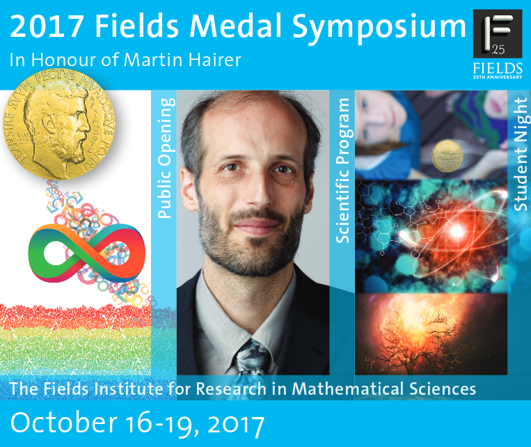

I am amazed by how good the speakers could talk about their deep deep ideas that even a non-specialist could understand their main ideas, something that doesn't usually happen in math conferences! The videos will be available [here](http://www.fields.utoronto.ca/video-archive). Here are a few snapshots from some of the talks:

#### [Self-avoiding walk, spin systems, and renormalisation](http://www.fields.utoronto.ca/talks/Self-avoiding-walk-spin-systems-and-renormalisation)
Gordon Slade, Univeristy of British Columbia

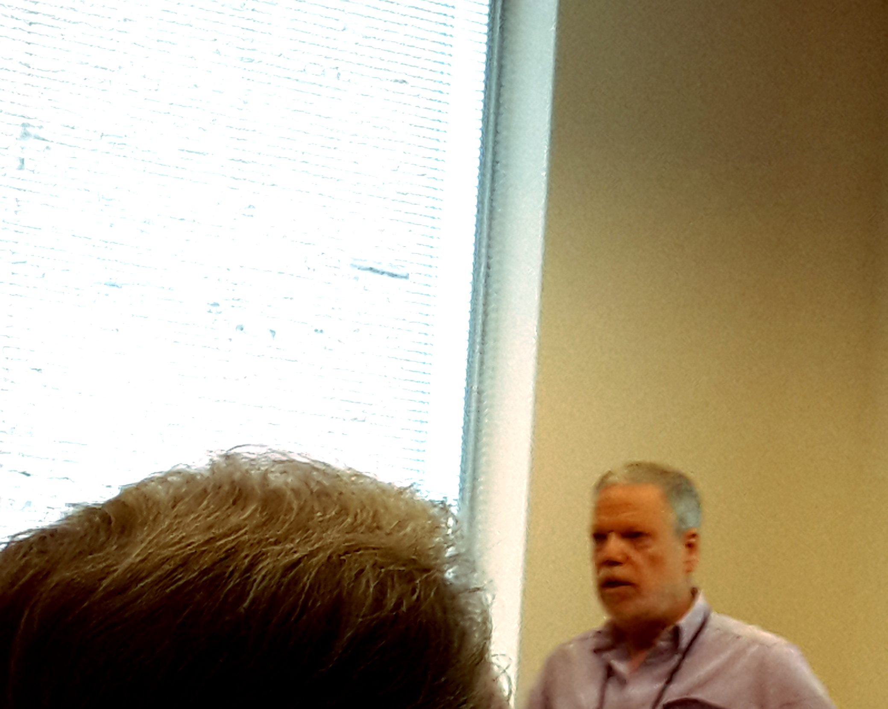

Gordon was interested in self-avoiding walks and their critical exponents. He started his talk by mentioning the results in enumerating such walks.

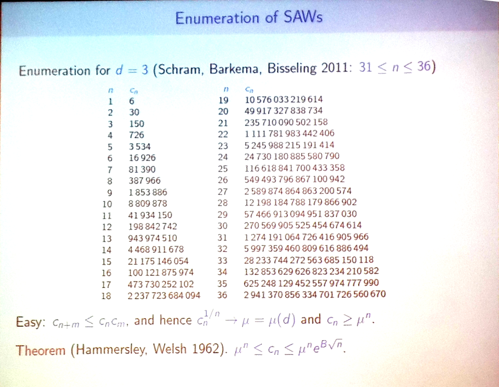

One interesting fact is that for exponents less than the critical ones, the walk tends to follow a geodesic curve, but for exponents less than the critical ones, the walk becomes like a Brownian motion. This came up in a couple of other talks. Here is a list of some experimentally found critical values: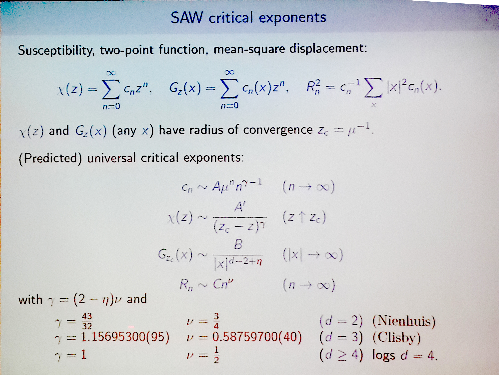

A nice side thing that he showed was the size of a self-avoiding walk. In the following picture the left is 10^8 steps of a self-avoiding walk and on the right (the tiny thing) is 10^8 steps of a simple random walk!

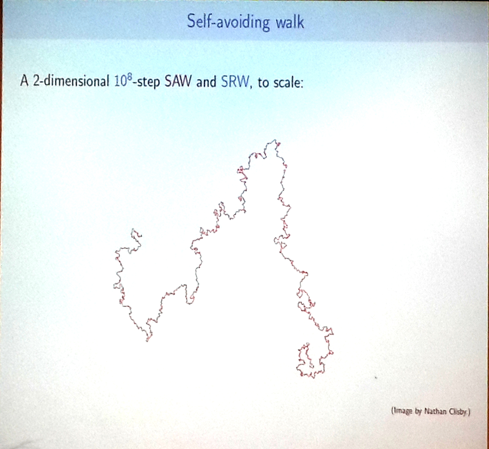

Then he gave some theorems and talk about continuous-time weakly self-avoiding walks, and mentioned some problems with physicist' approach.

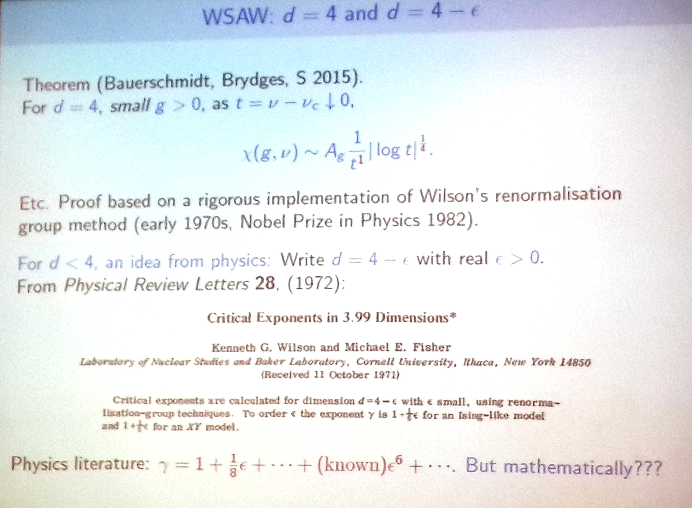

Then he talked about long-range self-avoiding walks (from 1972), and mentioned that they don't converge to a Brownian motion for some values of their parameters, they rather approach a stable process. The he connected it to the Ising model.

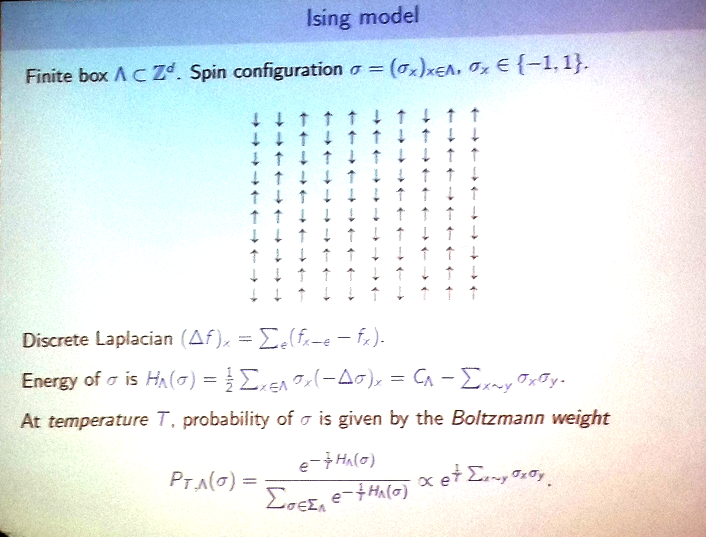

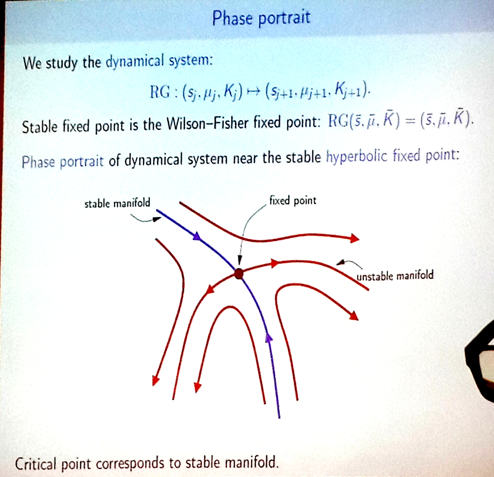

#### [Statistical motion of a convex body in a rarified gas close to equilibrium](http://www.fields.utoronto.ca/talks/Statistical-motion-convex-body-rarified-gas-close-to-equilibrium)
Laure Saint-Raymond, École Normale Supérieure

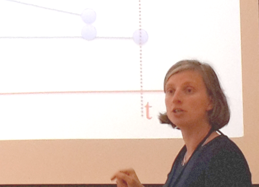

Laure started by describing how (sphere looking) atoms of the same size interact with each other:

And then she put a big (non-spherical) molecule in there, which suddenly made the dynamics much much more complex:

One of the audiences asked if the big molecule (if too big) can be considered as a plane, and hence as an approximation of a huge huge sphere, which didn't really get a response. Then she talked about the weak coupling limit, and showed the limit equations, and talked about the collision trees.

Yes, it is a crazy idea to assume that the collisions form a tree. But that was the main idea, where multiple collisions happen, things go wrong in the calculations, they eventually explode into infinity, the art is to show enough things cancel each other on average, hence the error is small!

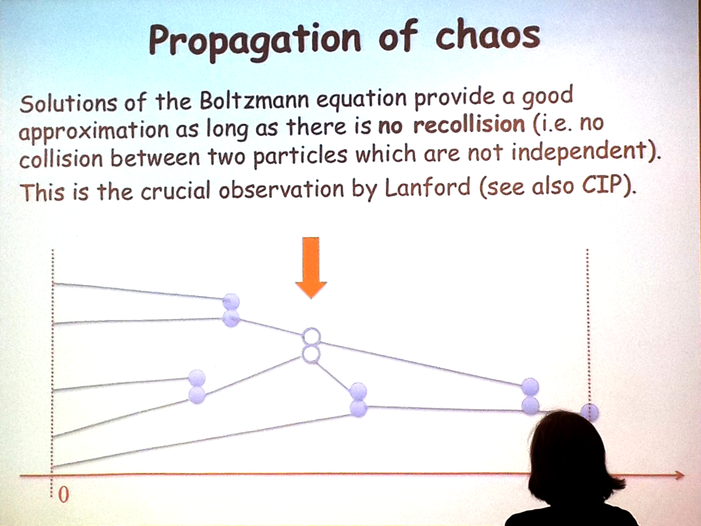

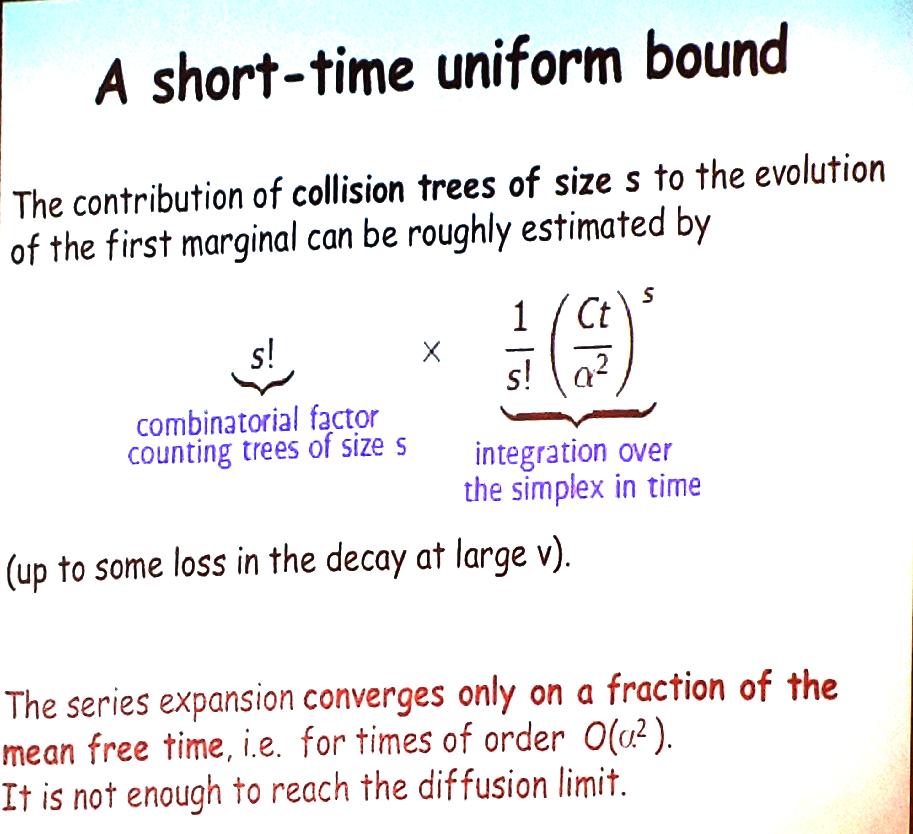

[I'll add rest of the talks here later]
