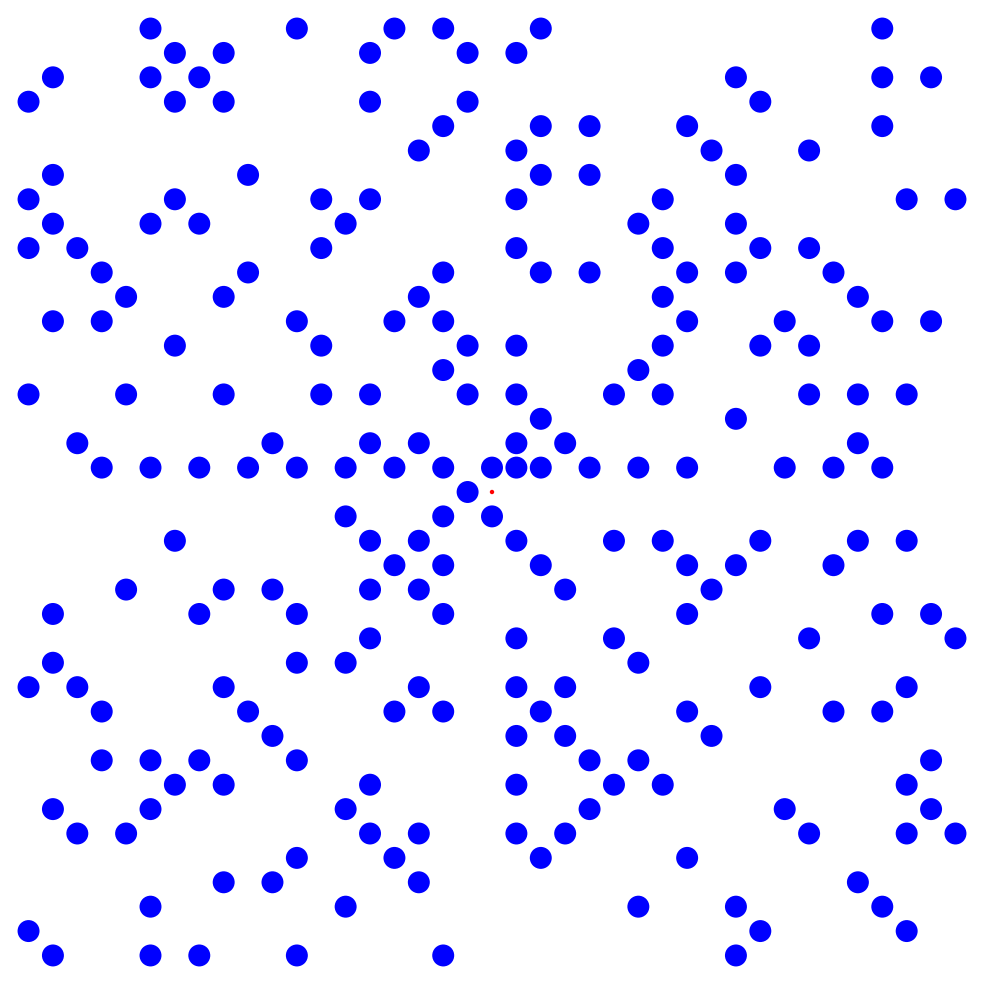
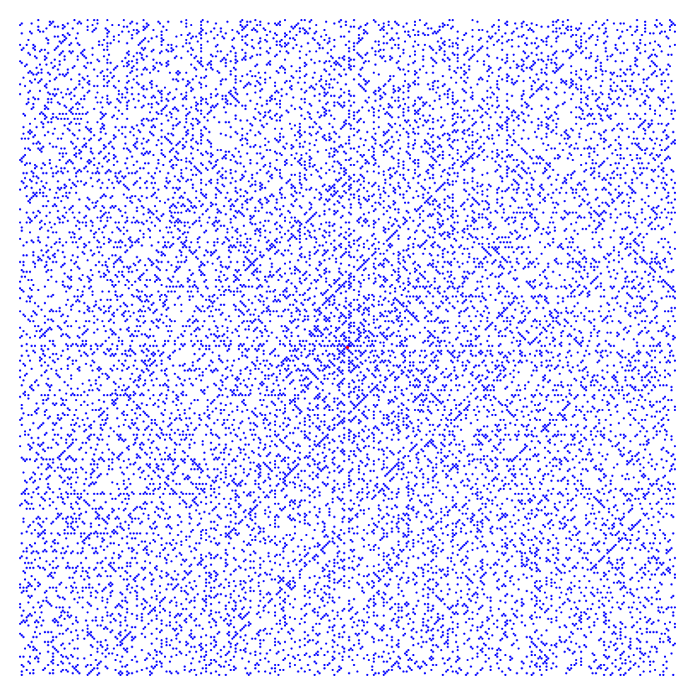
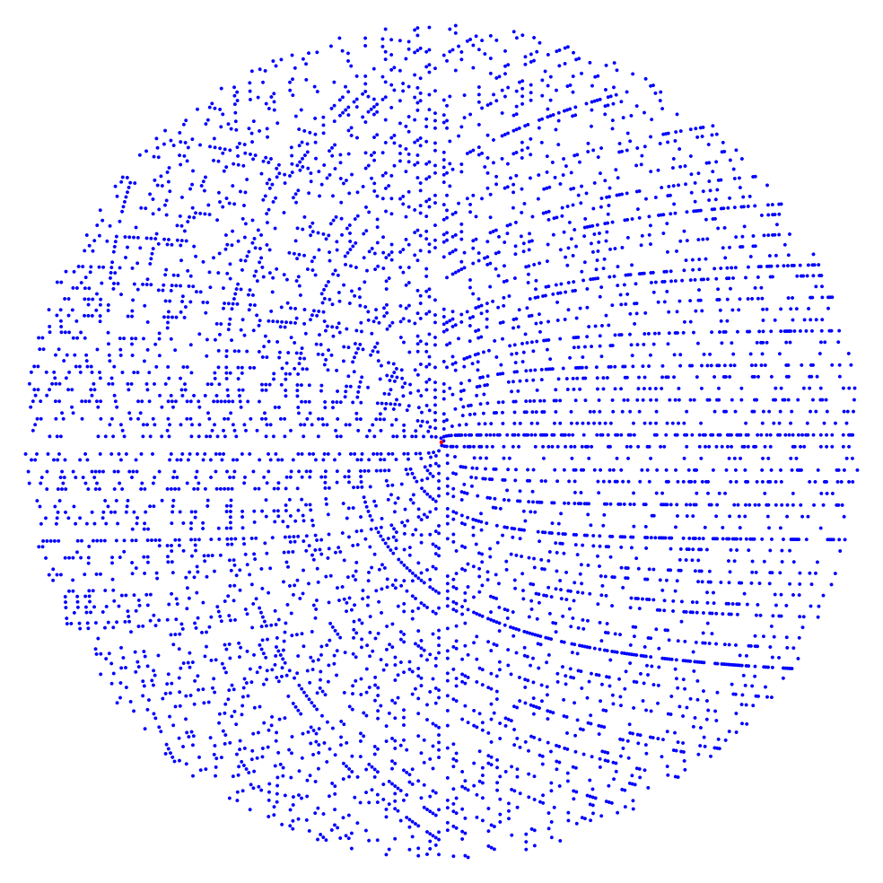

# Ulam spiral

So, bored in a math talk Ulam starts writing integers in a [spiral](https://en.wikipedia.org/wiki/Ulam_spiral) and circling primes. He soon notices something weird:

 20 layers of Ulam sprial. The red dot is the origin and it rotates counter clockwise starting with 1 to the right of the red dot

Here is a bigger picture:

 200 layers of Ulam spiral. That is a 400x400 grid.

Here is the sage code that I wrote to plot these:

```
def ulam_spiral(n):
    # n is the number of layers
    # output is list of coordinates of points corresponding to prime numbers in the spiral
    
    layers = n
    P = []
    count = 0
    for k in xsrange(layers):
        for s in range(4):
            for i in range(2*k):
                count += 1
                if s == 0:
                    if count.is_prime():
                        P.append((k,-k+i+1))
                if s == 1:
                    if count.is_prime():
                        P.append((k-i-1,k))
                if s == 2:
                    if count.is_prime():
                        P.append((-k,k-i-1))
                if s == 3:
                    if count.is_prime():
                        P.append((-k+i+1,-k))
    return(P)

## plot them
n = 20 #number of layers
p = points(ulam_spiral(n),size=100000/n^2,axes=False)
q = point((0,0),color='red')
(p+q).show(figsize=[10,10]
```

You can read more detailed version of the story [here](http://mathworld.wolfram.com/PrimeSpiral.html). Then there came the Sacks spiral, and other variations. [Here](http://www.dcs.gla.ac.uk/~jhw/spirals/index.html) is a nice article on number spirals and some python code.

Here are all the primes less than 50000:

 Primes less than 50000 in Sacks spiral.

And here is the sage code to generate the plot:

```
def sakcs_spiral(n):
    # all primes less than n
    # output is list of coordinates of points corresponding to prime numbers in the spiral
    
    layers = n
    P = []
    for i in xsrange(n):
        if i.is_prime():
            x = -cos(sqrt(i)*2*pi)*sqrt(i)
            y = sin(sqrt(i)*2*pi)*sqrt(i) 
            P.append((x,y))
    return(P)

## plot them
n = 50000 #number of layers
p = points(sakcs_spiral(n),size=8,axes=False)
q = point((0,0),color='red')
(p+q).show(figsize=[10,10])

```

And of course here is a [numberphile](https://www.youtube.com/watch?v=iFuR97YcSLM) video on the topic.
