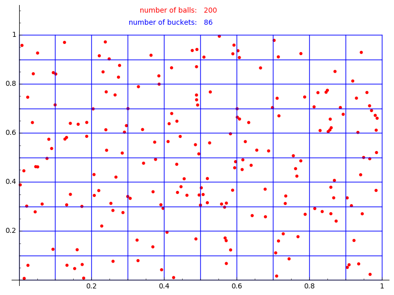
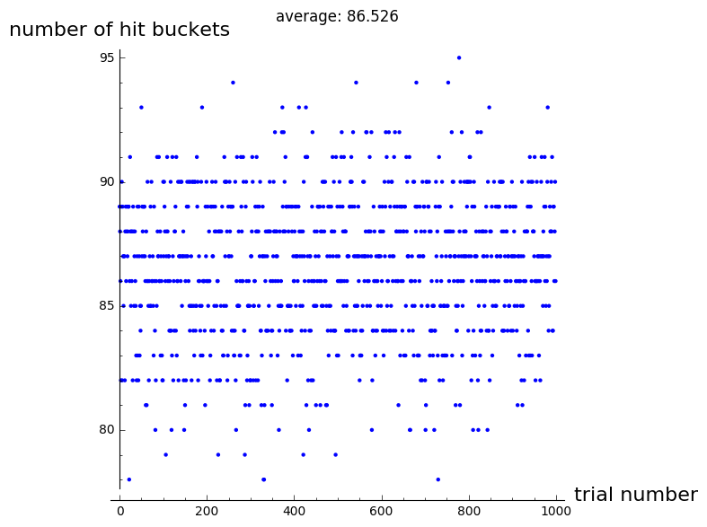
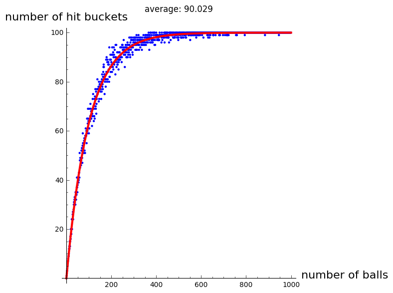

# Playing catch with Poison

My friend asked me this: Put balls into $n$ buckets uniformly at random and count $h$ the number of buckets with at least one ball in them. What is the expected value of number of balls $k$?

Let me do this differently. First the direct questions: Divide a square into $n$ smaller equal squares, and pick $k$ points in the big square uniformly at random. On average how many little squares have at least a point in them?

Here is a little sage [demo ](https://sagecell.sagemath.org/?z=eJyNVMFuozAQvUfKP1jtIXZjZe00PbQSh_xBzkUIQTDBXWOztulW_fod40RAU3WDlOjZM_PmDTNMJWpkC12ZNi8LpVwudV72x9_CO6w7qh19F7Y0TiSMvCwXCJ573aEE6b4thUWmRp2R2ruLzc1sri8r-S6dNGCAsyiODXKyEuHgG4Hcn76wIgYfIDTFUQ0m9AIIqo1FEkkdlJ4E6CIZuj82oGrgiI4zHfG_U8bn8RqoI8AH6uSnSLaMHo0yNllZUa3IJEBJLYJ_GgBOMaPyl3aEYh5Bdi0ILtcX9-BDGbgPgP_PnYFLoA6O9HzHh_h4l00L2oOstvBWfuDX19AcoIqWkKILKQ7nLoVHgnutjLGQEj2gLmUZGa1vX618at2nkr5l4MLjnS4Bu77F4bcnZCpL1ug8JSiBgIkCLz6gA_BWOUSHA74bh2MYuJc7ivBm90z5Bl4EaoyVn0b7QuWFkifdCu2hRfLU-BVF1x2bJdlekjhvw5QE5if-I7MS9Q3Ej9-pj1_JRD97urWAUvXi20S7WQXlWMEP3PMSvlLjyUewDr0bZ5ysx_aMcDvCxxHuyMY15i-eMEdkhe-tDlqXi-ViWA1bxmARXO2HYTXwmenm9XDbiuKDhn_5xXNd&lang=sage)and a sample output

```
def random_balls_in_buckets(np,ns,verbose=0):
    #np = number of points
    #ns = number of subdivisions of each side of the square
    P = [(random(),random()) for i in range(np)] #chose the random points
    
    plot_points = points(P,size=20,color='red')
    plot_lines = [line([(0,i/ns),(1,i/ns)]) for i in range(ns)]+[line([(i/ns,0),(i/ns,1)]) for i in range(ns)]+[line([(0,1),(1,1)]),line([(1,0),(1,1)])]
    
    A = matrix(ZZ,ns,ns)
    for p in P:
        i = floor(ns * p[0])
        j = floor(ns * p[1])
        A[i,j] = 1
    nb = sum(sum(A))
    
    if verbose == 1:
        text_plot1 = text("number of balls:", (.49,1.1), horizontal_alignment='right', color='red')
        text_plot2 = text(str(np), (.51,1.1), horizontal_alignment='left', color='red')
        text_plot3 = text("number of buckets:", (.49,1.05), horizontal_alignment='right', color='blue')
        text_plot4 = text(str(nb), (.51,1.05), horizontal_alignment='left', color='blue')
        (plot_points+sum(plot_lines)+text_plot1+text_plot2+text_plot3+text_plot4).show()
        
    return(nb)

np = 200 #number of points
ns = 10 #number of subdivisions of each side of the square
random_balls_in_buckets(np,ns,verbose=1)
```



The number of buckets without any balls in them follows the [Poison](https://en.wikipedia.org/wiki/Poisson_distribution#Definition) distribution with $\lambda = \frac{k}{n}$, and parameter $0$. We want to count the number of non-empty buckets which will then be $h = n (1 - e^{-\frac{k}{n}})$. So, in order to guess how many balls where there if $h$ buckets are non-empty, all I need to do is to solve the above equation for $k$, which will tell me $k = -n \ln(1-\frac{h}{n})$. For example, if I have 87 non-empty buckets out of a total of 100 buckets, then I have thrown approximately 204 balls.

So, if I [repeat ](https://sagecell.sagemath.org/?z=eJyNVMFu2zAMvQfIPwjNwdIidHbaHlbAh_QLeq4RBHJCJ-pkyZPktuvXj7Sb2kmKLgYS0CL5-OgncgsV88puXb0ulTFhre26bDe_IQZuG2mDfAFfNgHyVNxPJwyfmW1Yzmxbl-CZq1jjtI3h4AtHvtCWW_2ig3bowHdQmz0Legv0EvfAwp9WeeiTHzG14D0bLuTBEKxynmmmLTHdAfISKzbb7F2ADqMPPOLR_zfGxXV_jNC9wR9l0O-QL1K5ccb5PPGwTcQowWgLFF-QwQueSv3TBiF51hurc0J4OD-EU4xMMbwzsv-FpxhC0BQoP86yLr8_W40bWiKtWkWv3_jTE4mDUL2HSjRU4vFDJXo0hlfGOY8l2Q_WFOlKDN7nU2829i4LLZ9XGJL1Z7ZEO7Q1p99SiDEtXTG6JaRHjgkjBhHeUAH8qhlm0wu_Gi5Hd-HuryTj17e_ZHaNH4LtndfvzkZl1srona3BRpRI7_YxkexcsaMii0ORED3dEkK-y75FNlBdAHzzFft-Skb807tLGyhNC18Wuj3qoBw6-Ab7uIVTaD4agjlpN9xxMR_kGczFYN4M5q24Dnv3ykfIveUhtt4S1-lkOulWwyJNcRGc7YduNWRHrovXw3QyMxCTwKL_iw4dmGIVvLKoayDoB5pXXApGh0i5ZzJ1A9LB4_QogykdmTSdTk6n87DnEHSOqJduxxWx7FeYlvah0F8MPgUh-eh2XtXjlRR1NJCT6DiRKvIaFH7TByFQdfUGYW1UCSbkRdLR_-gvkclZowkN8WeNT9H-AXMBy10=&lang=sage)the above experiment 1000 times,

```
#let's try this a few times
nB = [] #list of number of hit buckets for each trial
n = 1000
for i in range(n):
    nB += [random_balls_in_buckets(np,ns,verbpse=0)]

P = [(i,nB[i]) for i in range(n)]
histogram = points(P,title='average: '+str(float(mean(nB))), axes_labels=['trial number','number of hit buckets'])
histogram.show()
```

then I'll get



One natural question to ask is how many balls shall we throw to be 95% certain that 50% of the buckets are hit? I don't remember my confidence intervals, but [a numerical experiment](https://sagecell.sagemath.org/?z=eJyVVM1O4zAQviPxDhYcYm8NJAUOi5QDPAFnom7ltNPG1LGzttOtePqdSQhJAbFspFbj-f_7Zg0b5pVdu3pZKmPCUttl2a52EAO3jbRB7sGXTYA8FXenJwy_c9uwnNm2LsEzt2GN0zaGQRaOZKEt13qvg3YowDeoVcWCXgM9YgUs_G6Vh974EU0L3mfDhRwIwTbOM820pUy3gHmJBTtfVS5A56NXPMqj_2-Mi8ueja57gj_KoF8gn6dy5YzzeeJhnYiJgdEWSL8gghc8lfrKBiF51hOLjwkhczaok45MUb0jsn-pp6hCrklRvvKyzr7nLaYF3WNatYpeH_jTEw0HXfUSCtFQiMfXKdGnUX1jnPMYkv1gTZEuxCh9fi_NptL7QsvnBapkPc-WSIe25vS7F2Kalt4w2hKaR44GkwwiHHAC2NUMrenBz8bl6Bbu7kwyfnnzU2aX2AhWOa9fnI3KLJXRW1uDjTgiva1iItnHiR0FmQ9BQvS0JeT5NvvSs4HNNxxff5Z9j5JJ_untdwsoTQufBro5qqAcK_jC93EJ713zCQhmNLtxx8VsHM9IzkfyeiRvxGWo3B8-8dxTHmLrLeV6enJ60sE_S_EO_P8JsA8EOkS20SGS8EOvuy3v7BECyqBJFy09ijecAdK1zQR1w_3CODMM9N2rt6C6-tOkpX0o9CeAJqUKs3Zbr-rpqYk6GsgThe7UFu5YMqPBIupU5DUo7NuDEDhZdYCwNKoEE_IieQeRRE44lY5DOxLC6155nuxo4qvW74GC47gQ0r_mCGqeXcCh4Re7K2LgKZV8J_HkYM_E9P7JWOnVDnci5Nfoir8VM-u8jsP_C4Wn4Ro=&lang=sage) shows:

```
ns = 10 #number of subdivisions of each side of the square
nB = [] #list of number of buckets for each trial
n = 1000 #number of points
for np in range(n):
    nB += [random_balls_in_buckets(np,ns,verbpse=0)]

P = [(i,nB[i]) for i in range(n)]
histogram = points(P,title='average: '+str(float(mean(nB))), axes_labels=['number of balls','number of hit buckets'])
var('k')
curve = plot(ns^2 * (1-exp(-k/ns^2)) ,(k,0,1000),color='red',thickness=3)
(histogram+curve).show()
```

Of course the red curve is $h = n (1-e^{-\frac{k}{n}})$.
