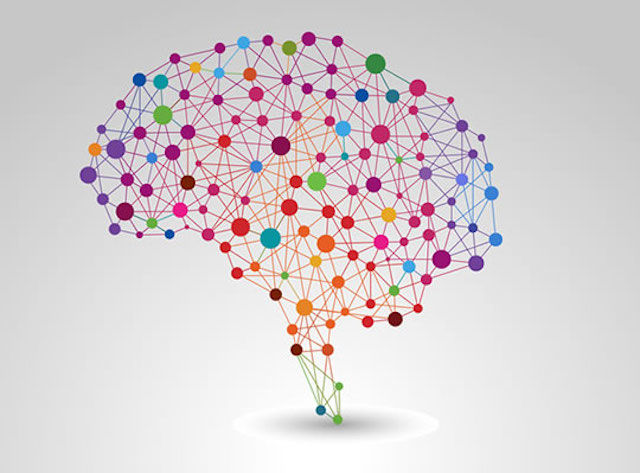
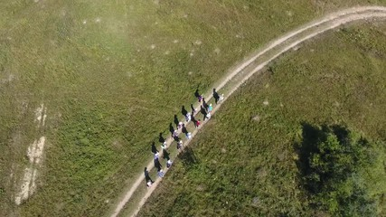
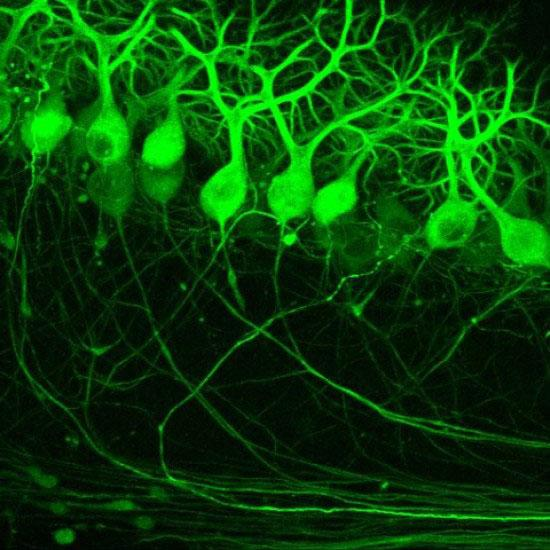
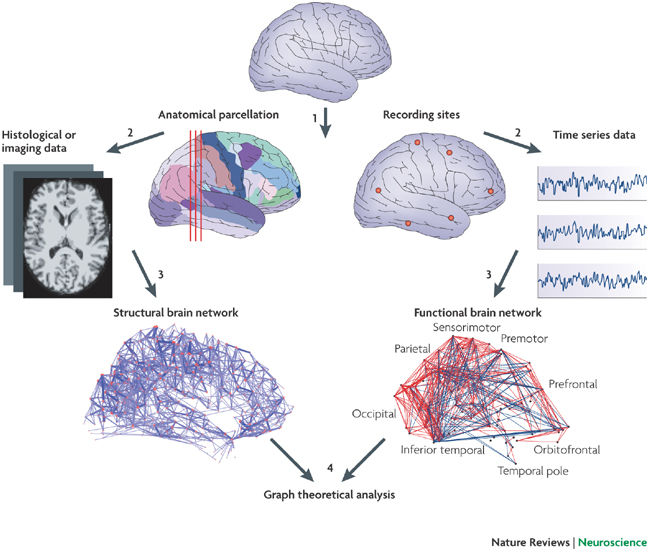

# Brain networks and the hiking trails

In the neuroscience community there's a divide on whether there are functional connectivity networks in the brain. This is a very vaguely defined concept, although, one can think of it this way:

Imagine a mountain with several points of interest, places that people are interested in visiting for whatever reason. There are some spots at the bottom of the mountain that people get to the mountain, and start hiking up. If there's a trail from where they start to where they wanna go, most people will take the trail. The trails define a physical network between various points of the mountain. The daily traffic defines a temporal dynamic network that evolves continuously. It is clear that the physical network of trails is a great indicator of the traffic network. That is, most of the traffic is on the trails.

On the other hand, from time to time there are people who want to explore other things, who want to take a shortcut, or maybe they just get lost; they take paths that are not a trail. These paths are often ignored, since there are nothing important or exciting about them. But there are times that someone takes a new path and finds something interesting, maybe a shorter way to get to another point or a more scenic way which is even longer, maybe there's a waterfall along the path, maybe it is to a new unexplored area. As more and more people start walking on that path, the grass gets flattened, the vegetation changes and it slowly starts to becoming a trail. While this might cause some other existing trails become obscure and flowers and grass start growing on them and the trail goes away, like it never existed. The traffic network slowly changes the physical network.

The physical network of trails in the mountain are like the neurons being connected to each other via [dendrites](https://en.wikipedia.org/wiki/Dendrite) and [axons](https://en.wikipedia.org/wiki/Axon). Neurons send electrical charges to each other throughout this network, but the charges can sometimes be transmitted via leakage, or other medium. The charges being sent are the people travelling on and off trails. The physical network is called the structural network and the traffic network is one of the instances of a network that some people refer to it as a functional network. Connecting every single pair of points in a mountain to each other via a straight (geodesic) line might make the travels faster and more efficient in terms of time, but it destroys the mountain, it is costly, and most of the trails will remain unused (and probably fade away) as some paths become more popular to travel. Hence, the question that what network is more likely to evolve as the structural network of the brain to get the transmissions done in a timely fashion but also to keep the number of connections to a minimum is an optimization problem that involves two competing parameters to be balanced out.

 Picture from the amazing 2009 review paper by Bullmore and Sporns: [Complex Brain Networks: Graph Theoretical Analysis of Structural and Functional Systems](http://dx.doi.org/10.1038/nrn2575) published in Nature Reviews Neuroscience, 10, 186-198.

This has brought up a lot of questions and experiments with [small world graphs](https://en.wikipedia.org/wiki/Small-world_network), [scale free graphs](https://en.wikipedia.org/wiki/Scale-free_network), and even [Ramanujan graphs](https://en.wikipedia.org/wiki/Ramanujan_graph) and [expanders](https://en.wikipedia.org/wiki/Expander_graph). One of the best references out there written by one of the most active people in the field is "[Networks of the Brain](https://mitpress.mit.edu/books/networks-brain)" by Olaf Sporns. And [here](http://science.sciencemag.org/content/342/6158/1238411) is a review paper that explains the current (2013) state of the art on the topic. Check them out.
