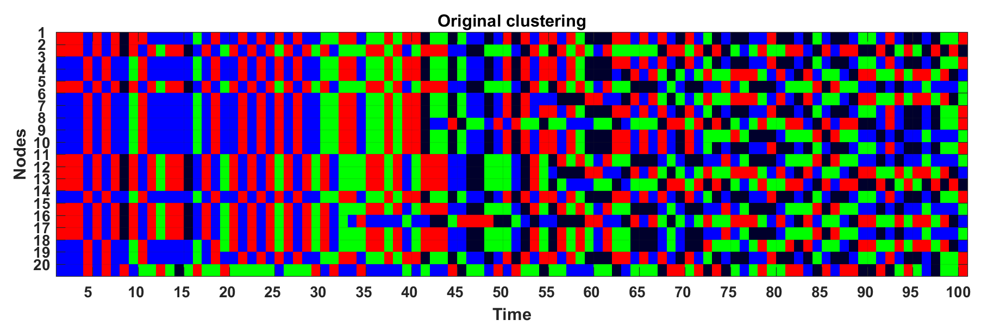
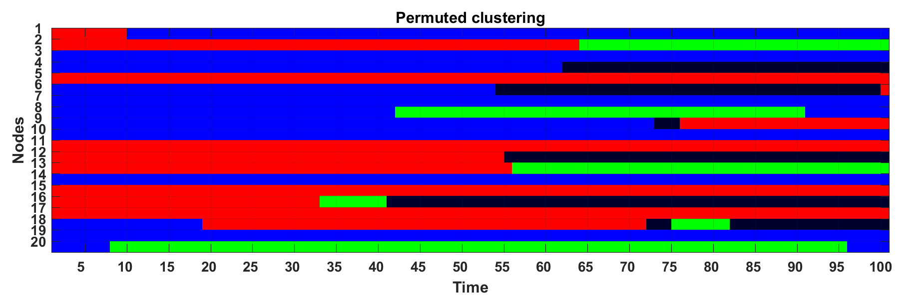

# Balls, bins, and the Hungarian method

It always excites me when I see a combinatorial matrix theory problem, and this is no exception, though it is so basic that it shows up in all forms and shapes. Let me start with a combinatorial problem:

Given a bunch of balls of various colors in some bins, we want to label bins so that each bin label best matches the color of the balls in them. For example, for the following

Ball colors
Bin 1
Bin 2
Bin 3

**Red**
2
**12**
1

**Green**
**15**
3
2

**Blue**
2
2
**7**

we want to label Bin 1 as "Green", Bin 2 as "Red" and Bin 3 as "Blue". It seems like an obvious question and the greedy algorithm should work: just pick the** maximum of the table** and assign it for that column, cross out that row and column and repeat.

But as soon as you start thinking about it, it gets complicated. Here is a minimal example that the greedy algorithm won't work:

Ball colors
Bin 1
Bin 2

**Blue**
3
**5**

**Red**
**0**
3

Let's first think how we should measure if we've done a good job assigning the labels of the bins. The objective is to have the most "matching" between the labels and ball colors. That is, If one counts the number of the balls in each bin that have the same color of the label of that bin, the total should be maximum.

Now, if you start with the maximum of the table above and assign "Blue" to Bin 2, then Bin 1 will be "Red". The "matching score" for this combination is 5+0 = 5. But if you do the only other way of assigning the labels, the matching score will be 3+3 = 6. A simple observation shows this can get arbitrarily better/worse. So, the greedy algorithm will not even provide an "approximation" of the maximum matching score. Also, going through all permutations of labels and finding the maximum matching score is not efficient at all!

In combinatorial matrix theoretical language, you have a matrix and you want to permute rows and/or columns of the matrix so that he trace becomes maximum. That is, to maximize $PAQ$, where $A$ is the given matrix, e.g. $\begin{bmatrix} 3&5 \\ 0&3 \end{bmatrix}$, and $P$ and $Q$ are permutation matrices. This can be done with linear programing over the (convex) set of doubly stochastic matrices, where the corners of the set are the permutation matrices, which are guaranteed to be extremal points.

However, there is a combinatorial solution for this problem. Let's look at a slightly different formulation of this problem. There are three companies that will do three jobs for a given price. You want to assign one job to each company so that the total cost is minimized (this is the dual problem now). Harold Kuhn in 1955 came up with a method that he named the [Hungarian method](https://en.wikipedia.org/wiki/Hungarian_algorithm), (From Wikipedia: "... because the algorithm was largely based on the earlier works of two Hungarian mathematicians: Dénes Kőnig and Jenő Egerváry. James Munkres reviewed the algorithm in 1957 and observed that it is (strongly) polynomial. Since then the algorithm has been known also as the Kuhn–Munkres algorithm or Munkres assignment algorithm.")

I won't go through the method here, and you can read all about it on Wikipedia (linked above), but I want to tell you about how I ended up using this working on a completely (I'd say) non-mathematical problem: I have a network at hand that evolves as time passes. My job is to cluster the network for each time and identify/explain the changes in the network, in terms of its clusters. Quite reasonably, I cluster the network at each time $t$ using some clustering algorithm that best fits my needs independent of the clustering of the network from previous times, and then plot the clusters to provide a visualization of the changes. For example, one such clustering time-series could look like this:

 Each vertical column shows a clustering of a graph on 20 nodes (vertical axis) that evolves through time (horizontal axis), so does its clusters. Each color represents one cluster.

Just looking at this picture might not tell much story about how the clusters are/aren't changing as time elapses. For example one might think something big has happened at t = 5, while all has happened is that the cluster colors are switched. Now, if I permute the colors of each column according to its "maximum matching score" with previous clusterings, I'll get the following picture:

This already shows that until t = 7 nothing has changed in the clusters, and at time 7 only the last node has formed a new cluster. The next change happens at time 10 when the first node goes from the red cluster to the blue cluster, and so on.

Here is a question for you to ponder upon: Does there always exist a node that its color never changes according to this scheme?

---

## Old Comments

> **OKK** — September 12, 2018
> 
> Fun!
> U should consider Alluvial diagram for visualizing temporal changes in network structure. https://journals.plos.org/plosone/article?id=10.1371/journal.pone.0008694
> http://www.mapequation.org/apps/AlluvialGenerator.html#alluvialinstructions
> 
> > **k1monfared** — September 13, 2018
> > 
> > Sounds interesting. I'll look into it. Thanks for sharing :)

