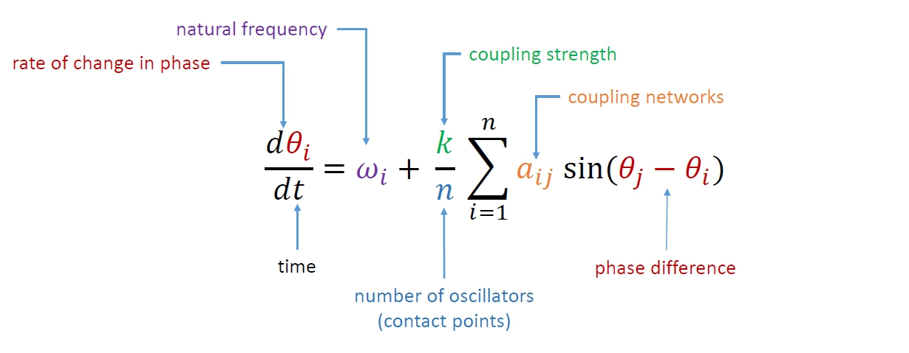
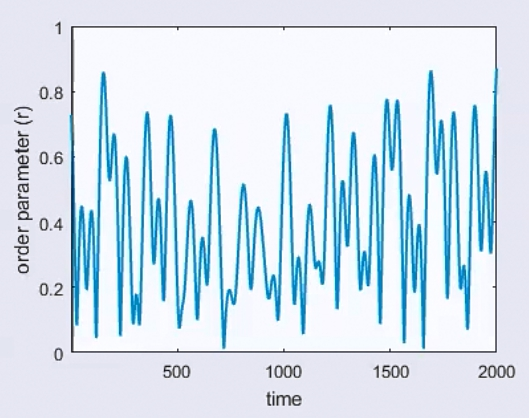
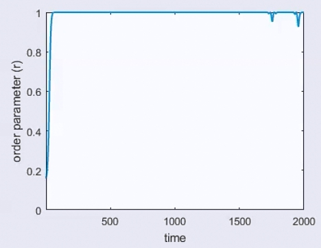
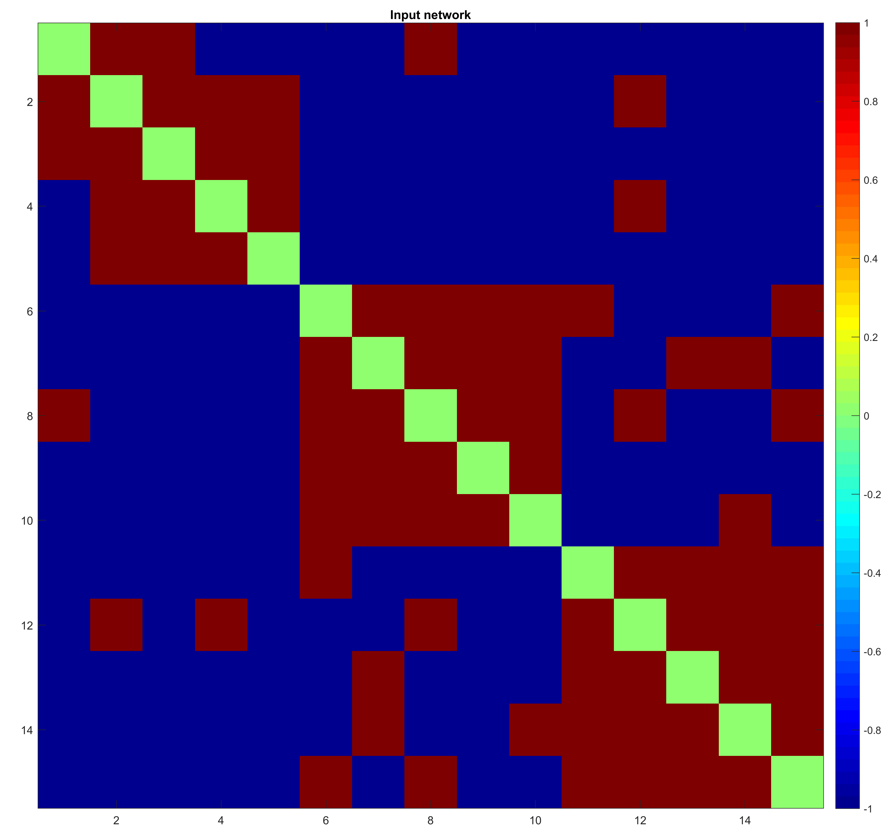
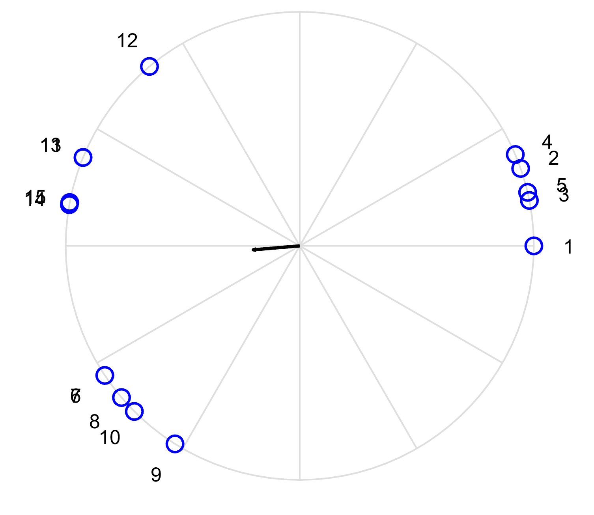
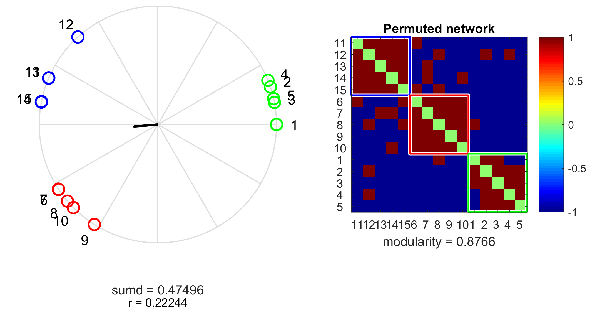

# If you treat a network like a dynamical system...

Let's say we have a graph (i.e. network), and we want to cluster the vertices (nodes).  Here, think of the nodes as people, agents, oscillators, some dynamic being, and the edges... the edges tell you if these people are **friends or enemies**, and how much, they tell you if the agents want to collaborate with each other or not, they tell you if the oscillators **attract** each other or **repel** each other, and how much. This means we have a (signed weighted) network that can be treated as a dynamical system. One of the most famous and simple (nonlinear) dynamical systems that can model **attraction/repulsion** is the [Kuramoto ](https://en.wikipedia.org/wiki/Kuramoto_model)model. In simple terms, it says if you have $n$ oscillators $i$ and each of them is moving around the unit circle with a natural frequency $\omega_i$ while being attracted/repelled by other oscillators $j$ as strongly as $a_{ij}$, the derivative of its phase with respect to time (the angular velocity, the rate of change of its phase) is given by

 The Kuramoto model

where $k$, is called the coupling strength of the system. At the beginning when they are not coupled, their movement looks like this:

 

 Five uncoupled oscillators with some natural frequencies

 

The order parameter, which is simply the length of the vector of the sum of their positions, will look like this:

There is no synchrony. But if we assume all of them attract each other, that is, if all $a_{ij} = 1$, then they'll start behaving like this:

 

 Five coupled oscillators with some natural frequencies

 

They soon synchronize and stay "together"! The order parameter will look like this:

I'm not sure what those bumps towards the right end are, beginning of a chaos?

Anyways, the fact that all of them synced together tells me that the network is very well connected, and probably I don't want to break it into clusters since there's only one meaningful cluster out there.  But if I start with some network like this: 

And run the model, I will end up with some final phases likeWhich, in turn, will be clustered as

This reveals the underlying clustering of my network. Matlab/Octave code for calculations can be found on my [GitHub](https://github.com/k1monfared/kuramoto_clustering).
