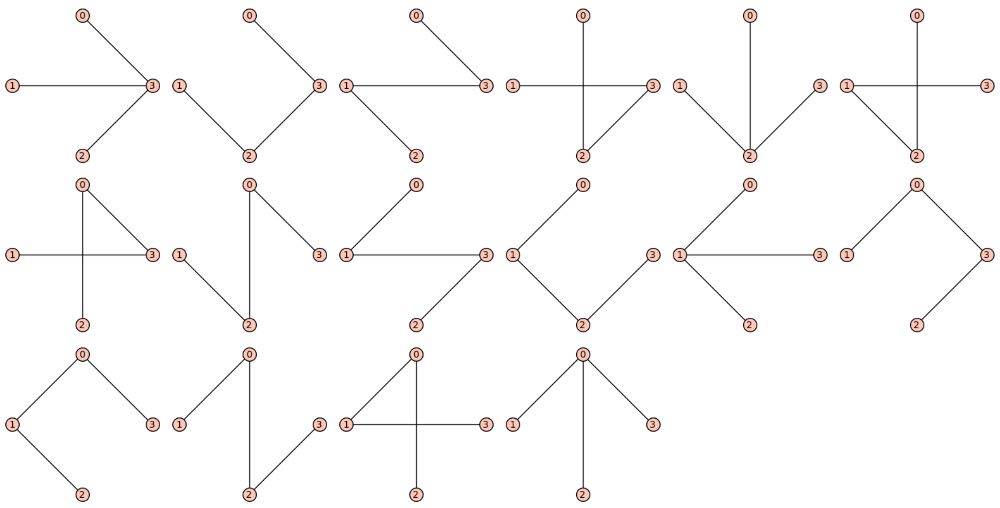
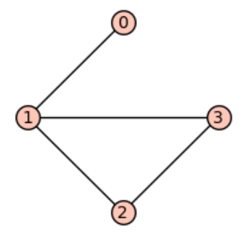
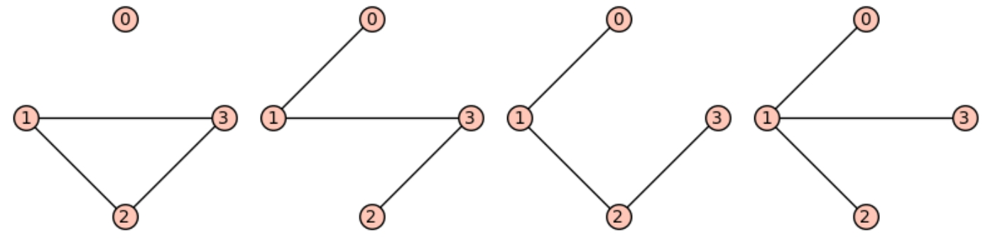

# Signless Laplacian and the matrix-tree theorem

What is the minimum number of links that you need to connect 4 computers in a wired network? 3.

How many different ways are there to achieve this? 16. Here they are:



These are all the "spanning trees" of the complete graph on 4 vertices. [Here](https://sagecell.sagemath.org/?z=eJxzV7BVSC9KLMgo1nPOzy3ISS1JdQdxNUw0ebnS8osUShQy8xTc9YoLEvPyMvPS40uKUlOLNTSteLkUgKBErzgjv1wjJ7Eyv7TEVj05syi5NCexSF0nLTO9OLMq1TbaSM9UB4hjNQFBASJC&lang=sage) is the Sage code that generated it:

```
G = graphs.CompleteGraph(4)
for t in G.spanning_trees():
    t.show(layout='circular',figsize=[2.5,2.5])
```

A [spanning tree](http://Spanning tree) of a graph $G$ is a subgraph of $G$ that is a tree (i.e. is connected and has no cycles) and uses all the vertices of $G$. Counting the number of spanning trees of a complete graph is a nice but not hard problem, and it is [known](https://en.wikipedia.org/wiki/Cayley%27s_formula) that the complete graph on $n$ vertices (i.e. $K_n$) has exactly $n^{n-2}$ spanning trees. But the problem for general graphs suddenly becomes much much harder.

One of the beauties of algebraic (spectral) graph theory is that *some times* it solves some very hard problems very efficiently, thanks to linear algebra. For this particular problem, one can count the number of spanning trees of any graph using the [matrix-tree theorem](http://Kirchhoff's theorem), which states the number of spanning trees of a graph is equal to the determinant of *any *submatrix of its [Laplacian](https://en.wikipedia.org/wiki/Laplacian_matrix) by deleting any row and column (up to a minus sign), more precisely, any cofactor of the Laplacian. The Laplacian matrix of a graph on $n$ vertices is an $n\times n$ matrix where each diagonal entry $(i,i)$ is the degree of vertex $i$ and the off-diagonal entry $(i,j)$ is $-1$ whenever vertex $i$ is adjacent to vertex $j$, and zero otherwise. For example, the Laplacian matrix of the complete graph on $4$ vertices is

$L = \left[ \begin{array}{rrrr}
3 & -1 & -1 & -1 \\
-1 & 3 & -1 & -1 \\
-1 & -1 & 3 & -1 \\
-1 & -1 & -1 & 3
\end{array} \right]$

[Sudipta Mallik](http://oak.ucc.nau.edu/sm2825/) asked if there is an analog of the matrix-tree theorem for the "signless Laplacian". The signless Laplacian, $Q$, is the same the Laplacian but all the entries are positive. Another simple but fun result about the original Laplacian is that the multiplicity of the zero eigenvalue of $L$ counts the number of the connected components of the graph. For the signless Laplacian, the multiplicity of zero eigenvalue counts the number of the bipartite connected compnents of the graph! We can consider the matrix-tree theorem, in terms of the eigenvalues, rather than the determinant. If $0 = \lambda_1 \leq \lambda_2 \leq \cdots \leq \lambda_n$ are the eigenvalues of $L$, then number of the spanning trees of the graph is $\frac{\lambda_2 \lambda_3 \cdots \lambda_n}{n}$. Curious yet? Keep reading...

In our [paper](https://doi.org/10.1016/j.laa.2018.09.016) (recently published at journal of linear algebra and its applications, also available on [arXiv](https://arxiv.org/abs/1805.04759)), while exploring Sudipta's question we first play around with special spanning subgraphs of a graph called TU-subgraphs of it. "T" stands for tree, and "U" stands for unicyclic (a graph with only one cycle in it). A TU-subgraph of a graph is a spanning subgraph where each connected component of it is either a tree or a unicyclic graph. At first it is weird that why would anyone be interested in such subgraph of a graph. But for starts, there are other people who have worked on it, and the signless Laplacian of a graph connects to such subgraphs.

The **main result** (Theorem 2.9) that we prove in this paper states that for a graph $G$ on $n$ vertices the determinant of $Q(i)$, which is the matrix obtained from the signless Laplacian of $G$ by deleting row and column $i$ of it, is equal $\sum_H 4^{c(H)}$, where the sum runs over all TU-subgraphs of of $G$ with $n-1$ vertices consisting of a unique tree on vertex $i$ and $C(H)$ odd-unicyclic graphs.

Well, that's a mouthful. Let's look at an example. The following graph is called a "paw". Let's call it $G$.



OK, it's usually drawn differently to look more like a paw, but you get the point. It's signless Laplacian is

$Q = \left(\begin{array}{rrrr}
1 & 1 & 0 & 0 \\
1 & 3 & 1 & 1 \\
0 & 1 & 2 & 1 \\
0 & 1 & 1 & 2
\end{array}\right)$

It has four vertices, and all the TU-subgraphs of it with three edges are the following 4 graphs: ([Sage code](https://sagecell.sagemath.org/?z=eJxVjEEKgzAQRfeB3GF2JhBEXRaycJXeIYQSdNRA2khUWnv6jm0pdBiG_x6faUHD1a85PIS1lYIaFN3KKc5sTYEM7Rs_ufrHwzgnOTP0yGQ_T6Il4mxIGRDCDUyJ_YiLkCfOgOZMxS7NuzDyK8oeI654OXoCf3aZ0l1Ev6dt1UUXcrdFnws1hHEJT9S2UY2TL3oZMC4=&lang=sage))



Let's call them $H_1, H_2, H_3, H_4$ from left to right. All of these have a tree on vertex 0. So $\det(Q(0)) = \sum_{i=1}^4 4^{c(H_i)} = 4^0 + 4^0 + 4^0 + 4^1 = 7$. OK, neat you say, but what does this number mean in terms of the graph? The corollaries that we get are more useful than the main result, as expected!

Our Corollary 2.11 says any such determinant is an upper bound for the number of spanning trees of the graph. Also, it is equal to the number of spanning trees if and only if all odd cycles contain the vertex $i$. That is some sort of an analog for the matrix-tree theorem. But then we go further and prove something more exciting. We prove that $\det(Q) = \sum_H 4^{c(H)}$, where the sum runs over all TU-subgraphs without any trees or even cycles, i.e. all connected components are odd unicyclic graphs. Let $\rm{ous}(G)$ denote the number of spanning odd uncyclic subgraphs of $G$. Then $\det(Q) \geq 4 \rm{ous}(G)$. And finally, $\det(Q)/4$ is an upper bound for the number of odd cycles of $G$.

One of the things I learned a lot dealing with this problem is to look at $Q$ as $NN^\top$ where $N$ is the signless[ incidence matrix](https://en.wikipedia.org/wiki/Incidence_matrix) of $G$ which is also used in proofs of many theorems about the original Laplacian. I also got much more comfortable working with [Binet-Cauchy formula](https://en.wikipedia.org/wiki/Cauchy%E2%80%93Binet_formula) for determinants.

We propose a couple of open problems at the end of the paper, check them out [here](https://doi.org/10.1016/j.laa.2018.09.016) and [here](https://arxiv.org/abs/1805.04759).
