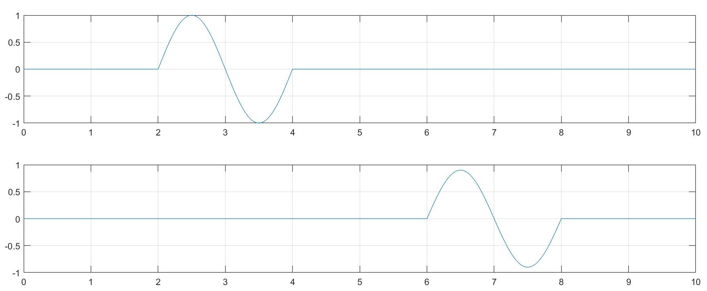
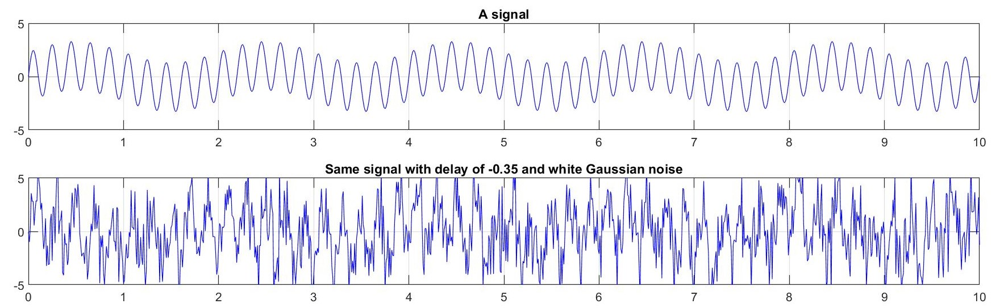
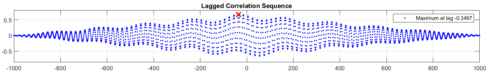
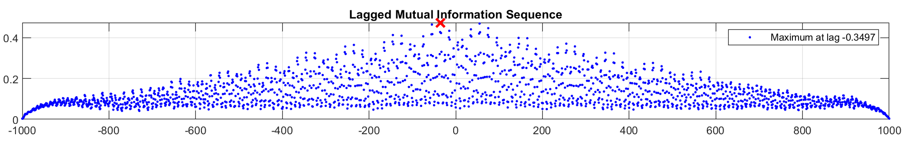
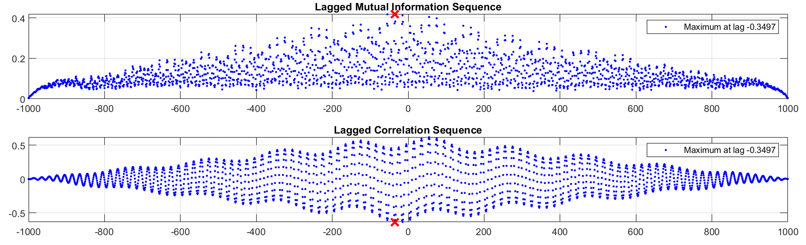

# Mutually informing the cause?

**Disclaimer:** I'm not a statistician, and no, correlation does not mean causation. Also, I'm not a seismologist. And none of the followings are necessarily true. I'm just stretching my thoughts here!

To begin, read [this ](https://sccn.ucsd.edu/wiki/Chapter_4.5._(Cross-)_correlation_does_not_imply_(Granger-)_causation)and then take a look at [this](https://xkcd.com/552/). Then come back and we'll talk about something related.

Welcome back! OK, I don't really want to talk about causality, I'm interested in the direction of the information flow. What do I mean by that? Let's say there was an earthquake and two recordings of it are available from two different stations. Can we figure out which one is closer to the centre of the earthquake? Considering both stations use the same devices and the same settings, it should be the one that shows the signals first. Or, at least that's my guess. Here is a very fake picture:

You'd guess the information is flowing from the station which made the top recording towards the one that made the bottom one. But in general, the signals are not gonna be this clear. So, let me try with another example:



One traditional way of detecting what we could detect with our eyes in the previous picture is to lag the second signal by $\pm 1, \pm 2, \ldots$ samples and find the cross-correlation of the first signal with these lagged signals. Where the maximum occurs tells you which one received the information first, and by how much delay.



This detects the delay almost exactly where it is. And note that the correlation is positive here. Another way of comparing two signals is to compute their mutual information. If I do the same lagging and replace the correlation with mutual information I'll get a picture like this:



And here also we can detect the delay with the same precision. There are some considerations that one needs to take into account. One is that the mutual information is *less robust* than correlation. Another thing is the calculation is much *slower* for hundreds of lagged signals. Also, one needs to* bin the data* to find their joint entropy before being able to compute the mutual information, and deciding about how to bin the data could become a problem on its own.

One more detail here is that this delay detection can be done when one of the signals are anti-correlated with the other one. For example, if I turn the second signal above upside down, then do the same analysis, I'll find out the maximum happens the same way for the mutual information, but at the negatives for cross-correlation, since I'm finding the maximum of absolute values of them.



All that said, there are more established ways of looking at such data out there, and [here](https://sccn.ucsd.edu/wiki/Chapter_4.3._A_partial_list_of_VAR-based_spectral,_coherence_and_GC_estimators) are a few of them that for any practical purposes, you might wanna use those. The code to compute above examples and mutual entropy is on my [GitHub](https://github.com/k1monfared/mutual_information_joint_entropy).

Here I want to talk a little about the mutual information itself and how to compute it, along with details about joint entropy.

### Entropy and joint entropy

Entropy of a probability distribution $P = (p_1, \ldots, p_k)$ is defined to be

$H(P) = \sum_{i=1}^k p_i \log_2(p_i).$

Now, let's assume I have a vector $x$ of length $n$. This vector could be a sampled signal. I could find a probability distribution of each number here, but most probably I'm going to end up with $n$ unique numbers in $x$ which means the probability of each of them is $1/n$ and then the entropy is simply the maximum possible entropy for a vector of this length, which is $\log_2(n)$. OK, I'm implicitly saying

$0 \leq H(P) \leq log_2(n),$

for any probability distribution of $n$ events. This means one can normalize entropy to be able to compare information of varying length. Also, a list of unique numbers will reach this maximum entropy.

That is, this doesn't tell me anything about my signal. All of the entries of my signal are probably distinct. Hence, I need to *bin *my data in order to get a nontrivial probability distribution. Let's say for the moment I decide to have 10 bins $p_1,\ldots, p_{10}$ and put my data into those bins. Then I can count how many points are in each bin and that will give me a nontrivial probability distribution if I haven't chosen my bins **too small** or **too big**. In order to do so in Matlab, I can decide what is the number of bins I want to have `nbins` and then

```
edgex = min(X):(max(X)-min(X))/nbins:max(X)+(max(X)-min(X))/nbins; % creat bins
edgey = min(Y):(max(Y)-min(Y))/nbins:max(Y)+(max(Y)-min(Y))/nbins; % creat bins
Xb = discretize(X,edgex); % bin X
Yb = discretize(Y,edgey); % bin Y
```

Here I'm adding an extra bin at the end to ensure the numbers in the top bin are accounted for. Then I can find the number of unique elements in `Xb` and `Yb` by looking at the third output of the`unique()` command and count how many of each unique number is there by the help of `accumarray()`, and its probability is the frequency divided by the number of unique numbers. The rest is plugging this information into the formula.

The joint entropy, then is to find the joint probability distribution of `Xb` and `Yb`, and then repeating the process. Here the joint probability distribution is computed by counting how many times each ordered pair has appeared in the list. for example if
`Xb = [1, 1, 1, -1, -1, -1]` and
`Yb = [1, -1, 1, -1, 1, -1]`, then the ordered pair `(1,1)` appears exactly twice, in the first and third position. To make this example complete, the joint frequency distribution will look like this:
2    1
1    2
and then the joint probability distribution is that devided by `6 = 2+1+1+2 = length(Xb)`. The joint entropy is then

$H(X,Y) = - \sum_{i,j} p_{ij} \log_2(p_{ij}).$

For eample, in the case of example above, it is

$-(\frac{2}{6} \log_2(\frac{1}{6}) + \frac{1}{6} \log_2(\frac{1}{6}) + \frac{1}{6}  \log_2(\frac{1}{6}) + \frac{2}{6} \log_2(\frac{2}{6})).$

The joint entropy then has the property that

$\max(H(X), H(Y)) \leq H(X,Y) \leq H(X) + H(Y)$

And finally, the mutual information is defined as

$\rm{mi}(X,Y) = H(X) + H(Y) - H(X,Y).$

Then it is easy to see that the mutual information is always positive, and theoretically no less than $2 \log_2(n)$. which means this mutual information can be normalized so that we can compare information of different lengths.

In the example above, the entropy of both `X` and `Y` here is `1`, and their joint entropy is about `1.92`, which leads to a mutual information of about `0.08`. Their entropy tells me that optimally I need 1 bit to express each of them, and their joint entropy says optimally I'll need less than 2 bits to be able to express both of them(?). But I'm not sure how does this exactly work! That is overall, about 0.08 of their information is overlapping and can be saved in communication.

I am interested in figuring out what is the maximum possible joint entropy and what pair or probability distributions yield it. Same thing for the mutual information. Also, when two signals have zero mutual information, or maximum mutual information, what does it say about them? What does it even mean? Share your thoughts :)

--

Most of my understanding of the topic came from [this great post](https://stackoverflow.com/a/23691992/1209885).

Many of the details I've learned through discussions with Aiden Huffman and Gabi Zeller.
