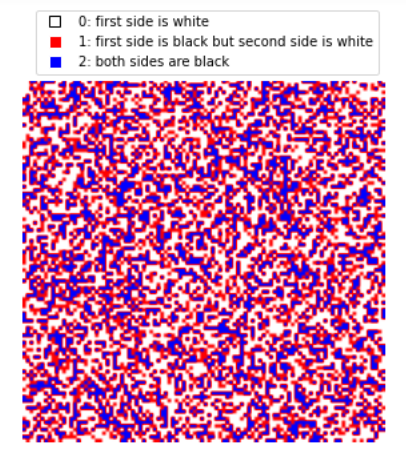
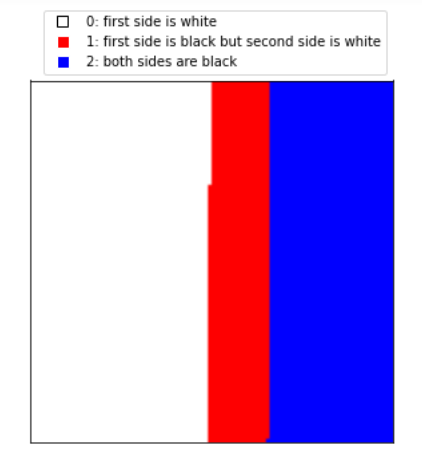

# Getting (Non)philosophical With Bayes

Since first time I that have encountered a statistical "paradox" I have this feeling that my explanations for what is the "right" answer might not be correct and it might be the case that I'm just not seeing yet another blind spot in my reasoning. So, as any experimental mathematician would do, I set to actually perform the statistical experiments and at least empirically "approve" my reasoning. This is one of the most recent ones I just remembered, since it is mentioned in the book "Causal Inference In Statistics" by Pearl and co-authors:

"You have 3 identical cards where each has two indistinguishable sides, except for their colour, where one card has two white sides, another card has two black sides, and the last card has one black side and one white side.

3 cards: BB, WW, and BW

You draw one card at random and look at one side of it and it is black. What is the probability that the other side is also black?"

Go ahead and try to come up with various explanations and if you can get different numbers. At least try to get 1/2 and 2/3, and maybe a 3/4. At the end of the day, how do you convince yourself that there is not anything that you are not considering here? I'm not trying to get into the philosophy of mathematics and how we make sure that what we prove to be correct is actually correct... So, i'll just do the experiment and go with the explanation that gives the number close to the empirical one, and try to come up with reasons that why other explanations are not correct. If I have more than one explanation that gives the same number close to the empirical value, either they are all correct but just different reasoning, or maybe at their core they are really the same reasons, but if they are really different, then I'm screwed. 

Here is the experiment in Python:

import random
import numpy as np

cards = [['b', 'b'] , ['b', 'w'], ['w', 'w']] # stack of 3 cards 

iter = 1000000 # total number of experiments
record = np.zeros(iter) # record results of each experiment, 
                        # 0 means first side isn't black
                        # 1 means first side is black
                        # 2 means both sides are black

for i in range(iter):
    card = random.randint(0,2) # choose one of 3 cards at random
    x = random.randint(0,1) # choose one of the two sides at random
    if cards[card][x] == 'b': # if first side is black
        record[i] = 1 # 1 means first side is black
        if cards[card][1 - x] == 'b': # if the second side is also black
            record[i] = 2 # 2 means first and second sides both are black</pre>

What is the probability that first side is white?

np.sum(record == 0) / record.shape[0]
# 0.499647</pre>

What is the probability that first side is black but second side isn't?

np.sum(record == 1) / record.shape[0]
# 0.166715 (surprised?)</pre>

What is the probability that both sides are black?

np.sum(record == 2) / record.shape[0]
# 0.333638</pre>

And finally, hat is the probability that second side is black if the first side is black?

np.sum(record == 2) / np.sum(record > 0)
# 0.666805</pre>

Here is a record of 10K experiments:

10K cards drawn at random and their results.

It's hard to say much from this jumble. Let's sort them and then look at it again:

Same 10K experiments sorted

Now, what do you think, would it make a difference if the cards had their front and back differentiated and we always looked at the front side first?
