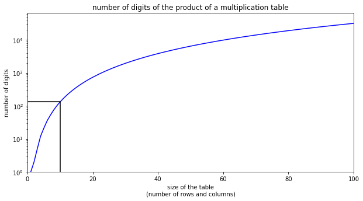
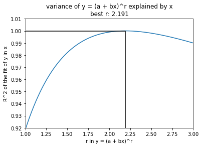

# 3rd-grade math just got harder

[James Tanton](https://twitter.com/jamestanton) is full of seemingly innocent and amusing questions. One of the questions that kept me busy one night is [this one](https://twitter.com/jamestanton/status/1384863126852677632): 

<blockquote class="wp-block-quote">
If one were to multiply together all one-hundred entries in a ten-by-ten multiplication table how big would the product be do you think? In the thousands? Millions? A twenty-digit answer? A hundred-digit answer? What does you[r] intuition say?
</blockquote>

As a theoretically oriented person, I should have started factoring numbers and multiplying and taking logs in base 10 etc., and after some bookkeeping, I would get that number, but for several reasons that wasn't what I did. First, I quickly replied: "Roughly 30^100" (by which I meant roughly the same number of digits as $30^{100}$) since 30 is in the "middle" of the table and there are 100 numbers. But that wasn't satisfying. Not only I still didn't know how many digits $30^{100}$ has, I also didn't know how far from the actual number I was. So, I just started writing a simple python script to get the answer.

import numpy as np
import matplotlib.pyplot as plt 
def multiplication_table(n):
    r = np.arange(1, n+1).reshape([1,-1]).astype('float64')
    t = r.transpose() * r
    return(t)
def product_digits(t):
    d = int(np.ceil(np.sum(np.log10(t))))
    return(d)
product_digits(multiplication_table(10))</pre>

and out came 132. Not bad. How many digits does $30^{100}$ has? 148. Doesn't seem too far off. But it is! To give some context, $20^{100}$ has 133, and $30^{89}$ has 132 digits. Anyways, that didn't seem to be much fun, the main question for me was how does this number grow compared to the size of the table. And my first guess was probably exponentially, or maybe $e^{e^n}$-ish. So, I had to check. And here comes the crunch time. 

n = 500 # size of the multiplication table
x = range(1,n+1)
y = [product_digits(multiplication_table(i)) for i in x]
y[0] = 1
plt.figure(figsize=[10,5])
plt.plot(x, y, 'b-')
plt.plot([0,10,10,10], [y[9], y[9], y[9], .1], color = 'k')
plt.yscale('log')
plt.ylabel('number of digits')
plt.xlabel('size of the table\n(number of rows and columns)')
plt.title('number of digits of the product of a multiplication table')
plt.xlim([.0, 100])
plt.ylim([1, y[100]*2])
plt.show()</pre>

Huh, it is sub-exponential! Well, the fact that it is not super-exponential might not be that surprising, it's the number of digits of a product after all, even there number of numbers being multiplied is increasing quadratically, and the numbers themselves are increasing, too. But it being sub-exponential is surprising for me. Now the question is what order that is! Let's do the most basic curve fitting there is to figure it out. I mean, let's assume in the plot above $y = (ax + b)^r$ where $y$ is the number of the digits of the product of all the numbers in the table and $x$ is the size (number of rows and columns) of the table. I fit the curve for various values of $r$ and see how good of a fit I get by evaluating the $R^2$ measure for the fit. Knowing that there is no "noise" in the data, I can safely choose the $r$ with the maximum $R^2$ and be confident that that's the best approximation, at least for the tables up to size 500. Let's do it:

n = 500 # size of the multiplication table
x = range(1,n+1)
y = [product_digits(multiplication_table(i)) for i in x]
y[0] = 1
plt.figure(figsize=[10,5])
plt.plot(x, y, 'b-')
plt.plot([0,10,10,10], [y[9], y[9], y[9], .1], color = 'k')
plt.yscale('log')
plt.ylabel('number of digits')
plt.xlabel('size of the table\n(number of rows and columns)')
plt.title('number of digits of the product of a multiplication table')
plt.xlim([.0, 100])
plt.ylim([1, y[100]*2])
plt.show()</pre>

Huh, still surprising to me! It's just a bit faster than quadratic growth. Best one I found is approximately $r = 2.191$. OK, enough of explorations. That's still far from a satisfying answer to this curious question, but at least it got me a head start to adjust my intuition. I'm going back to think about how to calculate this directly. 

Let's start by exploring the first few values, and hope we can find some recursive relation here:

1, 2, 5, 12, 21, 35, 52, 74, 101, 132, 168, 209, 255, 307, 364, 427, 495, 570, 650, 736, 828, 927, 1031, 1143, 1260, 1384, 1514, 1652, 1795, 1946, 2103, 2267, 2438, 2616, 2801, 2994, 3193, 3399, 3613, 3833, 4062, 4297, 4540, 4790, 5048, 5313, 5585, 5866, 6153, 6449, 6752, 7063, 7381, 7708, 8042, 8384, 8734, 9092, 9457, 9831, 10213, 10602, 11000, 11406, 11820, 12242, 12672, 13110, 13557, 14011, 14475, 14946, 15425, 15913, 16410, 16914, 17427, 17949, 18479, 19017, 19564, 20120, 20683, 21256, 21837, 22427, 23025, 23632, 24247, 24871, 25504, 26146, 26796, 27455, 28123, 28800, 29485, 30179, 30883, 31595, 32315, 33045, 33784, 34531, 35288, 36053, 36827, 37611, 38403, 39205, 40015, 40835, 41663, 42501, 43348, 44204, 45069, 45943, 46826, 47719, 48620, 49531, 50451, 51381, 52319, 53267, 54224, 55191, 56166, 57151, 58146, 59149, 60162, 61185, 62217, 63258, 64308, 65368, 66438, 67517, 68605, 69703, 70810, 71927, 73053, 74189, 75334, 76489, 77654, 78828, 80011, 81204, 82407, 83619, 84841, 86073, 87314, 88565, 89826, 91096, 92376, 93666, 94965, 96274, 97593, 98921, 100260, 101608, 102966, 104333, 105711, 107098, 108495, 109902, 111318, 112745, 114181, 115627, 117084, 118550, 120025, 121511, 123007, 124513, 126028, 127554, 129089, 130634, 132190, 133755, 135330, 136916, 138511, 140116, 141732, 143357, 144993, 146638, 148294</pre>

Knowing I need to find something quadratic-ish as the solution to whatever recursive formula I come up with, I shouldn't be hoping to multiply the previous number by a constant and do something with that, that'll most probably end with an exponential-ish function. But a linear recursion in the past two values could be useful, especially with a positive coefficient and a negative one. However, I don't see how I'm going to argue going from an $n \times n$ table to an $(n+2) \times (n+2)$ table later.

Since I'm lazy and it's late at night, I'm going to have the computer do that for me.

data = np.c_[y[:-2], y[1:-1], y[2:]]
X = np.array(data[:,:2])
Y = np.array(data[:,2])
mod = sm.OLS(Y, X)
res = mod.fit()
res.params</pre>

The output is $y_n = 2.00879262 y_{n-1} - 1.00882363 y_{n-2}$. 

Even though that the fit is quite good ($R^2$ is almost 1) the output doesn't mean much. This is not exact, and it won't solve my problems. Now, I'm guessing that probably a nice looking formula won't work because depending on what you multiply things by it could suddenly increase the number of digits, however I was hoping the fact that at each step I'm multiplying by a whole range of 1..n would fix that. 

Unfortunately the OEIS doesn't not have neither [this sequence](https://oeis.org/search?q=1%2C+2%2C+5%2C+12%2C+21%2C+35&sort=&language=english&go=Search) nor the [derivative of it](https://oeis.org/search?q=1%2C++++3%2C++++7%2C++++9%2C+++14%2C+++17&sort=&language=english&go=Search). One probably should add it to their database!

I'm out of ideas for now, let me know if you've got any.

---

## Old Comments

> **Mojtaba Eslami** — April 28, 2021
> 
> Cool, amigo!
