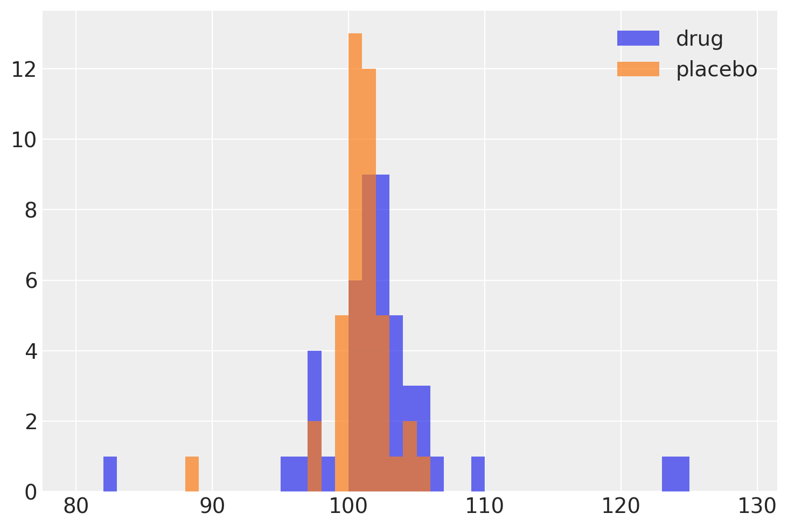
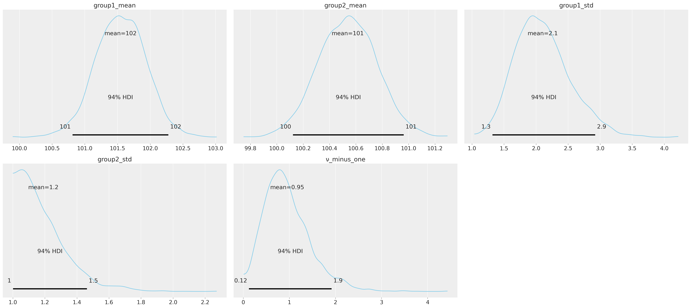
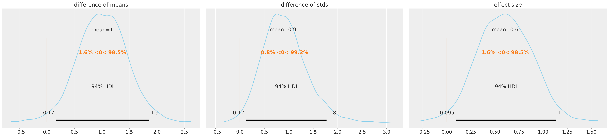
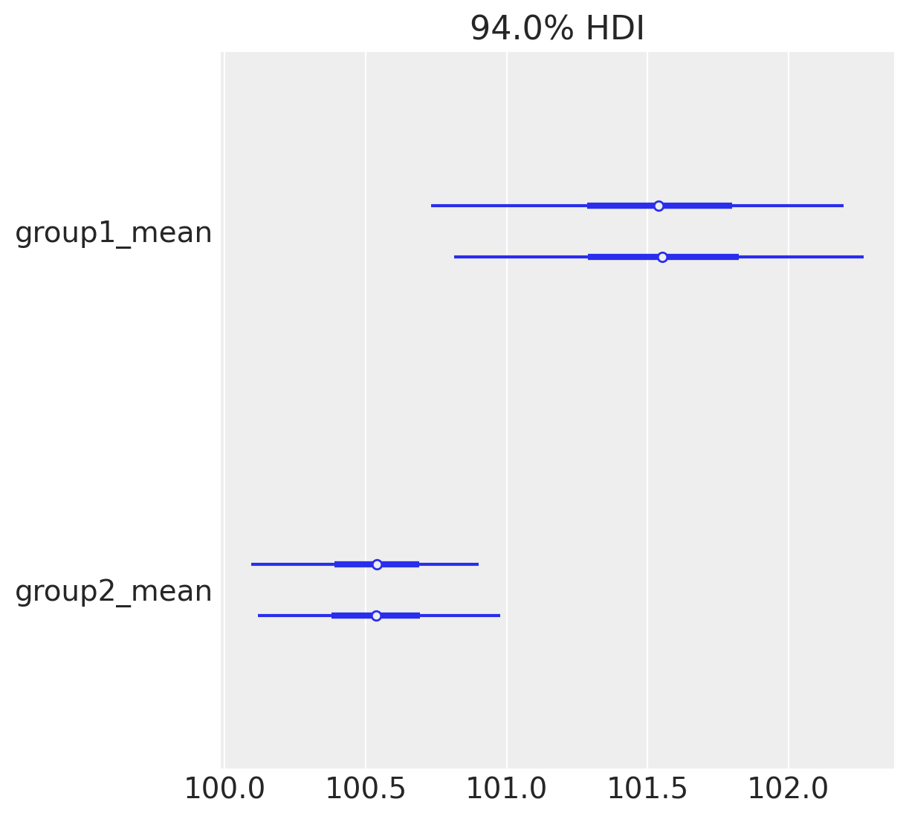
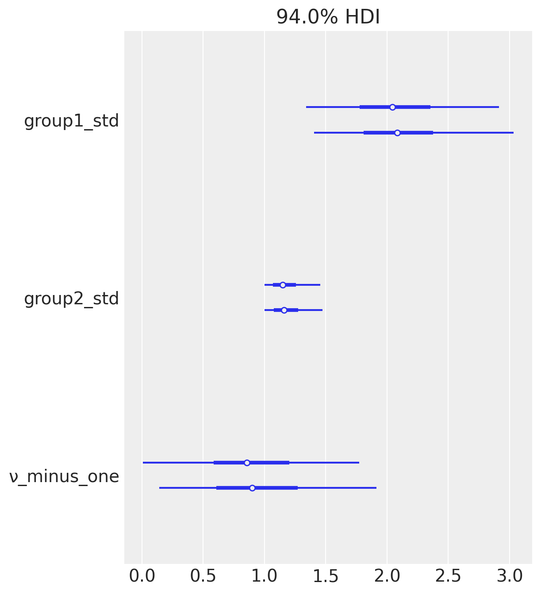

# How far is far enough?

A frequentist vs Bayesian case

[This is an adaptation of [Bayesian Estimation Supersedes the T-Test](https://docs.pymc.io/pymc-examples/examples/case_studies/BEST.html)]

How different are two sets of numbers from each other? That's one of the million-dollar questions of statistics. For example, let's say we are testing a new drug by administering it to half of a group of randomly chosen patients and administering a placebo to the other half, and measuring a certain attribute of these two groups sometime later. And let's say these are the numbers we get for that certain attribute after measuring for each group:

drug = (101,100,102,104,102,97,105,105,98,101,100,123,105,103,100,95,102,106,109,102,82,102,100,102,102,101,102,102,103,103,97,97,103,101,97,104,96,103,124,101,101,100,101,101,104,100,101)
placebo = (99,101,100,101,102,100,97,101,104,101,102,102,100,105,88,101,100,104,100,100,100,101,102,103,97,101,101,100,101,99,101,100,100,101,100,99,101,100,102,99,100,99)</pre>

Are these two sets of numbers different enough from each other to say the drug had some sort of effect on the patients? 

The most naive approach would be to check their means and see if they are different:

np.mean(drug) - np.mean(placebo)

> 1.5577507598784166</pre>

About 1.6 different. Is that big enough? Maybe we should look at how wide the range of the numbers is so that we get a feeling of whether 1.6 is big enough or not.

Hmm, can't quite tell by just looking at the histogram. Seems like the drug-administered patients have a wider spread of the measured attribute. Call up a statistician friend and they'll suggest running a simple t-test to decide whether the means of these two sets are statistically significantly different. Well, an unpaired two-sample t statistic for two sets of the same size and similar variance is measured by

$t=\frac{\bar X_1 - \bar X_2}{s_p \sqrt{2/n}} $,

where $s_p$ is the pooled standard deviation which is 

$s_{p}={\sqrt {\frac {s_{X_{1}}^{2}+s_{X_{2}}^{2}}{2}}}$.

This is known as [Student's t-test](https://en.wikipedia.org/wiki/Student's_t-test#Independent_(unpaired)_samples) and as you can see it takes into account the variance of the two sets to quantify an understanding of whether 1.6 is big enough or not. But then we know that our two sets have different sizes (47 and 42) and we might think that based on our sample, the underlying populations might have different variances. Here comes [Welch's t-test](https://en.wikipedia.org/wiki/Welch%27s_t-test) which has the same spirit but takes care of the technicalities that we are concerned with here. 

from scipy.stats import ttest_ind
ttest_ind(drug, placebo, equal_var=True, alternative='two-sided')

> Ttest_indResult(statistic=1.5586953301521096, pvalue=0.12269895509665575)

ttest_ind(drug, placebo, equal_var=False, alternative='two-sided')

> Ttest_indResult(statistic=1.622190457290228, pvalue=0.10975381983712831)</pre>

Seems like whether we assume the variance of the populations are equal or not, the p-value of the t statistic is large ($p > 0.1$) and most scientists would say they are not significantly different from each other and close the case. The drug is not effective.

A Bayesian would tend to approach this problem differently though. Rather than judging the efficacy of the drug solely on a seemingly arbitrary chosen threshold for the p-value to show significance, they would ask what would happen if I sampled these samples again and again and check whether those samples are significantly different from each other!

Let's put some wide assumptions on the two populations as our priors:

import arviz as az
import matplotlib.pyplot as plt
import numpy as np
import pandas as pd
import pymc3 as pm
y = pd.DataFrame(
    dict(
        value = np.r_[
            np.array(drug), 
            np.array(placebo)
        ], 
        group = np.r_[
            ["drug"] * len(drug), 
            ["placebo"] * len(placebo)
        ]
    )
)

μ_m = y.value.mean()
μ_s = y.value.std() * 2
σ_low = 1
σ_high = 10

with pm.Model() as model:
    group1_mean = pm.Normal("group1_mean", mu=μ_m, sd=μ_s)
    group2_mean = pm.Normal("group2_mean", mu=μ_m, sd=μ_s)
    group1_std = pm.Uniform("group1_std", lower=σ_low, upper=σ_high)
    group2_std = pm.Uniform("group2_std", lower=σ_low, upper=σ_high)
    ν = pm.Exponential("ν_minus_one", 1 / 29.0) + 1
    
    λ1 = group1_std ** (-2)
    λ2 = group2_std ** (-2)
    group1 = pm.StudentT("drug", nu=ν, mu=group1_mean, lam=λ1, observed=y1)
    group2 = pm.StudentT("placebo", nu=ν, mu=group2_mean, lam=λ2, observed=y2)

    diff_of_means = pm.Deterministic("difference of means", group1_mean - group2_mean)
    diff_of_stds = pm.Deterministic("difference of stds", group1_std - group2_std)
    effect_size = pm.Deterministic(
        "effect size", diff_of_means / np.sqrt((group1_std ** 2 + group2_std ** 2) / 2)
    )</pre>

Now we can start sampling:

with model:
    trace = pm.sample(2000)

pm.plot_posterior(
    trace,
    var_names=["group1_mean", "group2_mean", "group1_std", "group2_std", "ν_minus_one"],
    color="#87ceeb",
)</pre>

This still doesn't tell us whether the two sets are meaningfully different from each other or not. Let's look at the differences:

pm.plot_posterior(
    trace,
    var_names=["difference of means", "difference of stds", "effect size"],
    ref_val=0,
    color="#87ceeb",
)</pre>

Now we can say that there are meaningful differences between the two groups for all three measures. For the difference of means, at least 94% of the posterior probability are greater than zero, which suggests the group means are credibly different. The effect size and differences in standard deviation are similarly positive. We can also look at the individual sets and see the differences there:

pm.forestplot(trace, var_names=["group1_mean", "group2_mean"]);
pm.forestplot(trace, var_names=["group1_std", "group2_std", "ν_minus_one"]);</pre>

- - 

That means if our statistician friend is a Bayesian one, they'll approve that the drug is possibly effective.

For a discussion on HDI see: 

- https://en.wikipedia.org/wiki/Credible_interval- https://discourse.pymc.io/t/highest-density-regions-hdr-misunderstanding/1364- https://stackoverflow.com/a/53689098
