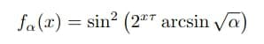
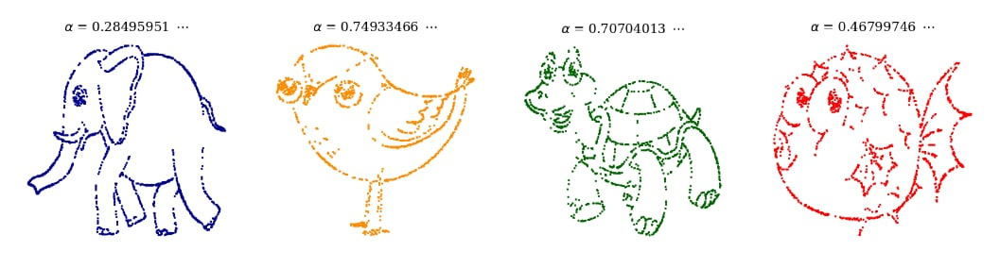
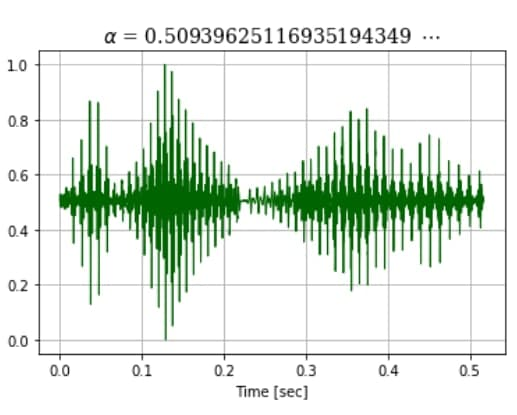
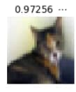
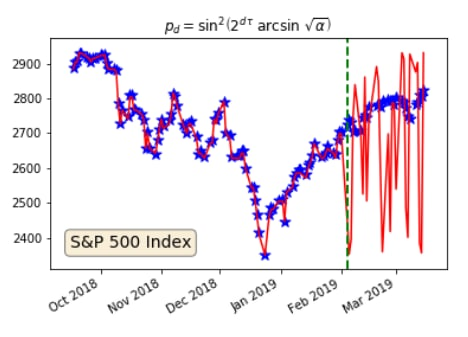
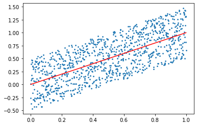
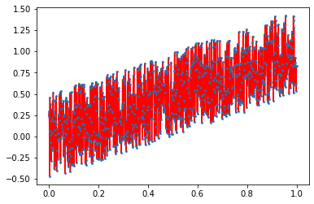
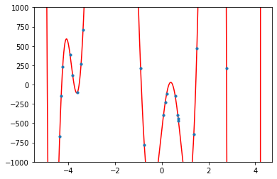
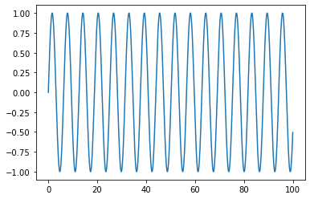
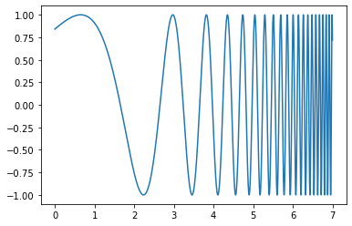

# One-parameter family of functions

Here's a fun paper to read: [Real numbers, data science and chaos: How to fit any dataset with a single parameter](https://arxiv.org/pdf/1904.12320.pdf). The premise of the paper is that "all the samples of any arbitrary data set can be reproduced by a simple differentiable equation", namely, this one:

where $\alpha$ is "learned" from the data set. And to illustrate this, they provide some examples along with their learned parameter. 

The crazy part, they apply this to other types of data, including time series.

Of course, that doesn't mean that you can use this to make any prediction or classification, etc. Quite the opposite, one of the goals of the authors is to warn against interpretations that come out of any machine learning model, and they do this beautifully and mention it in Section 3 of the paper. But let's take a moment to understand what is the thing that they actually do?

If I'd asked you to create a one-parameter family of functions that "fits" any given data set what would you do? You might think of lines that pass through the origin. And then you might think, well, that doesn't "fit" anything really, at best, it shows a trend in the data. 

This is when I start explaining that by fitting I really mean just curve fitting, some function $f(x): \mathbb{R} \rightarrow \mathbb{R}$ for which the sum of the vertical distances of the observed points from the curve is minimized. Without really any other assumptions, constraints, etc. The ideal one will have [RMSE](https://en.wikipedia.org/wiki/Root-mean-square_deviation) (root mean square error) zero. Something like this:

Here a reasonable person would explain that such a thing, even if possible, would not serve any real purpose, other than just connecting those dots. And that is what I've actually done there, I've connected the dots with line segments. But I'll keep explaining that I'm really just interested in knowing if there is a family of functions that could do this for me, where suddenly a mathematically oriented person would point out that yeah, you can estimate it with a polynomial of large enough degree, right before someone pointing out that that's not gonna be a "one-parameter" family though. 

The thinking here is that high-degree polynomials will give you enough zeros, enough oscillations that then you could control by adjusting the coefficients of the polynomial. The fit is going to be awful for any practical purpose, but the RMSE will go to zero if you choose the degree large enough. OK, I'm not even going to attempt plotting one for the above data set, since it will fill the whole area with red lines, but here is one for a much smaller set just for your imagination: 

Even though the polynomial idea was not that good (too many parameters) it points in a good direction (thanks the mathematically oriented person who suggested this). The reason a polynomial of high degree can do this is that it has many zeros (more than a line) and with coefficients, you can "tune" them to fit your data set well. Now that we don't have the luxury of many coefficients, maybe we can use many zeros somehow?! So, what would you do, if you wanted to achieve many zeros with a function that doesn't have many parameters? Yes, an oscillating function like $f(x) = \sin(x)$ would do. 

Now, you probably need to space the zeros of the function so that they are not uniform, one idea could be to space them exponentially, that is, to use $f(x) = \sin(2^x)$. this will introduce a lot more zeros in a limited domain and space them unevenly, the further you go, the more zeros:

We're almost there, now if you just shrink or stretch the function horizontally, you might have a good chance of "fitting" many many data sets with really low RMSE. And in this very interesting paper, Laurent Boué does exactly that. Well, not exactly, there are a few more details to take care of the precision, and also it's a $sin^2(x)$ so that the numbers are between zero and one, for simplicity I guess, or for being fancy, I don't know. The $\arcsin(\sqrt{\alpha})$ is just a number that shrinks and stretches the function horizontally, and I think all of it could have been called the $\alpha$, but again for some computational reasons, or for the sake of being fancy, or something else, it was used like this. The catch here is that you need to *reeeeeally* fine-tune that $\alpha$ to get what you want and to achieve this, they have to do the calculations with really high precision, and apparently, to be able to do that you need to do it in binary, with strings?! And at the end, what you have is a purely(?) mathematical hash function. Yes, you are not fitting or learning anything, to be honest, this is just an interesting hash function. Anyways, enjoy reading the paper, especially Section 3.
