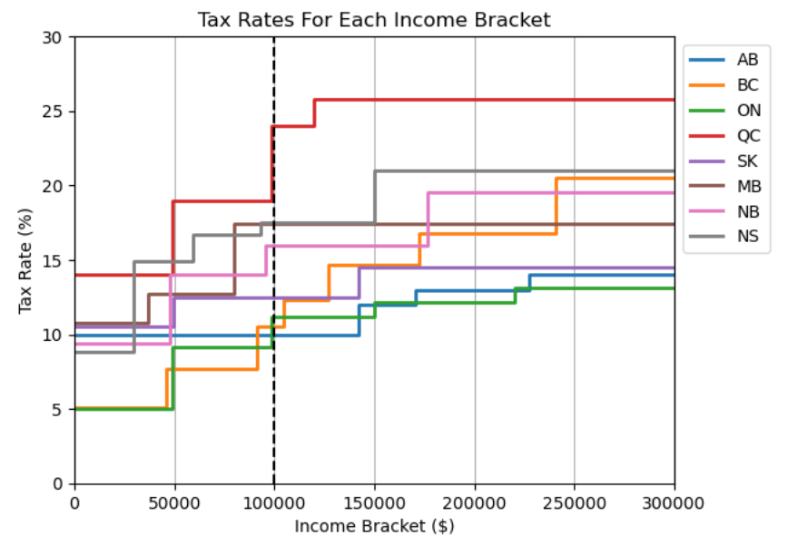
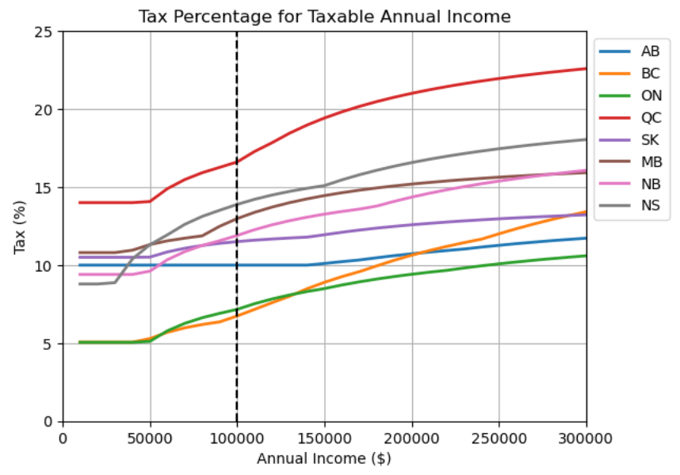
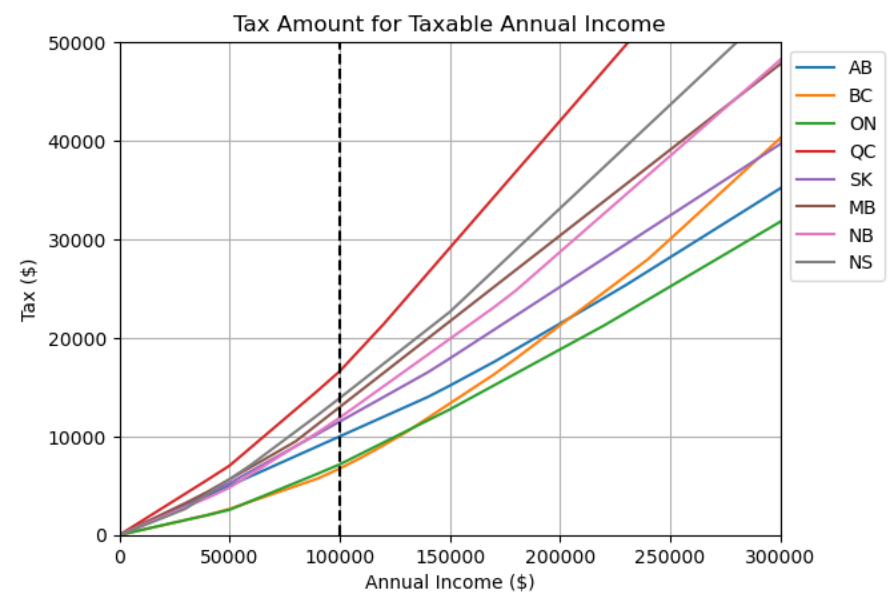

# Which province in Canada pays the least tax?

Well, that depends on how much income you have. Here is a chart of the 2023 tax brackets in 8 of the provinces (I was just too lazy to get them all!) [source: [https://www.canada.ca/en/revenue-agency/services/tax/individuals/frequently-asked-questions-individuals/canadian-income-tax-rates-individuals-current-previous-years.html](https://www.canada.ca/en/revenue-agency/services/tax/individuals/frequently-asked-questions-individuals/canadian-income-tax-rates-individuals-current-previous-years.html)]

Let's assume your income is annual taxable income is $100K. In that case, you'll be in the lowest tax bracket if you are in Alberta. But the total tax paid depends on the lower brackets too. Let's take a look at how much total provincial tax you'll be paying with this annual income.

In BC you'll be paying the least tax, roughly 6.7% of your total salary, and Ontario comes a close second at 7.2%. Then Alberta is at 10%, and all others are worse.

But because the higher brackets in BC are so much higher than in Ontario and also than Alberta, as your income increases, the total tax amount (and percentage) changes. e.g. at $150K Ontario is slightly less than BC, at $200K Alberta and BC are almost the same, and at $250K BC is more than Alberta and Ontario.

The summary is, for incomes less than $150K (this is more than 90% of Canadians) BC and Ontario pay the least tax and are comparable. for incomes between $150K and $200K, Ontario pays the least amount of tax, and then BC. And finally, for incomes higher than $200K Ontario still pays the least amount of tax, and then Alberta.

Note that here I am not taking into account any tax return policies that might exist across provinces.

Interestingly, provinces like QC, NS, MB, and NB are universally higher taxed for all income brackets. BC is taxing higher-income people more and lower-income people less. Alberta has an opposite (compared to BC) trend. And Ontario is universally lower taxed than other provinces.
