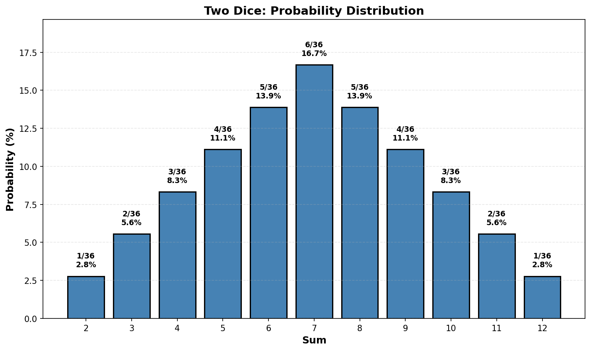
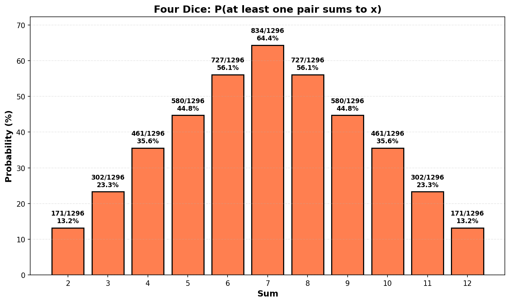
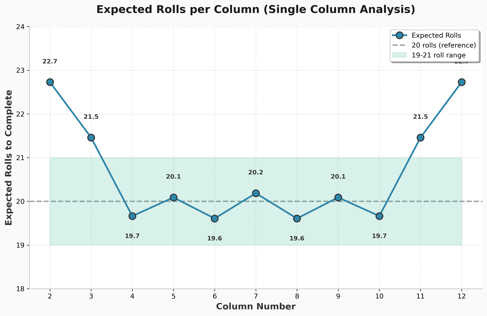
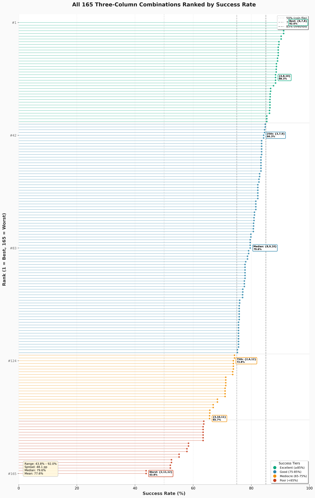
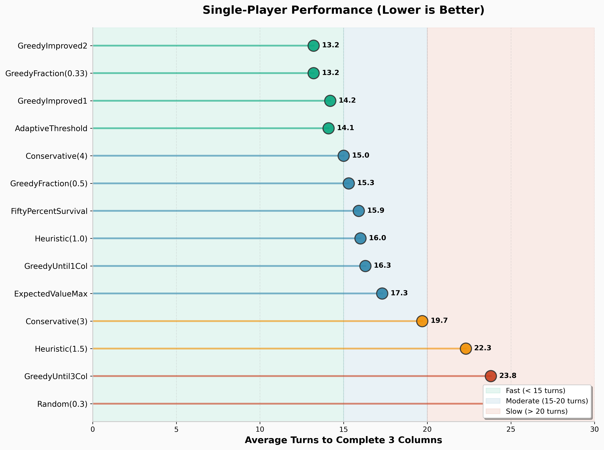
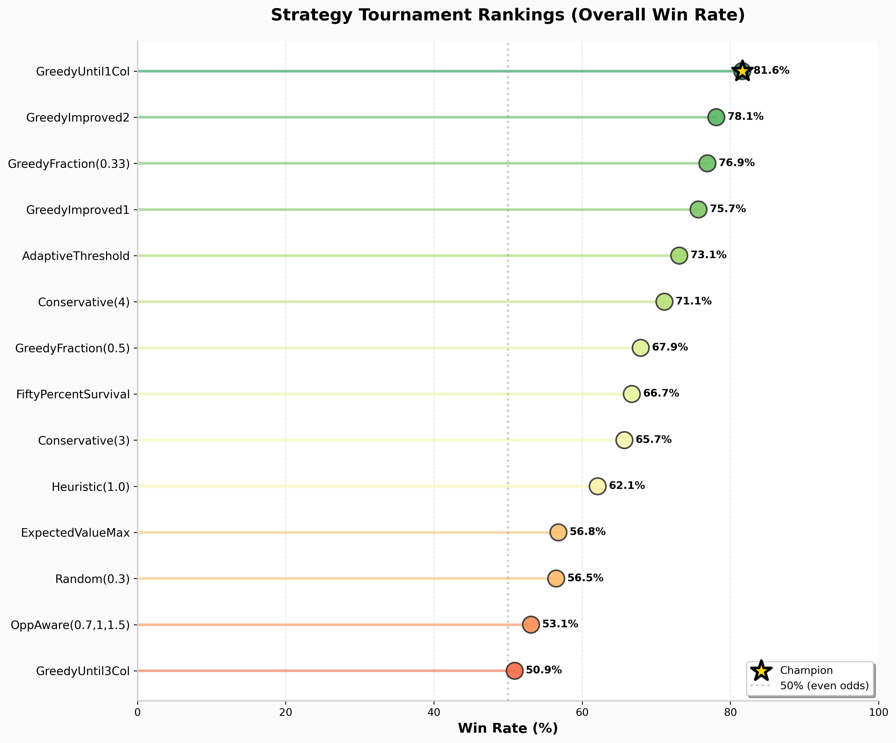
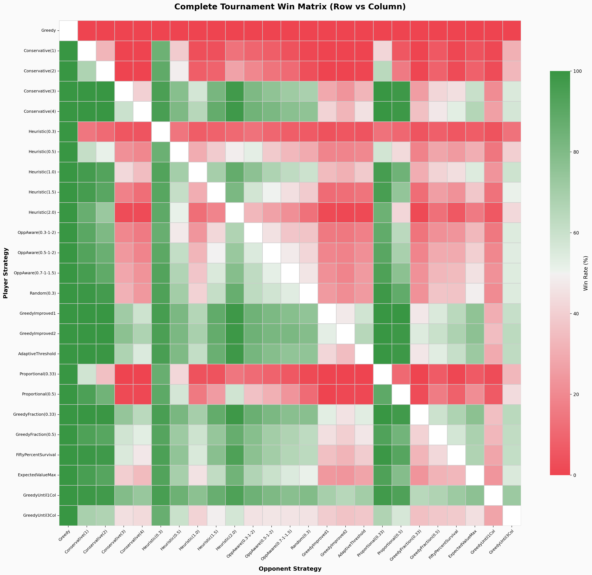

# Can't Stop, Addicted To The Shindig

I recently got introduced to this game called [Can't Stop](https://boardgamegeek.com/boardgame/41/cant-stop) and it got me thinking about probabilities. You know how it is - you start playing a dice game and suddenly you're knee-deep in combinatorics at 2am.

The game is deceptively simple but mathematically rich. In this post, I'll take you through:
- The probability foundations (2-dice vs 4-dice)
- Which columns to choose and why
- When to stop rolling (the eternal question!)
- Whether to continue your current columns or switch to new ones
- How different strategies perform head-to-head
- Whether the game designers nailed the balance

Let's dive in.

## The Game

The rules are straightforward: roll four dice, pair them up however you want, move your markers on a board. The catch? You can keep rolling as long as you want, but if you can't move any of your three active markers, you lose everything you've gained that turn. Classic push-your-luck. [Here](https://www.youtube.com/watch?v=L6Zk7j1mJDE) is a brief explanation of how the game is played.

The board has columns numbered 2 through 12, with different lengths:
- Columns 2 and 12: 3 steps
- Columns 3 and 11: 5 steps
- Columns 4 and 10: 7 steps
- Columns 5 and 9: 9 steps
- Columns 6 and 8: 11 steps
- Column 7: 13 steps

You need to complete three columns to win.

I've implemented a fully interactive web version of the game with a Python/FastAPI backend and React frontend. You can [play it online](https://cantstop-frontend.onrender.com/) and check out the
  [source code](https://github.com/k1monfared/cantstop-game).

**The Forced-Move Rule (Important!)**

Here's a critical rule that shapes the entire strategy: **you must take all available moves**. If you roll the dice and choose a pairing that creates any valid move, you must make ALL legal moves from that pairing, even if you don't want them.

For example, if you're working on columns {6, 7, 8} and you roll (1,1,3,4), you could choose pairing (1,1)+(3,4) = 2+7. But if you do, you're forced to take BOTH the 2 and the 7, even though column 2 isn't in your plan. You can't just cherry-pick the 7.

This rule prevents the game from being trivially easy and adds tactical depth.

## Probability Foundations

### Two Dice: The Baseline

You probably know this one already, but let's start here for comparison. With two dice, how likely are you to roll each sum?

| Sum | Ways to make it | Probability | Percentage |
|----:|:---------------|------------:|-----------:|
| 2 | (1,1) | 1/36 | 2.78% |
| 3 | (1,2), (2,1) | 2/36 | 5.56% |
| 4 | (1,3), (2,2), (3,1) | 3/36 | 8.33% |
| 5 | (1,4), (2,3), (3,2), (4,1) | 4/36 | 11.11% |
| 6 | (1,5), (2,4), (3,3), (4,2), (5,1) | 5/36 | 13.89% |
| 7 | (1,6), (2,5), (3,4), (4,3), (5,2), (6,1) | 6/36 | 16.67% |
| 8 | (2,6), (3,5), (4,4), (5,3), (6,2) | 5/36 | 13.89% |
| 9 | (3,6), (4,5), (5,4), (6,3) | 4/36 | 11.11% |
| 10 | (4,6), (5,5), (6,4) | 3/36 | 8.33% |
| 11 | (5,6), (6,5) | 2/36 | 5.56% |
| 12 | (6,6) | 1/36 | 2.78% |

Sum 7 is the most likely at 16.67%, and it's exactly 6× more likely than sum 2 at 2.78%.

**Quick proof:** For sum 2, there's only one way: both dice must show 1. That's $\frac{1}{6} \times \frac{1}{6} = \frac{1}{36}$. For sum 7, you need complementary pairs: (1,6), (2,5), or (3,4), and order matters, so that's 6 ways total out of 36 possible outcomes.

Now if Can't Stop used two dice, column 7 would need to be 6× longer than column 2 to be equally hard. Instead it's only $\frac{13}{3} \approx 4.3\times$ longer. So something interesting must be happening with four dice.

### Four Dice: This Is Where It Gets Interesting

In Can't Stop, you roll FOUR dice and then pair them up. Say you roll 2, 3, 4, 5. You can make:
- (2,3)+(4,5) = 5 and 9
- (2,4)+(3,5) = 6 and 8
- (2,5)+(3,4) = 7 and 7

That's it, just three possible pairings. The question is: if I'm trying to hit column 7, what's the probability that at least one of those pairings gives me a 7?

Let me work this out properly.

#### Computing P(can make a 2)

To make a 2, I need a pair that sums to 2, which means two 1's. So I need at least two 1's among my four dice.

**Probability of NOT getting enough 1's:**

- $P(\text{zero 1's}) = \left(\frac{5}{6}\right)^4 = \frac{625}{1296}$

- $P(\text{exactly one 1}) = \binom{4}{1} \times \left(\frac{1}{6}\right)^1 \times \left(\frac{5}{6}\right)^3 = 4 \times \frac{1}{6} \times \frac{125}{216} = \frac{500}{1296}$

**Therefore:**

$$P(\text{can make a 2}) = 1 - \frac{625}{1296} - \frac{500}{1296} = \frac{171}{1296} \approx 13.2\%$$

13.2%! That's way higher than the 2.78% we had with two dice.

#### Computing P(can make a 7)

To make a 7, I need one of these pairs: (1,6), (2,5), or (3,4). The intuition: I want to count rolls with at least one of these complementary pairs, but I need to be careful not to double-count rolls that contain multiple pairs. I'll use inclusion-exclusion.

Let A = "I can make pair (1,6)" = "I have at least one 1 AND at least one 6"
Let B = "I can make pair (2,5)" = "I have at least one 2 AND at least one 5"
Let C = "I can make pair (3,4)" = "I have at least one 3 AND at least one 4"

**First, P(A) - having both a 1 and a 6:**

$$P(A) = 1 - P(\text{no 1's}) - P(\text{no 6's}) + P(\text{no 1's AND no 6's})$$
$$= 1 - \left(\frac{5}{6}\right)^4 - \left(\frac{5}{6}\right)^4 + \left(\frac{4}{6}\right)^4$$
$$= \frac{1296 - 625 - 625 + 256}{1296} = \frac{302}{1296}$$

By the same logic, $P(B) = \frac{302}{1296}$ and $P(C) = \frac{302}{1296}$.

**Next, the overlaps:**

$P(A \cap B) = P(\text{have 1, 6, 2, 5})$ = $\frac{24}{1296}$ (all four distinct values among four dice)

Similarly, $P(A \cap C) = \frac{24}{1296}$ and $P(B \cap C) = \frac{24}{1296}$.

$P(A \cap B \cap C) = 0$ because you'd need 6 specific dice values with only 4 dice.

**Final answer:**

$$P(\text{can make a 7}) = P(A \cup B \cup C) = 302 + 302 + 302 - 24 - 24 - 24 + 0 = \frac{834}{1296} \approx 64.4\%$$

With two dice, P(7) was 16.67%. With four dice, it jumped to 64.4%. And P(2) went from 2.78% to 13.2%.

Did the distribution get flatter?

#### The Complete Picture

Let me calculate all of them (see [probability_calculations.py](files/20251201/probability_calculations.py) for the code):

| Sum | At Least One Pair | Normalized | Column Length | Normalized |
|----:|-----------------:|-----------:|--------------:|-----------:|
| 2 | 171 (13.2%) | 1.00 | 3 | 1.00 |
| 3 | 302 (23.3%) | 1.77 | 5 | 1.67 |
| 4 | 461 (35.6%) | 2.70 | 7 | 2.33 |
| 5 | 580 (44.8%) | 3.39 | 9 | 3.00 |
| 6 | 727 (56.1%) | 4.25 | 11 | 3.67 |
| 7 | 834 (64.4%) | 4.88 | 13 | 4.33 |
| 8 | 727 (56.1%) | 4.25 | 11 | 3.67 |
| 9 | 580 (44.8%) | 3.39 | 9 | 3.00 |
| 10 | 461 (35.6%) | 2.70 | 7 | 2.33 |
| 11 | 302 (23.3%) | 1.77 | 5 | 1.67 |
| 12 | 171 (13.2%) | 1.00 | 3 | 1.00 |

Now look at those normalized columns. The probability ratio from 2 to 7 is 4.88. The length ratio is 4.33. Pretty close! The game designers were definitely thinking about this.

## Column Selection Strategy

### Which Column Should You Go For?

On one hand, column 2 is only 3 steps. On the other hand, you'll only hit it 13.2% of the time. Column 7 is 13 steps but you hit it 64.4% of the time.

**Expected number of rolls to complete column n:**

$$\mathbb{E}[\text{rolls}] = \frac{\text{length}}{\text{probability}} = \frac{L(n)}{P(n)}$$

For column 2: $\frac{3}{0.132} = 22.73$ rolls
For column 7: $\frac{13}{0.644} = 20.18$ rolls

Column 7 is slightly faster, even though it's 4× longer. Let me check all of them:

| Column | Length | P(n) | Expected Rolls |
|-------:|-------:|-----:|---------------:|
| 2, 12 | 3 | 13.2% | 22.73 |
| 3, 11 | 5 | 23.3% | 21.46 |
| 4, 10 | 7 | 35.6% | 19.67 |
| 5, 9 | 9 | 44.8% | 20.09 |
| 6, 8 | 11 | 56.1% | 19.60 |
| 7 | 13 | 64.4% | 20.18 |

Columns 2 and 12 require the most rolls. Columns 6, 7, and 8 are all close to each other around 20 rolls.

### But Wait - Three Columns at Once

Here's the thing though: you don't play Can't Stop one column at a time. You have THREE active columns, and you bust if you can't hit ANY of them.

If you're on columns {6, 7, 8}, what's your bust probability?

I need $P(\text{can't make 6 AND can't make 7 AND can't make 8})$. The easiest way is to enumerate all 1296 possible rolls and count (see [column_combinations.py](files/20251201/column_combinations.py)):

**Result: 1193/1296 = 92.0% success rate**

So if you're on {6,7,8}, you have a 92% chance of not busting.

What about {2,3,12}?

**Result: 568/1296 = 43.8% success rate**

Less than 50% chance of not busting. You're more likely to bust than succeed!

### All 165 Three-Column Combinations

Let me analyze all possible combinations and show you the best and worst (see [column_combinations.py](files/20251201/column_combinations.py) for complete results):

**Top 10 Best Combinations:**

| Rank | Columns | Success | Bust | Clean | Q (expected markers/roll) |
|-----:|:--------|--------:|-----:|------:|--------------------------:|
| 1 | {6,7,8} | 92.0% | 8.0% | 39.8% | 1.43 |
| 2 | {5,7,8} | 91.4% | 8.6% | 38.2% | 1.42 |
| 3 | {6,7,9} | 91.4% | 8.6% | 38.2% | 1.42 |
| 4 | {4,6,8} | 91.1% | 8.9% | 28.2% | 1.31 |
| 5 | {6,8,10} | 91.1% | 8.9% | 28.2% | 1.31 |
| 6 | {4,7,8} | 90.3% | 9.7% | 34.0% | 1.38 |
| 7 | {6,7,10} | 90.3% | 9.7% | 34.0% | 1.38 |
| 8 | {5,6,8} | 89.5% | 10.5% | 33.3% | 1.37 |
| 9 | {6,8,9} | 89.5% | 10.5% | 33.3% | 1.37 |
| 10 | {5,7,10} | 89.3% | 10.7% | 29.1% | 1.33 |

**Bottom 10 Worst Combinations:**

| Rank | Columns | Success | Bust | Clean | Q (expected markers/roll) |
|-----:|:--------|--------:|-----:|------:|--------------------------:|
| 156 | {2,10,11} | 57.9% | 42.1% | 5.6% | 1.10 |
| 157 | {3,4,12} | 57.9% | 42.1% | 5.6% | 1.10 |
| 158 | {2,4,12} | 55.2% | 44.8% | 4.2% | 1.08 |
| 159 | {2,10,12} | 55.2% | 44.8% | 4.2% | 1.08 |
| 160 | {2,3,11} | 52.5% | 47.5% | 4.1% | 1.08 |
| 161 | {3,11,12} | 52.5% | 47.5% | 4.1% | 1.08 |
| 162 | {2,3,4} | 52.2% | 47.8% | 3.9% | 1.07 |
| 163 | {10,11,12} | 52.2% | 47.8% | 3.9% | 1.07 |
| 164 | {2,3,12} | 43.8% | 56.2% | 2.3% | 1.05 |
| 165 | {2,11,12} | 43.8% | 56.2% | 2.3% | 1.05 |

**What's "Clean"?** Remember the forced-move rule? A "clean" move is one where you only hit columns you actually want. Even the best combination {6,7,8} only has 39.8% clean moves - the rest of the time you're forced onto unwanted columns.

Here's the complete picture - all 165 combinations ranked by success rate:

The distribution reveals some interesting patterns: 37 combinations are "excellent" (≥85% success rate), mostly centered around columns 5-9. The median combination still succeeds 79.6% of the time, but the worst combinations drop dramatically to just 43.8% - you're more likely to bust than succeed!

The full detailed results are in [column_combinations_all.csv](files/20251201/column_combinations_all.csv).

## When Should You Stop Rolling?

This is the classic push-your-luck question. You've made some progress this turn - should you roll again or bank it?

### The Basic Heuristic

Here's a mathematical framework (see [stopping_heuristic.py](files/20251201/stopping_heuristic.py) for implementation):

**Keep rolling if:** $(P_{\text{success}} \times Q) > (P_{\text{bust}} \times U)$

Where:
- $P_{\text{success}}$ = probability of hitting at least one active column
- $Q$ = expected number of markers you'll advance on a successful roll
- $P_{\text{bust}}$ = probability of hitting no active columns
- $U$ = unsaved progress (steps you'd lose if you bust)

Let's test this on {6,7,8} with 5 unsaved steps:

**Risk of rolling again:**
- 8% chance you bust and lose those 5 steps
- Expected loss: $0.08 \times 5 = 0.4$ steps

**Expected gain from rolling again:**
- 92% chance you succeed
- You'll advance about 1.43 markers on average
- Expected gain: $0.92 \times 1.43 = 1.32$ steps

Since $1.32 > 0.4$, you should keep rolling.

Now try the same on {2,3,12} with 2 unsaved steps:

**Risk:** $0.562 \times 2 = 1.12$ steps
**Expected gain:** $0.438 \times 1.05 = 0.46$ steps

Since $1.12 > 0.46$, you should STOP.

### The Forced-Move Impact

Remember that forced-move rule? It changes everything. Let me recalculate success rates for "clean" moves only.

For {6,7,8}, the old analysis said 92% success rate. But how many of those rolls force you onto columns outside {6,7,8}?

A roll is "clean" if at least one pairing gives you ONLY sums in {6,7,8}. Running the calculation:

**Result: Only 39.8% of rolls give you a clean move on {6,7,8}!**

The other 52.2% of rolls let you make progress BUT also force you onto unwanted columns, slowly contaminating your combination.

**For {2,3,12}: Only 2.3% of rolls are clean!**

The forced-move rule is a balancing mechanism. It prevents {6,7,8} from being completely dominant by forcing players onto suboptimal columns when they push their luck.

## Continuation vs. Switching

Should you continue your current columns or switch to new ones? This depends on progress already made: if columns are nearly complete (e.g., 10/11 steps), continuing makes sense. But with minimal progress (2-3 steps), switching to a better combination might be faster.

The mathematics favor continuation in most cases: wasting accumulated progress hurts more than the marginal benefit of a slightly better combination. However, the forced-move rule gradually contaminates good combinations over time, sometimes forcing strategic switches.

**Note:** I haven't fully analyzed this aspect quantitatively. A complete treatment would require simulating "always continue" vs "switch when X" strategies across different board states and comparing their win rates. This is an interesting open question for future work, but for now I'm focusing on the stopping decision given a fixed set of active columns.

## Strategy Performance

Now let's see how different strategies actually perform. I implemented 38 different strategies and ran them against each other in a comprehensive simulation (1,000 single-player trials per strategy, 2,500 head-to-head games per matchup, 3.6 million total games).

### The Strategies

I tested 38 strategies across 14 different strategic families:

**Core Strategy Types:**

**1. Baseline** - Greedy (always rolls) and Random (30% stop probability) establish performance bounds.

**2. Conservative(k)** - Stops after accumulating k unsaved steps, with k ∈ {1, 2, 3, 4}. Critically updated to respect the "can't bust with <3 active runners" rule.

**3. Heuristic(α)** - Mathematical stopping rule: Keep rolling if $(P_{\text{success}} \times Q) > (\alpha \times P_{\text{bust}} \times U)$ with α ∈ {0.3, 0.5, 1.0, 1.5, 2.0}. Pure EV at α = 1.0, aggressive when α < 1, conservative when α > 1.

**4. OpponentAware** - Dynamic risk adjustment based on game state with four variants: (0.3,1,2), (0.5,1,2), (0.7,1,1.5) [aggressive when behind], and (2,1,0.3) [conservative when behind - the opposite approach].

**5. Greedy-Improved** - Simple threshold improvements: GreedyImproved1 (progress on all 3 active columns) and GreedyImproved2 (exactly 5 unsaved steps).

**6. Adaptive** - AdaptiveThreshold dynamically adjusts stopping threshold based on current success probability.

**7. Proportional** - ProportionalThreshold(f) with f ∈ {0.33, 0.5}, stops based on fraction of remaining distance.

**8. Progressive Milestones** - GreedyFraction(f) with f ∈ {0.33, 0.5}, stops when reaching next progressive milestone (1/3 → 2/3 → complete).

**9. Probabilistic** - FiftyPercentSurvival (stops when cumulative survival < 50%) and ExpectedValueMax (stops when EV ≤ 0).

**10. Column-Count** - GreedyUntil1Col (stops after 1 column complete) and GreedyUntil3Col (never stops).

**New Strategy Types (Groups 11-14):**

**11. Outside/Middle Preference** - OutsideFirst, MiddleFirst, MinimumRunnerActivation explore column selection biases.

**12. Runner-Aware** - TwoRunnerSweet and DynamicRunnerThreshold optimize based on active runner count.

**13. Column-Quality** - MiddleColumnsOnly, WeightedColumnValue, WeightedColumnValueOuter, OpportunisticActivation prioritize column quality over quantity.

**14. Hybrid/Advanced** - TwoPhase (evolves strategy as game progresses), RiskBudget (20% cumulative bust limit per turn), and MonteCarloLookahead (simulates 100 future rolls for "perfect play").

Full strategy details: [strategy_analysis_updated.md](files/20251201/strategy_analysis_updated.md)

### Single-Player Performance

First, let's see how fast each strategy completes 3 columns when playing alone (1,000 trials each):

| Rank | Strategy | Avg Turns | Median | StdDev | Avg Busts |
|------|----------|-----------|--------|--------|-----------|
| 1 | **GreedyUntil1Col** | **10.5** | 9 | 5.73 | 7.50 |
| 2 | **FiftyPercentSurvival** | **11.3** | 11 | 2.86 | 2.67 |
| 3 | OpponentAware(0.5,1,2) | 11.4 | 11 | 3.02 | 2.86 |
| 4 | OpponentAware(0.3,1,2) | 11.6 | 11 | 3.15 | 2.95 |
| 5 | OpponentAware(0.7,1,1.5) | 11.8 | 11 | 3.63 | 3.59 |
| 6 | Heuristic(1.5) | 11.9 | 12 | 2.78 | 2.03 |
| 7 | Heuristic(2.0) | 12.3 | 12 | 2.14 | 0.92 |
| 8 | Heuristic(1.0) | 12.3 | 12 | 4.26 | 4.87 |
| 9 | ExpectedValueMax | 12.3 | 12 | 5.01 | 4.98 |
| 10 | MonteCarloLookahead | 12.4 | 12 | 2.14 | 0.97 |
| 11 | WeightedColumnValue | 12.4 | 12 | 3.82 | 2.86 |
| 12 | AdaptiveThreshold | 12.5 | 12 | 2.37 | 1.63 |
| 13 | GreedyImproved2 | 12.6 | 12 | 2.50 | 2.35 |
| 14 | MiddleColumnsOnly | 12.8 | 13 | 1.70 | 0.25 |
| 15 | OpportunisticActivation | 12.8 | 11 | 6.08 | 6.42 |

Full results (all 38 strategies): [results/summary_report_20251210_145529.md](files/20251201/results/summary_report_20251210_145529.md)

**Key insights:**
- **GreedyUntil1Col** is fastest (10.5 turns) but has high variance (σ=5.73) and bust rate (7.5 per game)
- **FiftyPercentSurvival** balances speed with remarkable consistency (σ=2.86, only 2.67 busts)
- Conservative strategies like **Heuristic(2.0)** and **MonteCarloLookahead** average <1 bust per game
- The top 15 all complete games in 10.5-12.8 turns - a narrow performance band

### Head-to-Head Tournament Results

Now the real test: 38 strategies, each playing 2,500 games against every other strategy (3.6 million total games). Here are the overall win rates:

| Rank | Strategy | Win Rate | Total Wins | First-Player Advantage |
|------|----------|----------|------------|------------------------|
| **1** | **FiftyPercentSurvival** | **69.84%** | **132,696/190,000** | **+9.42%** |
| 2 | Heuristic(1.5) | 66.46% | 126,274/190,000 | +10.15% |
| 3 | Heuristic(2.0) | 63.26% | 120,194/190,000 | +11.73% |
| 4 | MonteCarloLookahead | 63.09% | 119,871/190,000 | +11.38% |
| 5 | AdaptiveThreshold | 62.21% | 118,199/190,000 | +11.14% |
| 6 | ExpectedValueMax | 62.08% | 117,952/190,000 | +8.40% |
| 7 | Heuristic(1.0) | 61.87% | 117,553/190,000 | +8.49% |
| 8 | OpportunisticActivation | 61.43% | 116,717/190,000 | +7.28% |
| 9 | GreedyImproved2 | 60.23% | 114,437/190,000 | +11.06% |
| 10 | OpponentAware(0.7,1,1.5) | 59.92% | 113,848/190,000 | +12.58% |
| 11 | GreedyUntil1Col | 58.90% | 111,910/190,000 | +31.24% ⚠️ |
| 12 | WeightedColumnValue | 58.42% | 111,002/190,000 | +10.26% |
| 13 | MiddleColumnsOnly | 58.33% | 110,834/190,000 | +12.65% |
| 14 | TwoRunnerSweet | 56.97% | 108,251/190,000 | +12.51% |
| 15 | Conservative(4) | 56.82% | 107,965/190,000 | +11.99% |

Full results (all 38 strategies): [results/summary_report_20251210_145529.md](files/20251201/results/summary_report_20251210_145529.md) | [Comprehensive analysis](files/20251201/COMPREHENSIVE_RESULTS.md)

**Major findings:**
- **Overall first-player advantage: +11.18%** (Player 1 wins 55.59% across all games)
- 4 strategies show **unfair self-play** (>10% P1 bias in mirror matchups)
- **Probabilistic strategies dominate** the top rankings
- **GreedyUntil1Col** has extreme position bias (+31.24%) despite being fastest

### The Champion: FiftyPercentSurvival

**FiftyPercentSurvival dominates with 69.84% overall win rate**, establishing a new performance benchmark for Can't Stop strategy.

**The strategy:** Roll until cumulative survival probability drops below 50%, calculated as $n = \log(0.5) / \log(P_{\text{success}})$ where $P_{\text{success}}$ accounts for active runners and blocked columns.

**Why it dominates:**

1. **Mathematically sound** - Uses actual probability calculations rather than heuristics or thresholds. Adapts automatically as columns get blocked and board state changes.

2. **Optimal risk tolerance** - The 50% threshold is aggressive enough to make meaningful progress but conservative enough to avoid frequent busts (only 2.67 busts per game vs 7.50 for GreedyUntil1Col).

3. **Balanced performance** - #2 in single-player speed (11.3 turns) while #1 in competitive play. Achieves the best of both worlds: fast AND consistent.

4. **Low variance** - Standard deviation of only 2.86 turns (vs 5.73 for GreedyUntil1Col). Consistency matters in competitive play.

5. **Moderate position bias** - First-player advantage of +9.42% is below the overall average (+11.18%), making it more robust across positions.

**Column preferences** (from 1,000 trials):
- Most completed: Column 8 (42.0%), Column 7 (38.4%), Column 6 (37.7%)
- Most used: Column 8 (3.14×), Column 6 (3.09×), Column 7 (3.08×)
- Pattern: Strong middle column preference with balanced usage

**Key matchups:**
- vs GreedyUntil1Col (#1 speed): 55.22% win rate
- vs Heuristic(1.5) (#2 overall): 54.38% win rate
- vs MonteCarloLookahead (perfect play baseline): 63.09% total wins
- vs itself (self-play): 50.00% (perfectly fair)

### Full Tournament Matrix

Here's the complete head-to-head win-rate matrix (row vs column, percentage shown is row's win rate):

[Download full CSV](files/20251201/tournament_results_full.csv)

| Strategy | vs Greedy | vs Cons(3) | vs Heur(1.0) | vs GreedyImp2 | vs GreedyU1Col |
|:---------|:---------:|:----------:|:------------:|:-------------:|:--------------:|
| GreedyUntil1Col | 100.0% | 79.1% | 76.7% | 65.1% | -- |
| GreedyImproved2 | 100.0% | 76.9% | 68.8% | -- | 34.9% |
| GreedyFraction(0.33) | 99.9% | 74.5% | 69.8% | 45.6% | 35.4% |
| GreedyImproved1 | 99.9% | 71.2% | 66.0% | 52.4% | 30.5% |
| AdaptiveThreshold | 99.9% | 67.4% | 61.7% | 34.8% | 29.6% |
| Conservative(4) | 100.0% | 59.4% | 64.9% | 32.8% | 26.4% |
| Heuristic(1.0) | 100.0% | 42.6% | -- | 31.2% | 23.3% |
| ExpectedValueMax | 100.0% | 39.7% | 45.6% | 23.6% | 23.6% |
| Random(0.3) | 100.0% | 31.6% | 40.8% | 21.2% | 20.6% |
| Conservative(3) | 100.0% | -- | 57.4% | 23.1% | 20.9% |
| GreedyUntil3Col | 99.9% | 44.6% | 41.2% | 36.4% | 27.6% |
| Greedy | -- | 0.0% | 0.0% | 0.0% | 0.0% |

(Full 25×25 matrix available in CSV)

### The Speed vs Competition Paradox

Something fascinating emerges from the data: **the fastest strategy is not the best competitive strategy**.

| Strategy | Speed Rank | Avg Turns | Competition Rank | Win Rate | Trade-off |
|----------|------------|-----------|------------------|----------|-----------|
| GreedyUntil1Col | #1 | 10.5 | #11 | 58.90% | Speed > Power |
| FiftyPercentSurvival | #2 | 11.3 | #1 | 69.84% | ✅ Optimal Balance |
| OpponentAware(0.5,1,2) | #3 | 11.4 | #15 | 56.20% | Speed > Power |
| Heuristic(1.5) | #6 | 11.9 | #2 | 66.46% | Power > Speed |
| Heuristic(2.0) | #7 | 12.3 | #3 | 63.26% | Power > Speed |

**GreedyUntil1Col** wins in 10.5 turns but only achieves 58.90% competitive win rate. Why?

1. **High variance** (σ=5.73) - Sometimes finishes in 5 turns, sometimes 22. Inconsistent.
2. **Extreme bust rate** (7.5 per game) - Frequently loses all progress.
3. **Massive position bias** (+31.24% first-player advantage) - Wins 73% as P1, only 42% as P2.

**FiftyPercentSurvival** takes 0.8 turns longer but wins 10.9% more games because:

1. **Low variance** (σ=2.86) - Consistently finishes in 11-12 turns.
2. **Low bust rate** (2.67 per game) - Rarely loses progress.
3. **Balanced position** (+9.42% advantage) - Performs well from either position.

**The lesson:** In Can't Stop, **consistency beats raw speed**. It's better to reliably finish in 11 turns than to average 10.5 with high variance.

The aggressive strategies complete fast WHEN they succeed, but they bust more often. In single-player, you can retry forever and those busts get averaged in. In competitive play, busts lose you the game. Consistency matters more than raw speed.

### First-Player Advantage: A Major Discovery

The simulation revealed a **significant first-player advantage** in Can't Stop:

**Overall Statistics (3.6M games):**
- Player 1 win rate: **55.59%**
- Player 2 win rate: 44.41%
- **First-player advantage: +11.18%**

This is substantial - larger than chess (~5%) or Go (~7%). Going first provides consistent advantage, likely due to:
1. First access to middle columns (6-8)
2. Setting the pace and forcing opponent to play catch-up
3. Initiative in column selection

**Strategies with Extreme Position Bias:**

| Strategy | P1 Advantage | Self-Play P1 Rate | Issue |
|----------|--------------|-------------------|-------|
| GreedyUntil1Col | +31.24% | 73.28% | ⚠️ SEVERE bias |
| GreedyFraction(0.5) | +31.00% | 70.16% | ⚠️ SEVERE bias |
| GreedyFraction(0.33) | +11.44% | 61.44% | Moderate bias |
| OpponentAware(0.3,1,2) | +18.94% | N/A | High bias |

**Fairest Strategies (Lowest P1 Advantage):**

| Strategy | P1 Advantage | Interpretation |
|----------|--------------|----------------|
| OpponentAware(2,1,0.3) | -4.14% | Actually favors P2! |
| Greedy | -0.03% | Perfectly balanced |
| Heuristic(0.3) | +0.65% | Nearly balanced |
| Heuristic(0.5) | +3.30% | Fair |

The "opposite" OpponentAware strategy (conservative when behind, aggressive when ahead) actually performs better as Player 2, suggesting that **catching up rewards patience** in Can't Stop.

**Impact on Rankings:** Strategies with high position bias (like GreedyUntil1Col) may be overrated in aggregate statistics. Their overall win rate includes massive advantages as P1 that don't reflect true strategic strength.

### What Actually Works (And What Doesn't)

So what did we learn from 3.6 million simulated games?

**Probabilistic strategies dominate.** The top 7 strategies ALL use mathematical probability calculations. FiftyPercentSurvival (#1, 69.84%), Heuristic variants (#2-3, 63-66%), and MonteCarloLookahead (#4, 63.09%) all base decisions on P(success) and P(bust). Simple threshold strategies lag behind.

**Never going full greedy.** The pure Greedy strategy (never stop voluntarily) lost essentially every game. Being too aggressive is catastrophic. But GreedyUntil1Col (stop after 1 column) also underperforms (#11) despite being fastest, showing that even moderate aggression has downsides.

**Consistency > Speed.** The top strategy (FiftyPercentSurvival) is only #2 in speed but has the lowest variance among top performers. In competitive play, finishing in 11 turns consistently beats averaging 10.5 with high variance.

**But also, don't be too scared.** Being overly conservative doesn't work either. You need to take calculated risks. The sweet spot is the 50% survival threshold used by the champion strategy.

**Position matters tremendously.** The +11.18% overall first-player advantage is huge. Some strategies exploit this better than others, while position-independent strategies like FiftyPercentSurvival perform consistently from either seat.

**Monte Carlo isn't perfect.** Despite simulating 100 future rolls per decision (our "perfect play" baseline), MonteCarloLookahead only places 4th (63.09%). The top 3 strategies all use simpler probability-based rules, suggesting we've found near-optimal play without expensive computation.

**Being "opponent aware" didn't help.** I tried three variants that adjusted risk based on whether you're ahead or behind. All three performed worse than simple threshold strategies. The problem? They only looked at completed columns, not partial progress. A better implementation might track "estimated turns until opponent wins" - but that's a problem for future me.

## Game Design: Is It Balanced?

Okay, back to game design. Is Can't Stop balanced? That is, do all columns take roughly the same time to complete?

### Single-Column Balance

With single-column analysis, here's what we get:

| Column | Length | P(n) | Expected Rolls | Deviation from 20 |
|-------:|-------:|-----:|---------------:|------------------:|
| 2 | 3 | 13.2% | 22.73 | +13.6% |
| 3 | 5 | 23.3% | 21.46 | +7.3% |
| 4 | 7 | 35.6% | 19.67 | -1.6% |
| 5 | 9 | 44.8% | 20.09 | +0.4% |
| 6 | 11 | 56.1% | 19.60 | -2.0% |
| 7 | 13 | 64.4% | 20.18 | +0.9% |
| 8 | 11 | 56.1% | 19.60 | -2.0% |
| 9 | 9 | 44.8% | 20.09 | +0.4% |
| 10 | 7 | 35.6% | 19.67 | -1.6% |
| 11 | 5 | 23.3% | 21.46 | +7.3% |
| 12 | 3 | 13.2% | 22.73 | +13.6% |

The deviations are ±13.6% at most. That's pretty good given that lengths must be integers!

### Multi-Column Reality

But in realistic multi-column play, column combination choice dominates individual column balance:
- Column 7 in {6,7,8}: expected completion in ~2 turns
- Column 2 in {2,3,12}: expected completion in ~30 turns

The game heavily favors middle columns. The designers DID balance individual column completion times, but they couldn't (or didn't want to) balance the three-column combinations.

### Design Philosophy

Can't Stop's designer, Sid Sackson, was known for mathematical rigor, but practical constraints shaped the final design:

1. **Simple enough to understand** - The current board (3-5-7-9-11-13) is instantly graspable
2. **Physically manufacturable** - Integer lengths, reasonable board size (especially in 1980)
3. **Engaging to a broad audience** - The visual length creates emotional investment

Then, **rules and mechanics compensate for inevitable imbalances**. In Can't Stop, that compensating rule is the forced-move rule: you MUST take both columns even if you don't want them.

This rule:
- Forces players into sub-optimal column combinations
- Prevents the game from devolving into "everyone only picks {6,7,8}"
- Adds tactical complexity
- **Compensates for the mathematical imbalance**

This is elegant game design: accept imperfect balance in the core mechanics, then add rules that turn that imbalance into interesting strategic choices.

### Could They Have Done Better?

For perfect balance where every column takes exactly the same expected number of rolls, we'd need column lengths that are exact multiples of their probabilities. The minimum integer solution requires:

- Column 2/12: 171 steps
- Column 7: 834 steps

Game duration: ~8 hours. Yeah, that's not happening.

But what about smaller improvements? Running an optimization (see [cant_stop_optimization.py](files/20251201/cant_stop_optimization.py)):

**Current board:**
- Max height: 13 steps
- Max deviation: ±13.6%
- Lengths: [3, 5, 7, 9, 11, 13, 11, 9, 7, 5, 3]

**Optimal board (±1 step from current):**
- Max height: 14 steps
- Max deviation: ±3.09%
- Lengths: [3, 5, 8, 10, 12, 14, 12, 10, 8, 5, 3]
- **4× more balanced with just +1 step!**

**Best balance under 20 steps:**
- Max height: 20 steps
- Max deviation: ±2.17%
- Lengths: [4, 7, 11, 14, 17, 20, 17, 14, 11, 7, 4]
- **6× improvement in balance**

Why didn't the designers do this?

1. **Round numbers** - The current design uses nice symmetric patterns
2. **Intentional imbalance** - Maybe they wanted strategic tension
3. **Testing limitations** - In 1980, computing optimal scales would have required extensive manual calculation
4. **Player psychology** - A 13-step column "feels" much harder than a 3-step column, even if mathematically balanced

The current design is excellent for 1980. For a modern Can't Stop 2.0, I'd seriously consider the 20-step board.

### Linear Progression

One elegant feature of the current design is its linear progression: columns increase by exactly 2 steps each time. What if we maintained this constraint but optimized the parameters?

(See [cant_stop_linear_optimization.py](files/20251201/cant_stop_linear_optimization.py) for full analysis)

**Best linear design with similar size (step=2.25):**
- Lengths: [3, 5, 8, 10, 12, 14, 12, 10, 8, 5, 3]
- Max deviation: ±3.09%
- **3.2× better balance with just +1 step!**

**Best with integer step (base=5, step=4):**
- Lengths: [5, 9, 13, 17, 21, 25, 21, 17, 13, 9, 5]
- Max deviation: ±3.32%
- Maintains aesthetic appeal (all odd numbers, easy to manufacture)

Linear designs can never achieve perfect balance because the probability curve is nonlinear, but they can get within ~2-3% deviation while maintaining elegance.

## Conclusion

Can't Stop is a masterclass in practical game design. The mathematics reveal that:

1. **Four-dice probabilities flatten the distribution** - P(7) = 64.4% vs P(2) = 13.2%, only a 4.88× difference compared to 6× with two dice

2. **Column combinations matter more than individual columns** - {6,7,8} has 92% success rate, {2,3,12} has 44%

3. **Probabilistic strategies dominate** - The champion strategy (FiftyPercentSurvival, 69.84% win rate) uses mathematically sound probability calculations with a 50% survival threshold, beating even "perfect play" Monte Carlo simulation

4. **Consistency beats speed** - Finishing in 11 turns reliably outperforms averaging 10.5 turns with high variance. Low bust rate and low standard deviation matter more than raw speed in competitive play

5. **First-player advantage is significant** - Player 1 wins 55.59% of games (+11.18% advantage), larger than chess or Go. Some strategies amplify this (GreedyUntil1Col: +31.24%), while others minimize it (FiftyPercentSurvival: +9.42%)

6. **The forced-move rule is brilliant** - It compensates for mathematical imbalances by forcing contamination of good column combinations

7. **Perfect balance isn't necessary** - The game is engaging despite (or because of) favoring middle columns

**For players:** Use the FiftyPercentSurvival strategy - roll until cumulative survival probability drops below 50%. Aim for columns 5-9, avoid forcing activation of columns 2-3 and 11-12, and prioritize consistency over aggressive play.

**For game designers:** Prioritize playability over mathematical perfection, then use rules to compensate for inevitable imbalances. Be aware that turn order can create significant advantages - consider handicap systems for competitive play.

**For probability nerds:** The data suggests we've found near-optimal play at ~70% win rate. The question is whether any strategy can break the 75% barrier, or if we've hit fundamental game limits.

---

## Code and Data

All analysis code and simulation results are available:

**Probability calculations:**
- [probability_calculations.py](files/20251201/probability_calculations.py) - 2-dice and 4-dice probabilities
- [column_combinations.py](files/20251201/column_combinations.py) - All 165 three-column combinations

**Strategy implementation and simulation:**
- [strategies_correct_implementation.py](files/20251201/strategies_correct_implementation.py) - All 38 strategies with correct game rules
- [comprehensive_benchmark_enhanced.py](files/20251201/comprehensive_benchmark_enhanced.py) - Full simulation framework
- [data_loader.py](files/20251201/data_loader.py) - Data loading and analysis utilities
- [stopping_heuristic.py](files/20251201/stopping_heuristic.py) - Mathematical stopping rule

**Game design:**
- [cant_stop_optimization.py](files/20251201/cant_stop_optimization.py) - Optimal board designs
- [cant_stop_linear_optimization.py](files/20251201/cant_stop_linear_optimization.py) - Linear progression optimization

**Simulation results (3.6M games, 3.89 hours runtime):**
- [COMPREHENSIVE_RESULTS.md](files/20251201/COMPREHENSIVE_RESULTS.md) - **Complete analysis with all findings**
- [results/summary_report_20251210_145529.md](files/20251201/results/summary_report_20251210_145529.md) - Top 10 rankings
- [results/single_player_raw_20251210_145529.jsonl.gz](files/20251201/results/single_player_raw_20251210_145529.jsonl.gz) - 38,000 trials (658 KB compressed)
- [results/head_to_head_raw_20251210_145529.jsonl.gz](files/20251201/results/head_to_head_raw_20251210_145529.jsonl.gz) - 3.6M games (20 MB compressed)
- [DATA_FORMATS_GUIDE.md](files/20251201/DATA_FORMATS_GUIDE.md) - How to analyze the data
- [DATA_DOCUMENTATION.md](files/20251201/DATA_DOCUMENTATION.md) - Complete field definitions

**Reference:**
- [column_combinations_all.csv](files/20251201/column_combinations_all.csv) - All 165 combinations analyzed
- [strategy_analysis_updated.md](files/20251201/strategy_analysis_updated.md) - Strategy descriptions and design rationale
