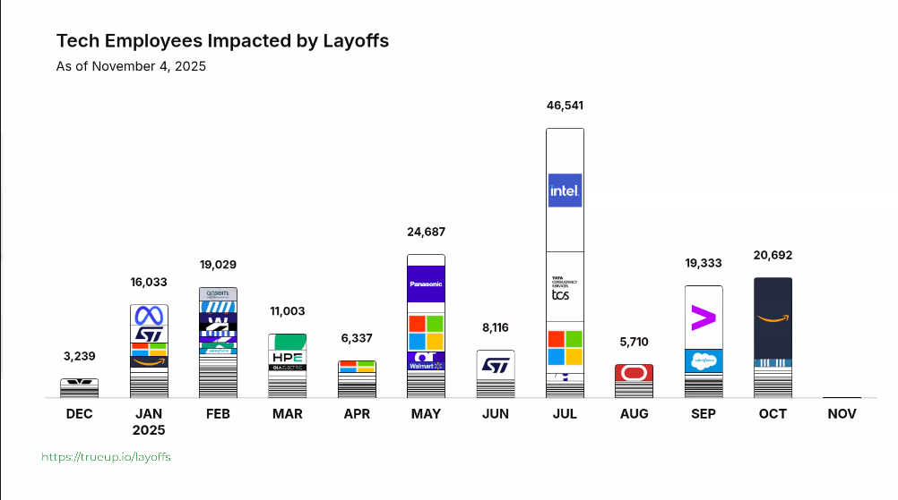
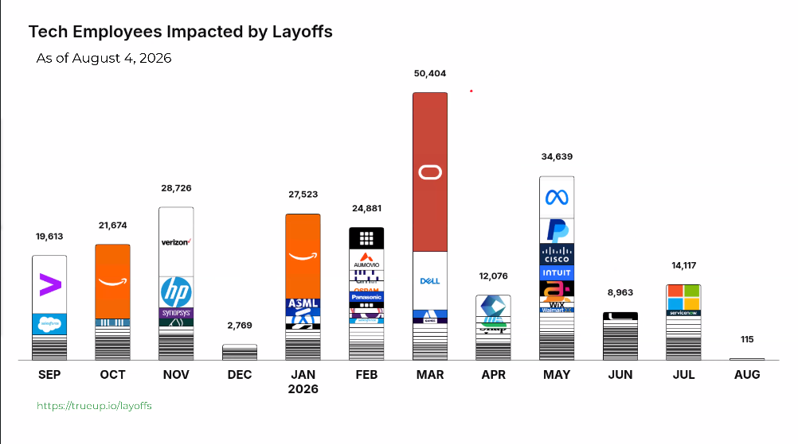
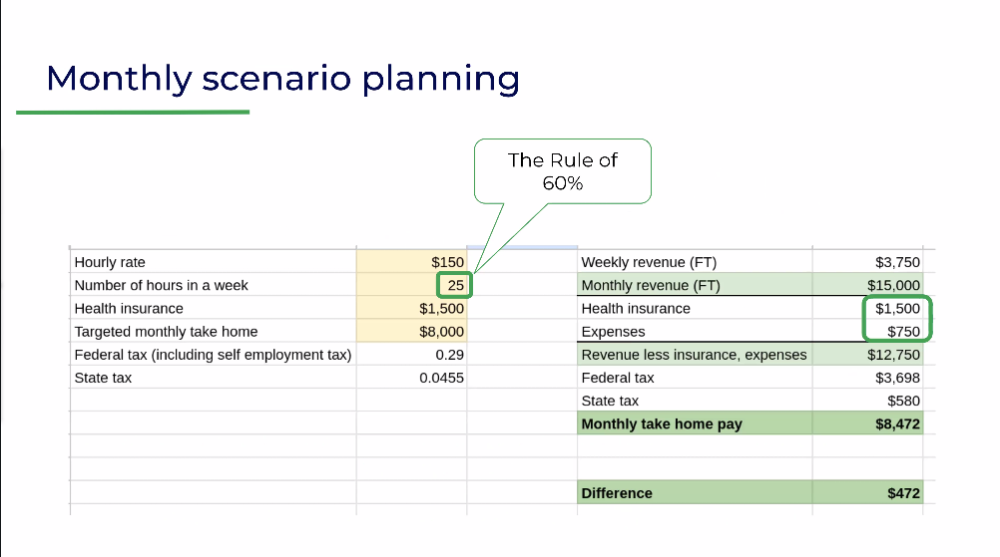
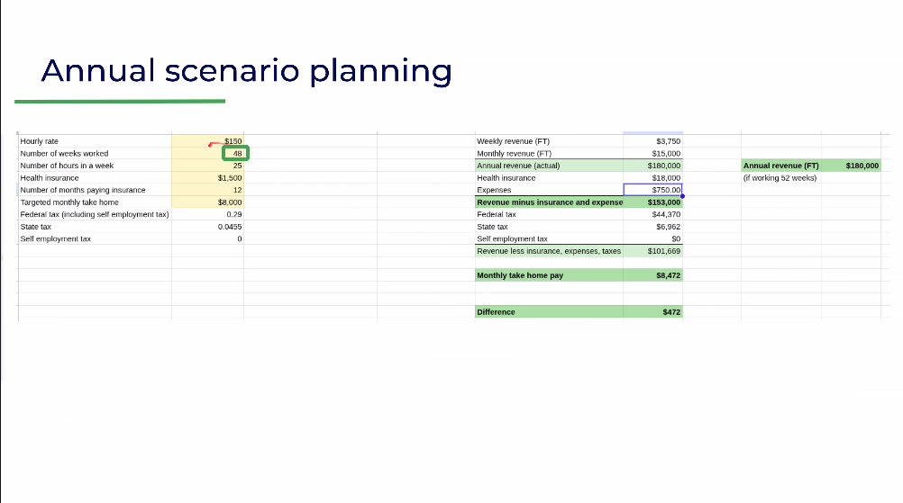

# Making your tech career layoff-proof

I sat through a talk by [Clair Sullivan](https://www.clairsullivan.com/) about making a tech career layoff-proof by going solopreneur. I am still deciding how much of it I actually believe. This is my notes from that talk.

The talk opened with a story that is doing a lot of the persuasive work. Clair was a director of data science at her last corporate job. On a Friday in December she went into a 9am meeting with her boss and came out of it without a job. She had been applying for a while already and getting nothing back, not even a call. She is the solo breadwinner for her family, based in Colorado. Out of that, she announced a generative AI consultancy on LinkedIn, and by the end of the week she had enough clients to replace her corporate salary.

> **On Clair Sullivan:** (from her website) A 20-plus-year data science and AI veteran (her linkedin says much less), she was Director of Data Science at Vail Resorts for almost 2 years (interestingly I'd seen the job posting for that position) and worked at GitHub and Neo4j before founding Clair Sullivan & Associates, a data science and generative AI consultancy in Breckenridge, Colorado. She says she replaced her corporate income within a week of going solo, and teaches this material in a [course](https://maven.com/clair-sullivan-associates/launch-your-solopreneur-business). The [talk itself](https://maven.com/clair-sullivan-associates) was a free one working mainly as an ad for the course.

## Why the idea works at all

- Laid-off companies still have the same amount of work and now fewer people to do it
    - They rarely lose the work along with the people, so they need someone else to do the job
    - That someone can be you, one client at a time
- Companies do not value loyalty the way they used to
    - The talk pulled in a [MoneyDigest piece titled "Companies Don't Value Your Loyalty Anymore"](https://www.moneydigest.com/1567962/companies-dont-value-your-loyalty-anymore/)
    - So betting your income on a single employer is riskier than the name "job security" suggests

> **On the MoneyDigest piece.** A May 2024 article by Daniel Feininger arguing that loyalty has quietly become a one-way street. Its list of reasons: a glut of cheap skilled labor, employees job-hopping every four years on average, standardized tools making workers replaceable, poaching rivals' staff for intel, automation eliminating whole roles, outside hires for management, shareholder pressure for ever-rising profits, and outsourcing. Its blunt advice to workers is to treat employers as stepping stones, not as places to grow old.

The data backed up the instability. The two bar charts are TrueUp's [tech layoff tracker](https://www.trueup.io/layoffs) numbers. Cumulative 2025 comes to roughly 210,000 people impacted, and year-to-date 2026 (January through July) comes to roughly 172,600. The peaks are what stand out: July 2025 at about 46,500 and March 2026 at about 50,400. The exact counts drift as TrueUp revises them, but the shape does not, and the shape is that the stream is not stopping. (If you are wondering, the big red O is Oracle)

<figure class="image-grid-2">
  <figure>
    
    <figcaption>Tech employees impacted by layoffs, as of early November 2025.</figcaption>
  </figure>
  <figure>
    
    <figcaption>Tech employees impacted by layoffs, as of August 4, 2026.</figcaption>
  </figure>
</figure>

- The job market for regular employees is genuinely hard (no sources were cited for the following data)
    - As of August 2025 the average tech employee files 400 to 750-plus applications per offer
    - Open roles receive thousands of applications
    - Ten-plus interviews to land an offer is not uncommon
    - Roughly one in four LinkedIn job ads is a "ghost job" with no real intent to hire

She then said: "Just because a company lays off 10,000 employees doesn't mean they have 10,000 people less work to do." Everything downstream is just the logical consequence of that sentence.

## Why people stay in corporate jobs anyway

The talk lists the legitimate pulls that keep people attached, even when the picture above is grim.

- Perceived "job security"
- Healthcare, called the 800-pound gorilla in the room, at least in the US
- Benefits like 401k matching, stock options, and various insurance
- Lower taxes and access to corporate infrastructure
- Great colleagues, plus mentoring and training opportunities

Right there is the core of the hesitation. It is not that people cannot see layoffs, it is that the alternative feels like stepping onto a raft without a map.

- The thing that keeps people from starting is fear of the unknown
    - No one teaches you that this path is allowed, let alone how to do it
    - The idea that "you can't keep a job" is a story people tell, not a fact
- And yet the benefits are concrete
    - You are your own boss and you define your own metrics
    - You are one of very few, not one of hundreds, a client is talking to 
        - "It is easier to land your first client than your next job," attributed to [Brett Trainor](https://bretttrainor.com/)
        - If they are talking to you, it is because they have a real problem to solve, not a ghost ad
    - A recruiter spends roughly six seconds reading a resume; a client already talking to you has moved past that (no source cited for that either)

> **On Brett Trainor.** The person behind the quote according to their website: Trainor spent over 25 years in corporate go-to-market roles before being let go, and now runs The Time Rich Project (formerly The Corporate Escapee), a podcast, newsletter, and community helping Gen X professionals transition out of corporate. His recurring thesis, "four clients are safer than one boss", is that a single salary is the most concentrated risk most people ever take, and that landing your first client is usually easier than landing your next job.

## The financial readiness framework

Clair was careful to put a caveat on a slide right before this section: she is not a lawyer or an accountant, get your own.

- Setting a goal
    - such as replacing your corporate salary
    - a defined number
- Identifying what you want to work on: 
    - what is your expertise
    - what are you known for
- Creating a cushion if you can
    - on the order of six months of salary
- Picking a pricing model from the menu
    - Freelancer: 
        - typically technical work
        - work product is code
    - Consultant: 
        - typically advises, 
        - work product is reports and presentations
    - Fractional: 
        - acts like a part-time employee
        - usually upper management 
        - work product is management and leadership
    - Product based: 
        - create and sell your own products
        - templates, tools, SaaS
    - You can be a combination of any of these at once
- Working out what you actually need per month
- Becoming a real business

The honest version of your hourly rate is not your salary divided by the hours you are paid for, because not all of your hours are billable. The talk uses a rule of sixty: other things eat about 40% of your time, so 25 billable hours a week is a realistic target.

- Hourly rate equals annual salary divided by working hours in a year
    - US assumes 2080 working hours a week, 40 hours per week times 52 weeks
    - The UK figure is about 1740 hours at 37.5 per week
    - On 150k that first pass gives about $72 an hour, before any fringe
    - Fringe matters: 
        - healthcare
        - retirement, 
        - vacation, 
        - all the things a payroll deduction quietly covered
    - A rough rule on the slide: divide your annual salary by 1000, so 150k maps to about $150 an hour, which is the rate the scenario boards then use
- A single salary is rarely the full economic picture of your time
    - The talk notes that at one contract shop, people took home a 150k-equivalent salary while the shop billed them out near $350 an hour. This gives a soloprenuer a more than 50% reduction in price in competition with competitors.

[Here](https://docs.google.com/spreadsheets/d/1fhuynLTNYJw5JWiWbRHq7XgWY_49i0GQ3uluXQ8RwwA) is an updated sheet with tax calculation for BC - Canada that you can adopt for your own calculations.

## Becoming an actual business

Between the arithmetic and the first client sits the part most people skip, which is making it real enough to protect yourself.

- A real structure protects you legally
    - The client cannot come after your personal assets the way they can a shoebox business
- You do not want to be a person on a Gmail address
    - Get a web domain and use email on that domain
- Have actual written contracts
- Run a separate business bank account
- You are not signed up for "side hustle" energy, you are building a small company

## Getting the first client

If the section above is the safety, this one is the engine.

- Your first client comes from your existing network
    - So does your second, and probably your third
- You are building the brand of you, and it rests on your experience
- "Your network is your net worth" (the phrase that titles Porter Gale's book) gets quoted here for good reason
- You can get to 25 billable hours quickly, and get running as a business in under 24 hours
- You can start moving before you leave: begin while you still have the corporate job

The final slide wraps it together: you do not need tons of clients, just a few to make your hours and replace a corporate salary, and the companies doing the laying off still have work that needs doing.

## Applying it to me

So where do I land?. I am not optimizing for a title or a promotion ladder, I am optimizing for a small number of clients who each represent real work and a real budget.

- What resonates
    - The argument that a client in conversation is worth more than hundreds of ghost applications
    - Replacing a salary with a few deep relationships instead of a hiring pipeline
    - Company loyalty is no longer a real bargain
- What I am skeptical about
    - The healthcare and benefits problem is dismissed faster than it deserves
    - The "land your first client in under 24 hours" framing understates how much portfolio and network groundwork the examples quietly assume
    - A solopreneur trades the ladder for the full firehose of tax, contracts, and prospecting, which the rule of sixty only partly prices in
- What I would actually do
    - Build the monthly and annual scenario boards with my own real numbers before any decision
    - Use a domain, contracts, and a separate account even for a first client
    - Treat "one or two real clients" as the test that decides whether independence fits me, not a leap to ten clients at once

I came away less convinced that everyone should go solo and more convinced that the arithmetic is worth doing regardless. You can build the spreadsheet and the network while still drawing a paycheck, and that is a strictly better position than either holding on hoping or jumping blind.

---

This post is a write-up of live talk slides. All figures are as presented in the talk and not verified independently. I chose the two scenario-planning spreadsheet screenshots to include because they are the reproducible math; the rest of the renders and text are in my notes.