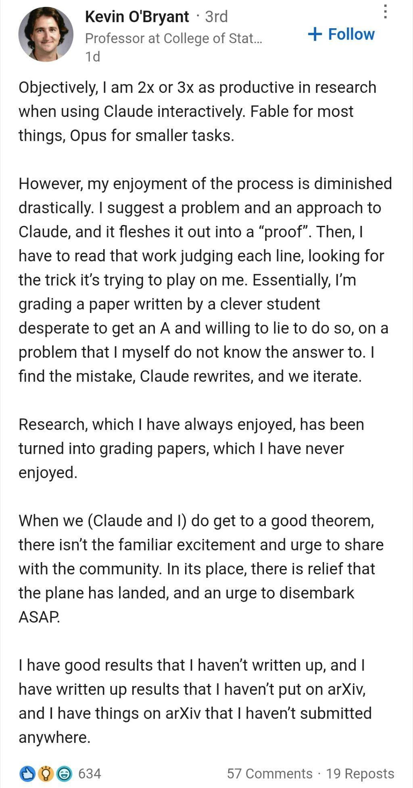
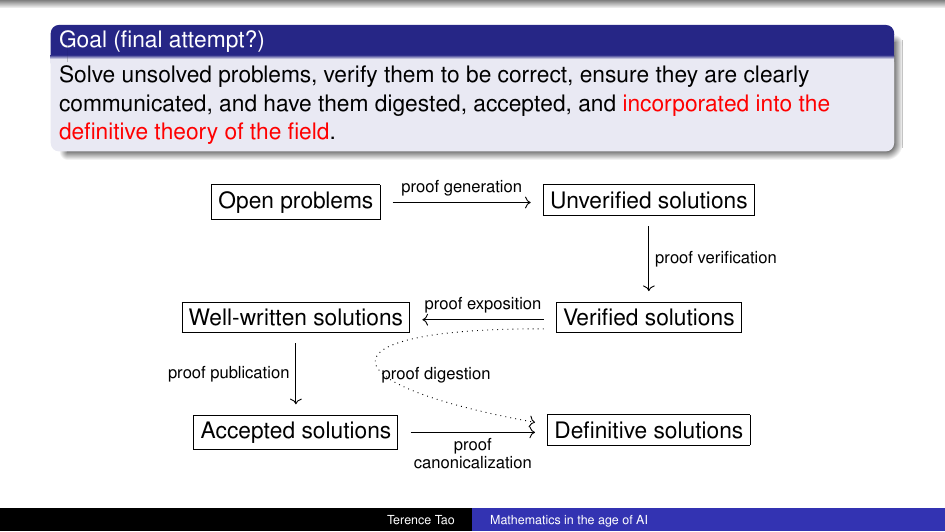

# What is mathematics

Last night Ehssan sent me a post from a math professor that has been making the rounds. The professor loves research and hates grading. Who doesn't? But lately, he wrote, his research has started to feel like grading the proofs of a very clever student who is desperate to get an A and doesn't mind lying to do so. A lot of people shared that feeling. Not only in mathematics, but also in (open source) software, in creative writing, and other areas. 

For a long time I had a confident answer to the question in the title, the kind you give outsiders and then stop thinking about. 
> Mathematics is the discipline of finding patterns where claims can be proven. 

An idea can be right or wrong, and a community of experts can settle which, for good, well, most of the times. That was what made math different from art criticism, politics, business, psychology, biology, or even physics. Everything else had opinions. Math had ground truth.

The summer of 2026 things happened that warranted another take on this question. At the International Congress of Mathematicians, Terence Tao gave a public lecture called "[Mathematics in the age of AI](files/20260806/Tao_slides.pdf)". Around the same time, Amir Moradifam published an essay, "[What Remains Human in Mathematics in the Age of AI](files/20260806/Moradifam_paper.pdf)". Both are attempts to say what mathematics is when the production of proofs stops being scarce. I read them, argued with them, and I mostly agree with them. However, they stop at the edge of the question I want to push on: the next step is speculation, which they have to avoid and the do so perfectly.

## The answer that stopped working

Let's start with the facts that broke the old answer into two.

First Proof, an independent group, ran a standardized test[*](https://github.com/k1monfared/notes/blob/main/blog/20260806_what_is_mathematics.md#appendix-the-facts-in-full) of AI at research mathematics in late May 2026: four leading systems solved seven of ten unpublished problems to publication quality, for ten to a thousand dollars of compute each, and the one step they could not automate was choosing the problems, which is exactly the judgment this post is about.

In early 2026, an AI system produced a machine-checked Lean proof of Erdős Problem #728, and in May 2026 an OpenAI model disproved the planar unit distance conjecture Erdős had posed in 1946[**](https://github.com/k1monfared/notes/blob/main/blog/20260806_what_is_mathematics.md#appendix-the-facts-in-full). In all cases human mathematicians verified the proofs and wrote human digestable versions of them.

Notice the split here: The model produced the result, the humans checked it, digested it, and presented it. That split is a big part of the story. Under the old definition, mathematics was the production of correct statements, and while on the surface it seems that the typical mathematician is busy proving theorems they're building intuitioin and finding clues to find patterns. The production of proofs has been automated, or it will be, under Tao's working assumption. Seven out of ten novel research problems, solved to publication quality, for a few hundred to a few thousand dollars of compute. And notice what was not automated. The problems were still chosen by people and handed to the models one at a time. That which patterns were worth chasing, is still human, and the models prove what we want them to prove. Although they still might need a lot of handholding to do so. On the other hand, there are conjecture generators out there, and there have been for years, but they propose patterns, they do not decide which ones matter. So either mathematics is over, or the old definition was wrong.

It's so over baby. 

lol jk, it isn't. I don't think it is, if anything, I think it has just started. But I want to explore how my old definition was wrong. Or maybe the proving was the chore and the finding was always the real thing?! And meanwhile in all of this I'm implicitely assuming mathematics "is what we humans do". Like a religion that assumes the god is the right thing, so anything that goes wrong is not part of that religion.

The proof process has a second half though. Verifying the proof is often implicitly part of the proof process, and that is being automated too.

## Verification is human work too

Tao's Working Hypothesis covers performing mathematical tasks, and verifying is one. So taken seriously, the hypothesis covers verification too. The question is what level of error we tolerate in it.

Here the right calibration is a story Hadi brought up: a Fields medalist who had to retract work years later. That was [Vladimir Voevodsky](https://www.ias.edu/news/2017/vladimir-voevodsky-obituary), Fields Medal in 2002. In the late nineties, Pierre Deligne went through his foundational paper line by line while Voevodsky lectured, and they found that the proof of a key lemma was wrong and could not be salvaged as stated. The earlier paper with Kapranov, on $\infty$-groupoids, had a main theorem that was eventually shown to be false, which [Voevodsky did not accept until years later](https://www.ias.edu/ideas/2014/voevodsky-origins). Multiple groups had studied those papers, used them, taught them, and nobody noticed for years.

[Voevodsky was scared by this](https://www.ias.edu/ideas/2014/voevodsky-origins). He asked: who would ensure that I did not forget something and did not make a mistake, if even the mistakes in much simpler arguments take years to uncover. He spent the rest of his career pushing for computer proof verification, because he no longer trusted the human process.

That is the calibration that matters. Human verification is not reliable. It is a Fields medalist's foundational paper carrying a wrong key lemma for years, and a main theorem that stood unchallenged for decades. So when AI verification arrives with an error rate comparable to that, it will not look unacceptable. It will look like business as usual. Which means the premise for everything that follows holds: generation and verification both automated, both imperfect, both roughly as imperfect as the people they replace. The AI-side rate is assumed, not measured, and the volume compounds: years to surface a mistake by hand, a million checks a day by machine.

## The process was the product

The old definition was wrong, and both authors know it. The sentence underneath everything they wrote is that mathematics was never the production of theorems. It was a process of thinking, and the process was the product.

Moradifam opens with the reason we teach math at all: not the facts, the struggle. A student sits with a problem, tries an idea, hits a wall, tries again, and slowly discovers what matters and what does not. That process builds the habit of tracking assumptions, the ability to move between concrete examples and general principles, the confidence to keep thinking when the answer is not immediate. He brings in the cognitive science. [Cognitive offloading](https://en.wikipedia.org/wiki/Cognitive_offloading) is the tendency to delegate mental effort to an external tool. The [illusion of explanatory depth](https://en.wikipedia.org/wiki/Illusion_of_explanatory_depth) is the way fluency gets confused with ownership. A student who can summon a complete, fluent solution within seconds risks equating exposure to an idea with understanding it. They are not the same. A calculator does not undermine arithmetic for a student who already understands place value. It becomes harmful when it arrives before the understanding. AI is that, with one new twist: it produces plausible explanations in a confident tone, so both student and instructor can mistake the output for the learning.

I keep coming back to an ad I saw in the San Francisco airport, from an early AI company: "let the AI do the thinking for you." The marketing treats thinking the way earlier automation treated laundry, as toil to be eliminated. The ad glosses over a real distinction between automating chores and automating thinking. Fixing a car is instrumental. You want the fixed car, not the experience of fixing it. Thinking is constitutive. The process of working through a problem is what builds judgment, and there is no shortcut that gives you the judgment without the process. Offload the chore and you keep the car. Offload the thinking and you keep an answer with an unchanged mind.

The fair version of my own argument has to admit the boundary is blurry. We said the same things about mental arithmetic, memorizing poetry, navigation. Some of those losses turned out fine. Some cost us something real, and the atrophying of spatial reasoning under GPS is decently documented: longitudinal work finds that more GPS use predicts a steeper decline in hippocampal-dependent spatial memory ([Dahmani & Bohbot, 2020](https://www.nature.com/articles/s41598-020-62877-0)), and long-term GPS use is associated with worse mental rotation and perspective-taking, which in turn hurts environmental learning ([Ruginski et al., 2019](https://www.sciencedirect.com/science/article/abs/pii/S0272494418308211)). So the question was never chores versus thinking as fixed categories. It is which cognitive activities are load-bearing for everything else. Calculation turned out not to be. Problem framing, noticing what's missing, deciding what's worth attention, those look load-bearing, and those are precisely the things the ad proposes to outsource. And proving is the gym where the finding is trained. The slog of writing a rigorous proof is what builds the muscle for spotting patterns, and the chore and the training are the same act. Even when proofs go wrong and don't work, there are a slew of ideas that comes to the mathematician's mind and learning occurs. 

Tao reaches the same place from the other end, through exposition. AI-polished proofs, he says, are close to flawless in spelling, grammar, and formatting, almost too flawless in a way. They dwell on trivialities and rush past the novel parts of an argument. They fail to connect to prior literature. And they remove friction. In a human-written proof, the parts the author found difficult keep a natural friction that makes the reader slow down and pay attention. An over-polished proof removes both natural and artificial friction, and the reader sails through without learning the key ideas. Paradoxically, mistakes in human exposition can be helpful. They mark where the work is. He quotes [Thurston](https://arxiv.org/abs/math/9404236): "We are not trying to meet some abstract production quota of definitions, theorems and proofs. The measure of our success is whether what we do enables people to understand and think more clearly and effectively about math."

The struggle, the friction, the process. All three point at the same thing, and it is the thing the pipeline optimizes away. The whole set of slides is a delight to go through, and it is completely non-technical ([files/20260806/Tao_slides.pdf](files/20260806/Tao_slides.pdf)).

Tao reaches this point and then keeps going in a direction neither document takes. Once the struggle stops being scarce, he asks, what is the community actually optimizing for?

## Tao's pipeline

Tao's talk is conditional. He states a "Working Hypothesis": AI tools will, reasonably soon, become capable of performing a reasonable fraction of research-level mathematics, with reasonable success, quality, supervision, and cost. He asks you not to believe it, only to assume it, and then he asks the orthogonal question: what are the goals and values of the mathematical community, the explicit ones and the implicit ones we actually pursue in practice? This is the question math has historically delegated to the humanities.

His argument runs through [Goodhart's law](https://en.wikipedia.org/wiki/Goodhart%27s_law), that when a measure becomes a target, it ceases to be a good measure. Historically the community's goals were positively correlated: solving problems, building theory, training the next generation, creating enduring aesthetic works, all moved together, so any one or two of them could proxy for the rest, and the rest could stay implicit. AI optimization threatens to break the correlation. Generative AI is ungrounded by nature, and AI companies have financial incentives, so the use of AI is particularly vulnerable to Goodhart. The goals can diverge.

Then the case study. Start with the goal "solve as many unsolved problems as possible." Refine it once, add verification, or you get a pile of incorrect solutions. Refine it again, add exposition, because a pile of correct but unreadable solutions isn't progress either. On [erdosproblems.com](https://www.erdosproblems.com) there are already dozens of AI-generated proofs, many likely correct, that no human expert has volunteered to verify and vouch for, and in several cases the human submitters declared themselves unqualified to do it. Refine again, add community acceptance, because a proof no one has digested contributes nothing to the field, and acceptance is slow, human, and external, something the authors and their AI tools cannot optimize directly. It is currently produced by volunteer editors and referees, work regarded as less prestigious than generating proofs, though it is how individual achievements become collective progress. Refine one more time, add canonicalization, incorporation into the definitive theory of the field, the textbooks and reference material taught to the next generation. This, he says, is the slowest stage of all, the least amenable to optimization, and the most valuable.

His punchline: we are moving from proof scarcity to proof abundance. Under the Working Hypothesis, mismatches appear at every stage. AI proofs accumulate, unverified. Verified proofs await readable writeups. Correct and well-written proofs overwhelm peer review. Published proofs are too numerous to ever digest. The bottleneck shifts to proof digestion, and digestion is the work we currently treat as low prestige. This reminds me of how Paul Halmos liked to present himself: he was a top mathematician, but he wanted to be known for exposition, for making math accessible to the rest of the mathematical community, rather than for doing cutting edge research. Tao's recommendations follow: normalize responsible disclosure of AI assistance, decrease the emphasis on generation and on being first, increase the emphasis on exposition, publication, and canonicalization. He points to the [Leiden Declaration](https://leidendeclaration.ai), a community statement on how AI should be used in mathematics, endorsed by the International Mathematical Union. And he offers a rule of thumb: if the authors cannot convincingly demonstrate that they can give a clear, expert-level talk on their result, correct and properly attributed, then the result should not be published.

The professor in that LinkedIn post is the human version of this. He got into research because he loved producing and hated grading. His reward for succeeding is to be demoted to the thing he hated, checking other people's work. Experimental science ran the same inversion when instrumentation made routine measurement cheap, and prestige moved from the measuring to the designing of experiments. That is the prestige inversion Tao is pointing at, and it is already happening.

## What remains human

Moradifam walks the research side faster. The [Davies results](https://www.nature.com/articles/s41586-021-04086-x) used machine learning as an intuition pump, finding correlations in knot theory that humans then formalized. [AlphaTensor](https://www.nature.com/articles/s41586-022-05172-4) framed matrix multiplication search as a game and found algorithms humans had not. The pattern is the same every time: the AI proposes, humans check, digest, and present. Then the line of work speeds up into the 2026 results I listed above, where AI takes on most of the discovery process.

His epistemology section is the interesting one. Mathematics already has precedents for accepted-but-opaque results: the [four-color theorem](https://en.wikipedia.org/wiki/Four_color_theorem), the [classification of finite simple groups](https://en.wikipedia.org/wiki/Classification_of_finite_simple_groups). We use them as tools because they survived extensive communal verification, even though no single person holds the whole proof in mind. As AI produces longer and more complex proofs, we may accept truths whose full deductive structure lies beyond any individual. And this changes the nature of understanding itself. Historically, mathematical understanding was constructive: you deepen it by reconstructing the proof. When a result arrives from an opaque process, understanding shifts from constructive to hermeneutic. The mathematician becomes less a builder and more an interpreter, trying to extract meaning from a proof produced by something that cannot explain itself. His thesis, in one sentence: as routine tasks get automated, problem framing, judgment, and taste become more visible and more valuable. I think that is right as far as it goes.

## The blind spot they share

Both documents stop at the same edge, and it is the edge I want to step past. Moradifam writes that AI "does not by itself determine what the mathematical community should regard as interesting, deep, or worth understanding. Those judgments remain human, shaped by taste, experience, and the collective culture of the field." Tao's equivalent is the claim that community acceptance is "ultimately an external process that cannot be optimized purely by the authors and their AI tools." Both locate the judgment of importance in a stable, human ground, and neither tries to look underneath it. That is the right place for their documents to stop. Mine is a blog post, and it is a different genre: I am building on their ground, not correcting it, and the next step is speculation, not scholarship.

And here is where the two threads of this piece finally meet. The process of thinking is the product, which means the thing that matters most about a piece of mathematics is what it was worth thinking about in the first place. That is importance, and I think importance was never a stable, purely human judgment. This is also, I suspect, why Hadi and I were worried. Consider how the field actually decided what was worth working on before AI. There were two levers.

The first was applicability. Did a problem solve something real elsewhere, in science, engineering, society? You could measure that fairly directly, and it was partly driven by where research funding lived. Money went to areas where results were wanted.

The second was the taste of the big names. What the field's influencers thought was important. That taste was itself a compound. Partly fame: [Nash](https://en.wikipedia.org/wiki/John_Forbes_Nash_Jr.), allegedly but not verified, was infamous for working only on problems that could get him famous. Partly genuine interest. And partly network favoritism: I know you, so if you work on a problem I become interested in it, so I work on it too, and as a result we both grow in our social position. That kind of thinking was always there, quietly.

Neither lever is pure mathematical judgment. Both are social. The field could pretend otherwise as long as the process was slow, local, and invisible. The AI era removes the cover story.

I should own the irony of saying this while leaning on Tao and Moradifam for most of the argument so far. They are exactly the kind of authority I am saying we should interrogate. I lean on them because their reasoning is checkable, not because their names are big, and I am trying to show my work the whole way. That is the difference I am pointing at, and I am not sure I fully live up to it.

## The influencer economy

Everything these days is sales, in a way. Whatever you create, you need to do more work to sell it than you did to make it. I think that's partly globalization, if that term is still in fashion: the competition used to be across town, now it's everyone with an internet connection. Production got cheap everywhere, so distribution became the constraint. The same is about to happen to mathematics. Under the Working Hypothesis, generating a result and verifying it both become cheap. What stays scarce is attention, and markets for scarce attention develop influencer structure.

The internet did this to writing, and social media did it to the internet. Blogs were written in vastly greater volume, and people read fewer books. Topics that were important got deprioritized relative to topics that were popular. That's what any influencer economy does. Then social media pushed it further, and the conversation moved away from writing toward video and voice, short-form clips and podcasts everywhere. Now people spend more time listening to random dudes on the internet talk about topics they may or may not be qualified to have an opinion on than reading a book by an expert on the topic, let alone accepting it. Furthermore, more people are interested in food supplemants than they are in world affairs, simple because the random dudes get paid to talk about them on their podcasts. It's easier to digest. It's more relatable, it creates a sense of urgency directly relevant to your life. And often it supports your current understanding, far better than it challenges it.

Something similar will happen to mathematics. I'm not sure about timing, it might take years, probably decades, not months though. The current influencers are still highly qualified. Tao, Gowers, even the slightly lower ranked mathematicians with a successful social media presence, earned their standing in a world where the canon was set slowly, by journals and seminars. Not that the old gatekeeping mechanism was good, but what is about to happens is defintiely worse. In "How democracies die" Levitsky talks at length and somewhat nostalgically about how old gatekeeping mechanism in politics was working and implicitely longs for it. I'm not saying that, but there is a function for gatekeeping and we need that to be more merit based, but we are moving in the opposite direction. The problem is not them. The problem is the mechanism that selects the next generation. What is written about, what is read, and what problems are allocated computation money to be solved by AI, will all be defined differently going forward. When compute becomes the budget, a research problem is worth what it costs in compute time, and that allocation will be based on direct impact on other fields first, and on what the influencers of mathematics advertise second. There would be also a long tail of problems that "applications" would not contribute to theory anymore because they could solve it themselves without the need of so called mathematicians, like how physics worked in the past, a physicist would just develop the math they needed and use it, but since everything was so much slower, they would have become known in the mathematical world, or even be known as mathematicians. Now, the problem will be solved internally and the tools used to solve their problems, the next company or science field would need to solve the problem themselves, with their own compute budget. 

There is a naive faith underneath the current system that nobody examines. We treat figures like Tao as disinterested, as if canonization decisions flowed from pure mathematical judgment rather than from people with careers, incentives, aesthetic biases, and finite attention. The assumption is not that they are corrupt. It is subtler. It is that their attention allocation is a public good when it is actually a private act with public consequences. A blog post by Tao can redirect years of collective effort. Nobody audits whether the redirection was optimal. The prestige itself becomes the justification. And so far we are lucky that private acts (likely) align with the public interest, but in an influencer economy there is no guarantee they will.

Historically the faith sort of worked, but for structural reasons that are eroding, not because mathematicians are unusually virtuous. The old gatekeepers were trustable to a real extent, and the trust was earned structurally: their standing was built over decades of checkable work, their judgments were open to being checked by the community, and a wrong call could cost them their standing. The influencer economy replaces that with a standing earned by engagement and answerable to nothing but more engagement. The old gatekeepers operated in a low-velocity, low-visibility attention economy: journals, seminars, letters. Feedback loops were slow, audiences were small, and there was little to gain from attention-maximizing behavior, because attention did not convert to much. They were influencers too, just slow ones: editors, program officers, referees, the institutional names the non-elite mathematician's fate already flowed through.

The influencer economy changes the conversion rate. When visibility converts into grants, positions, media presence, and now prominence in AI training data, the incentive to "be seen judging well" starts competing with "judging well". The moment influence becomes measurable and monetizable, it gets optimized for, and the optimization target diverges from the thing it proxied. This is the [measurement trap](https://k1monfared.com/notes/blog/20251023-from-measurement-to-intention/) I keep writing about, applied to the field itself.

I built a simulation of how canons form, in the context of classical music, and it applies here almost directly ([manufacturing taste](https://k1monfared.com/notes/blog/20260326-manufacturing-taste/)). Reshuffle who has access to the exposure pipeline and you get almost entirely different canons. Quality sets a floor and a ceiling. The vast middle is a lottery. If citation networks already made the pre-AI mathematical canon path-dependent, an attention-mediated canon would be worse, because the selection pressure shifts from "what did nearby researchers find useful" to "what is legible, narratable, and aligned with a curator's brand." I worried this applied to composers. It applies harder to theorems, because a result that nobody reads is inert: reputation and readership are the same gate, so whoever controls the gate controls what exists.

I should say what that floor and ceiling are made of, because the honest claim is narrower than the dramatic one. The floor is checkability: a result that fails to check does not survive, no matter who wants it to, and the machine-checked proofs are the clearest case of the world pushing back. The ceiling is structural value: a result that nothing can build on cannot be talked into importance. What the social layer decides is the vast middle between the two, and that is still the decisive part of a mathematician's work, because the middle is where almost every career lives.

And there is a Goodhart recursion that Tao doesn't reach. Once attention becomes the metric, the AI tools optimize for attention, so results get chosen and framed for virality among mathematicians, proofs of statements that make good talks. And the pipeline is a loop, not a line: which results win attention feeds back into which problems are posed next, so the attention economy reaches all the way back to problem selection. The community's last non-automatable function becomes the new proxy target. And if models become the primary readers and rankers of mathematics, whatever biases exist in today's canon get frozen in and amplified. The influencers of today become the training distribution of tomorrow. The collective culture that Moradifam treats as a stable arbiter is precisely what is up for grabs. One might argue this is exactly the best thing for the community and the science. Judging from how social media turned out, I highly doubt it.

Is this all doom? No, I don't think so. [Polymath](https://en.wikipedia.org/wiki/Polymath_Project)-style open collaboration, working mathematicians blogging proofs in progress, arXiv culture generally: all of these expanded who could participate in judgment rather than concentrating it. The failure mode is not visibility itself. It's when the selection mechanism for who gets amplified shifts from "trusted by peers over decades" to "performs well on engagement metrics." Mathematics has been partly protected because its audience is small and expert. Engagement farming does not work well when your readers can check your proofs. The danger with AI is that it changes the audience.

## What the craft becomes

What does all of this do to the people who actually love doing math? Woodworking went through its own version of this in the last century, and the shape of what happened is instructive. CNC machines and high-throughput manufacturing changed furniture. Most furniture is now the Ikea kind, mass produced, cheap, replaceable. A good chunk is still built at scale but at much smaller scale than Ikea, with more variety and local taste. And there are still custom built pieces that cost thousands of dollars. Woodworking did not disappear, and some things even cost less when made by humans than when bought. But in volume, what we have is the simplest functional things. There is not much room left for creativity, because not every neighborhood now has a carpenter building furniture for the people of that neighborhood. And the reason might not be just the need. It's that the carpenter who wants to be creative can't make a living at it anymore. At best they spend their time fixing Ikea furniture. But Ikea furniture became so cheap that nobody fixes it. They just buy a new one.

Watch how people use AI to build software and you see the same shape: someone generates an app in minutes, discovers the real work is in the details, abandons it, and moves on. The volume of starts goes up, the number of finishes goes down, and the middle, where the craft lives, is the desert.

This is the same middle Tao was trying to protect. His punchline was that the bottleneck shifts to digestion: exposition, verification, canonicalization, the low-prestige work that is first to empty out. That is the creative carpenter's shop. If we let it empty out the way furniture's middle emptied, mathematics keeps producing results while losing the people who make them legible, checkable, and taught.

## Agreement is not evidence

There is an epistemology to all of this, and it is the part I think matters most, so let me slow down. The desert in the middle is not only about making a living. It is also about who you can trust to tell you what a result means.

When someone agrees with me on a topic, I don't immediately buy their idea. I ask why. There have been plenty of times when their reasoning was very different from mine, and sometimes that difference gives me a new perspective, and sometimes it makes me disregard the agreement entirely. The decision was never the end goal, the way it is sometimes portrayed. The process of reaching it was.

Interrogating agreement as skeptically as disagreement cuts against the default. The default social epistemology is conclusion-matching: you say X, I believe X, we are allies, and your belief strengthens mine. But two people at the same conclusion via different reasoning are not in the same epistemic state, and the interesting information lives entirely in the delta. If their path is sound and different from yours, you now have two independent lines of support, genuine corroboration. If their path is broken, their agreement is evidence against your confidence in a strange way: it shows that the conclusion is reachable by bad reasoning, which means your own arrival at it needs at least a recheck, and that the person who shares the same conclusion is not necessarily your ally! Agreement without shared reasoning is coincidence wearing the costume of confirmation.

This is exactly the mechanism that breaks in influencer dynamics. Deference to a Tao-tier figure is conclusion-adoption with the reasoning step amputated. You inherit the belief without the justification, so you cannot detect when the justification would not survive your own scrutiny. Scale it up and you get a community whose beliefs are correlated not because reasoning independently converged, but because everyone copied from the same node. It looks like consensus, which we treat as strong evidence. The effective sample size is one. This also reminds me of Atiyah's last claim about proving the Riemann Hypothesis. He had all the authority in the mathematical community, but the consequences of the claim were so big that it was put under harsh scrutiny, and it didn't stand up. One might say he [wasn't even wrong](https://k1monfared.com/notes/blog/20250312-not-even-wrong/). Now imagine a million of these every day, on far less important topics, stacked on top of each other to form the body of mathematics done by AI with the help of humans.

That is the epistemically hollow version of agreement, and it is precisely what the attention economy manufactures: it propagates conclusions at high velocity while reasoning, which is expensive to transmit and verify, gets stripped in transit.

And an AI answer is the limit case of conclusion without process. When you ask a person why, sometimes the answer reveals their reasoning was different from yours, and that is the perspective-gaining moment. The fluent AI explanation is engineered to feel like that moment without necessarily being one. The danger is not only that students confuse exposure with ownership, though that is real. It is that everyone loses the practice of treating "why" as the real question, and the conclusion as merely its byproduct.

Somewhat relatedly, this also reminds me of the the thought experiment of a [tree falling in a jungle](https://en.wikipedia.org/wiki/If_a_tree_falls_in_a_forest_and_no_one_is_around_to_hear_it%2C_does_it_make_a_sound%3F)

## So what is mathematics

Correctness was never the binding constraint on what mathematicians actually do. It was the floor. The constraint was always importance: deciding what is worth attention, what is deep, what should be taught to the next generation. And importance is a partly social judgment: checkability and structural value set the floor and the ceiling, and the social layer decides the vast middle between them, shaped by careers, incentives, taste, and luck, whether we admit it or not. Confession: this is very hard to say for me, as a practicing mathematician, I always thought of math as that science of pure correctness and the art of finding beautiful patterns.

I know of mathematicians who will publish anything they can prove. In fact much of science works that way. A scientist writes a grant proposal for a big important problem, gets funded, works for years, has nothing to show, then publishes whatever detour they ended up on, and the big problem quietly stays unsolved.

So the answer to the title question is not "the production of correct statements of found patterns." Mathematics was never one of those things alone. It was always both: finding patterns, and proving them. The proving is the chore, the checking, the part that has now gotten cheap, and the finding is the deciding, which patterns are worth the proving, and that part is still human. I am not claiming mathematics was always mostly the finding. I am speculating that the mix is shifting: as proving and verification get automated, the weight moves to deciding which patterns matter, and that is where the field's values will live. Software engineering already made this turn. A lot of engineers today spend more of their time deciding what to build and why than writing the code. Some became product managers, some became architects. The coding got cheap, and the deciding got loud. Did the turn land well? Both ways, which is the point: open source runs on love, the framework wars run on attention, and software is already the two futures at once.

Mathematics is heading the same way, with one difference: the deciding was never counted or paid as work, so it has no established home in the profession. It was a personal measure of someone great: "how much my work is directing the field" kind of thing. The AI era does not replace the practice. It reveals it. When proving gets automated, the finding, the judgment, the taste become visible in a way they never were before, because they are now the only parts that can't be generated on demand. And what is revealed has to land somewhere. Either theoretical mathematics becomes a fun activity, done by people who can afford to do it for the love of it, or it becomes part of an influencer economy, and the deciding gets made by whoever holds attention, or whoever owns the compute it runs on. The community can try to keep hold of the deciding before it leaves their hands, but it was never fully theirs to begin with: a lot of what the field chose to work on was steered from outside, by physics and by what was useful elsewhere, and that steering at least answered to results, while what replaces it answers to engagement. I do not know which way it lands, and that is the point: it is not decided yet.

There is a precedent for landing well. Statistics went through the same turn when arithmetic got cheap: the calculation became a tool, the field's identity shifted from computing to designing the questions, and deciding which questions matter became the discipline itself. And prestige is assignable, the Halmos lesson: the community made a man famous for exposition, so the middle can be revalued if it wants to be.

The woodworking story is the same story told in furniture. The craft doesn't die. It stops being how people make a living, and the neighborhood carpenter disappears. The question isn't whether anyone still makes things by hand. The question is whether the craft still has a middle, whether the creative carpenter still has a way to be paid for being creative.

There is also the thing that outlasts all of it, the thing the airport ad got backwards. Thinking is what we are for. If we outsource it, there is little else we are good for. Mathematics has been, for centuries, one of the main places we practice thinking in public, with the stakes visible and the errors checkable. The question was never whether machines can do math. They can, and they will do more of it. The question is whether we keep doing the part that was always the point: framing the problem, judging what matters, and actually coming to understand. The struggle is the product. The proof is the gym: lifting weights is not the sport and barely resembles it, and almost nobody lifts for fun, but the athlete who stops lifting cannot perform at that level. That is the difference between the coach and the pro athlete. The coach has the ideas, the taste, the judgment, can tell you exactly what to do and why, but cannot do it anymore, maybe never could. The pro athlete is the one who still goes to the gym. Finding patterns is trained by proving, so automate the proving and you do not merely cheapen a chore, you risk stopping the training that produces people who can find patterns at all. Now imagine the athletes are robots with extreme powers. The coach is still human and still decides which patterns to chase, but the gym belongs to the robot. A coach who only ever coaches robots, who never lifts again, keeps the taste and loses the performance, and a sport full of such coaches is a sport where judgment floats free of any act of doing.

## Appendix

\* [First Proof](https://1stproof.org/) is an independent group of mathematicians trying to answer a concrete question: how good are AI systems at research mathematics? Their method is essentially a standardized test. They collect unpublished research problems from mathematicians across fields, pick ten for each batch, hand them to the leading AI systems to solve with one attempt each, then have human referees grade the solutions blind. The second batch ran in late May 2026, against four leading AI systems. Seven of the ten problems were solved at publication quality by at least one team, at a compute cost of ten to a thousand dollars per problem. The step they could not automate was the choosing, and it did its work before any model ran: which ten problems deserve the batch's compute is exactly the judgment this post is about.

\** In early 2026, a system combining OpenAI's GPT-5.2 Pro with [Harmonic's Aristotle](https://aristotle.harmonic.fun/) produced a formal [Lean proof](https://github.com/plby/lean-proofs/blob/main/ErdosProblems/Erdos728.md) (Lean is a proof assistant that checks proofs mechanically) of [Erdős Problem #728](https://www.erdosproblems.com/728). A human mathematician, Nat Sothanaphan, translated it into a [conventional argument](https://arxiv.org/abs/2601.07421). The Lean proof itself is machine-checked, and the problem is now marked [proved on the Erdős problems list](https://www.erdosproblems.com/728). In May 2026, an OpenAI reasoning model disproved the [planar unit distance conjecture](https://cdn.openai.com/pdf/74c24085-19b0-4534-9c90-465b8e29ad73/unit-distance-proof.pdf), posed by Erdős in 1946. The conjecture said the maximum number of unit distances among $n$ points in the plane grows like $n^{1+o(1)}$. The model constructed infinite families of point sets with at least $n^{1+\varepsilon}$ unit distances, using ideas from algebraic number theory. A [paper](https://arxiv.org/abs/2605.20695) with Alon, Bloom, Gowers and others then digested the result for the community.

