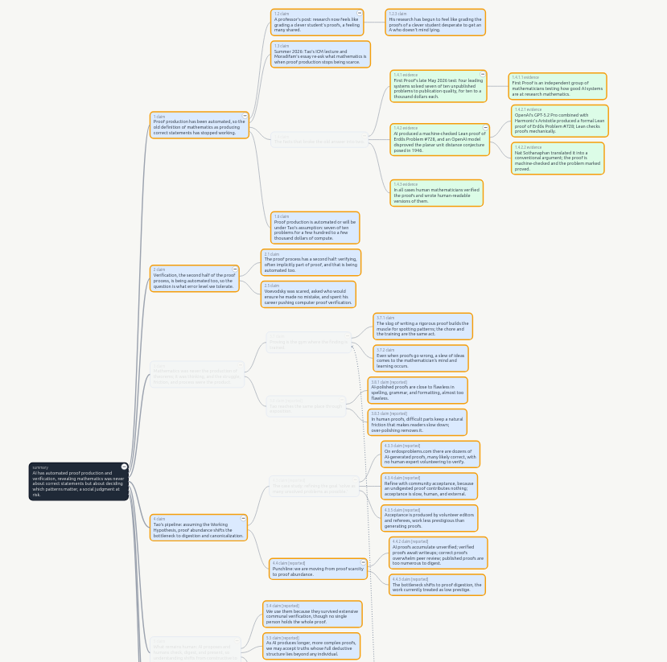
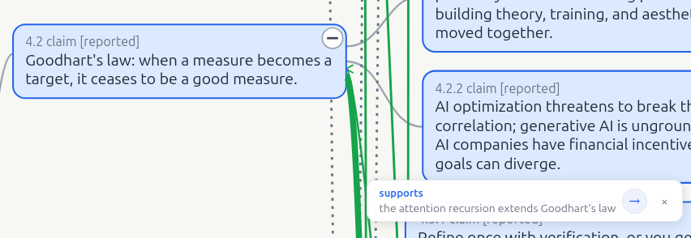
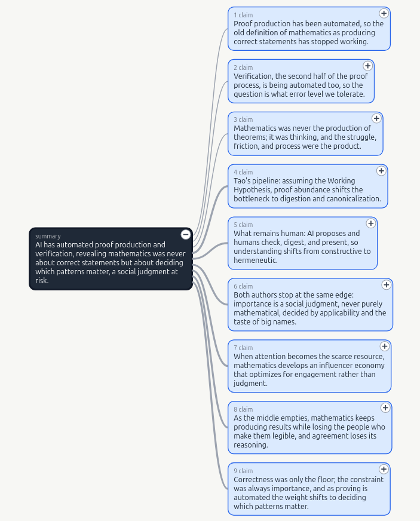
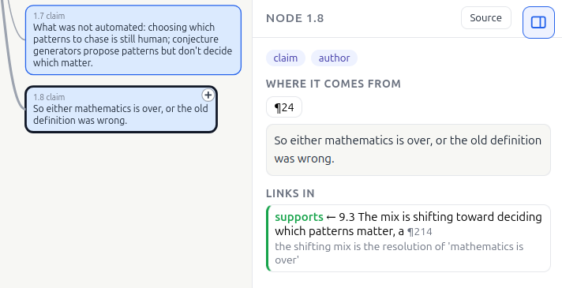
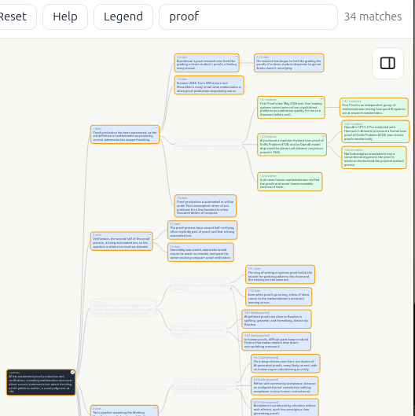
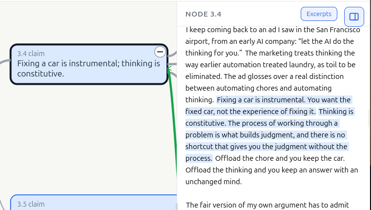

# In search of lossless encoding

When gpt3 came out, I half-jokingly wrote:

> now we will give 3 bullet points to the LLMs and have them write a professional email with those points, and then the receiver gives the email to their model and has it boil it down to 3 bullet points.

In that, I hoped the process would teach us to get to the point and just send the 3 bullet points without the fluff, saving 2 rounds of decoding and encoding where a lot of points get lost in translation. But it doesn't look like we are getting there anytime soon :(

Now, I am at a point where a lot of what I read is, if not completely AI generated, at least the main points padded with fluff, and as a result everything I'm reading is way longer than it needs to be and longer than it used to be. So, reluctantly, I have started giving long texts to an LLM to have them summarized. Thanks to all the fluffers out there (pun maybe intended). But the process is tedious. As in, do I want only a short sentence summary of what it is about? Do I want just the main points? Do I want to know the supports of the main points? Or do I want all the details organized in a way I can follow? How do different points connect to each other? Do they contradict each other too? Why does the author keep repeating themselves over and over?

Moreover, I am a very visual person, I need to see things so that I can build the connections in my head. For a lot of smaller things I do it in my head, usually with a few iterations over the content at hand, but for very long ones, it is harder and if the topic is not very important, I can't really do all of that quickly.

So, I built [digestif](https://github.com/k1monfared/digestif). It takes a text and turns it into a rooted graph. 

The root is one sentence that says what the whole thing is about. Below it are the main points, below those the details of each point, and further down the evidence, the examples, the objections, and the caveats. Every idea is a single node, short enough to read at a glance, and no node is allowed to exist without pointing at the exact passages in the text it came from. The connections between the nodes have kinds. One idea can support another, contradict it, give an example of it, add a nuance to it, concede a point, or turn out to be a restatement of something said elsewhere. So the whole thing is a tree at the top and a network further in, which is roughly what a real text is.

The UI allows one to explore the text at whatever level of detail they care about or have time for, and also to follow the connections between different passages, e.g. if some statement supports, contradicts, or adds nuance to another. 

You can open it at the summary level, or two layers deep, or all the way down.

Clicking a node tells you what it is, shows the quotes behind it, and lists all of its connections, and you can jump along a connection to the node at the other end. 

There is a search that hides everything except what you are looking for and the path from the root down to it.

And there is a view of the original text where the sentences behind the selected node are highlighted, so at any point you can leave the summary and read the actual words.

Since LLMs are notorious about hallucination and misinterpretation, I have built in steps to try to mitigate that as much as possible. First, before anything is summarized, the text is cut into numbered passages and the exact words of each passage are kept. A node that cannot point at a passage is thrown out before it ever reaches you. Second, the reading is done in several passes instead of one shot: a survey pass, then a pass for the main points, then a pass that maps every passage of the text to the point it serves, then the assembly of the details, and finally a pass for the repeats, the circles, and the contradictions. Third, a program does the boring checking afterwards: that every citation exists, that every passage is used by something, that the quoted words match the text character for character, and that the structure of the graph holds together. The outline and the picture are not produced until all of that passes. But there is no guarantee that there will be no errors, so each node comes with a set of direct quotes from the text. You can read just the excerpt, or the excerpt within the whole text, so that you can look at the actual content and decide whether you believe the summary, a variation of it, or none of it.

Also, I ran an evaluation to figure out how well this digestion process works, but there is no "ground truth" per se. So I decided the next best thing is to use some LLMs as a judge and evaluate the process on 3 dimensions that matter to me: whether every claim is actually supported by the passage it cites, whether the main points of the text all made it into the graph, and how often it repeats itself. It is faaaaaaaar from a meaningful evaluation, but that's all I've got for a small side project so far. It works by handing a judge the original text and the produced graph, one dimension per fresh call with no memory of the previous ones, and the judge answers with its reasoning and a score. The judge model is recorded with every run, since the scores only mean something next to the same judge. The corpus is twelve of my own posts, different genres and lengths, including one in Farsi to see what happens outside English. A text passes when it is faithful and complete enough, not too repetitive, and with no critical contradiction. And then I used those evaluations to figure out where they failed and improved the prompts and steps (this improvement was done by an LLM too, not manually), collecting the failures as fix lists and feeding them back into the instructions. The final results are that the first version passed zero of the twelve with a coverage around 0.84, and the current one passes four, is borderline on seven, fails one, and sits around 0.99 on both faithfulness and coverage, with repetition being the remaining thing under the bar. But all of this doesn't really mean anything since there is no ground truth, it just says that with some measures this is slightly better than the first version. Better than nothing, which seems to have been the standard for almost all the LLM applications I've seen around.

Anyways, the graph of this very post is live here: [lossy encoding, as a graph](../../files/20260915/lossy_encoding.graph.html). If you want to see the same thing on another text, I keep a demo of it here: https://k1monfared.com/digestif/

I guess the next step is to write the decoder. Not because I want to write the bullet points and have a fluffy text, but because I often think while I'm writing/talking. So, the goal is that I write an unhinged dump of my brain farts, the encoder digests it and gives me the graph, I review it and update it based on my thoughts, and then (after likely a few iterations) I can turn it into a nicely written prose that is structured, comprehensible, and to the point, and accompanied by the graph of it as a cherry on top that the reader can explore.
