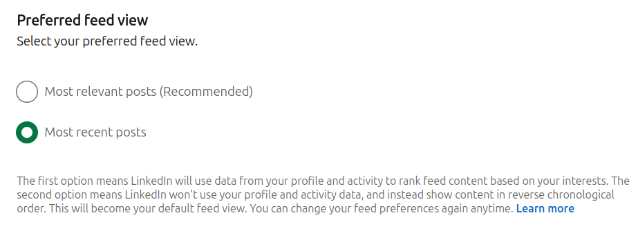

# 

A few months ago a product manager at linkedin posted that he'll give some sort of a prize to someone who has a winning idea for how to improve linkedin, or somethin like what feature linkedin should have so that I'm convinced to pay for subscription. A signal of "we are out of ideas for growth" mixed with "we want to listen to consumers". 

Now, I usually don't engage with such things in general, but it's been a while that I'm thinking reviewing products that I see dark patterns in, not really hoping for something to improve, but mostly to have put my thoughts in writing and make them a but more concrete, you know, a step up from nagging. Hopefully someday I can actually use these ideas in a product I build myself. 

There is an old story in Persian that is now used as a half joke: There was this person called Loghman who was as polite and respectful and thoughtful and knowledgeable as it gets. Someone asks him: who thought you to be so polite? And he responses: from the impolite ones. The morale of the story being that one simply can look at what bad things others do and by avoiding them, become better than them, or than most people for that matter.

Anyways, back to linkedin. I don't use social media all that often for various reasons. One of the reasons being people perform on social media, and tht is not something I'm that interested in, for one, most people are not good performers and it gets boring way too quickly, and also, the ones who are good at performing direct the society in the wrong direction, so overall social media are a disservice to the society. Especially linkedin, which is by definition a performance platform. 

However, they have done some good work in the right direction in the last several years, one of them being designing one of the most comprehensible settings I've seen for such platforms. It gives you quite a lot of felxibility to adjust your experience without being too overwhelming so that you get lost and give up entirely. Now, I'm not saying it is complete, it lacks a tonne, but that's a different story. Today I want to focus on one good thing they've done. 

Anyone who knows me is already tired of me complaining about recommender systems, and they're EVERYWHERE. I'm not going to repeat all those. But one of the last straws that had made me leave any social media platform despite being a heavy users of many of them since their inceptions has been their recommender models. The existence of a recommender system simply says: we know better than you what you want/need to read/watch/listen to/etc. In that, some of these by design lack any other system for you to discover any content, but some have kept the traditional ways of finding things. You might be able to follow/connect to another profile and find their posts, you might be able to keep a direct link to a content, etc. But think about the concept of a "feed" and you realize all social media now show you "top" content. Even when you browse some profile on youtube on their platform, the content are not ordered chronologically, you have to work for it to get it in that order (if ever, depending on your client).

On their defence, they have a good reason to do so though, a social media business makes money mainly by keeping you on the platform, and any half-assed recommender system that shows you the "top" content keeps you on the platform way longer than the chronological (the most recent on top) feed. Simply because in the chronological version you read all the things since last time and you'll be done with it, you've seen all the other content, no matter how much they show you the "activities" of other people that you care or don't care about, there's simply not that much content created that will keep you online. On the other hand, most people (traditionaly/intentionally) don't open social media just to be entertained. Usually people are there out of FOMO, and what brings you on the platform is not the same thing that keeps you on the platform. If you have a very strong FOMO and open your social media 5 times per minute, and there's nothing new, your FOMO will eventually go away and you might simply delete the app or forget that it exists. That's not good for business. 

But you might aask what "top" content really mean. What am I seeing when I'm seeing the top content, why am I seeing this particular content, why am I seeing it at all. Some social media have tried to signal a little bit of that in order to build some sort of a trust, e.g. you are seeing this because your connection Y liked this etc. This is soomewhat useful, it allows you to quickly "skip" the things you don't care about, but it is not really 

